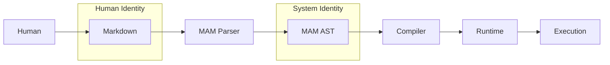
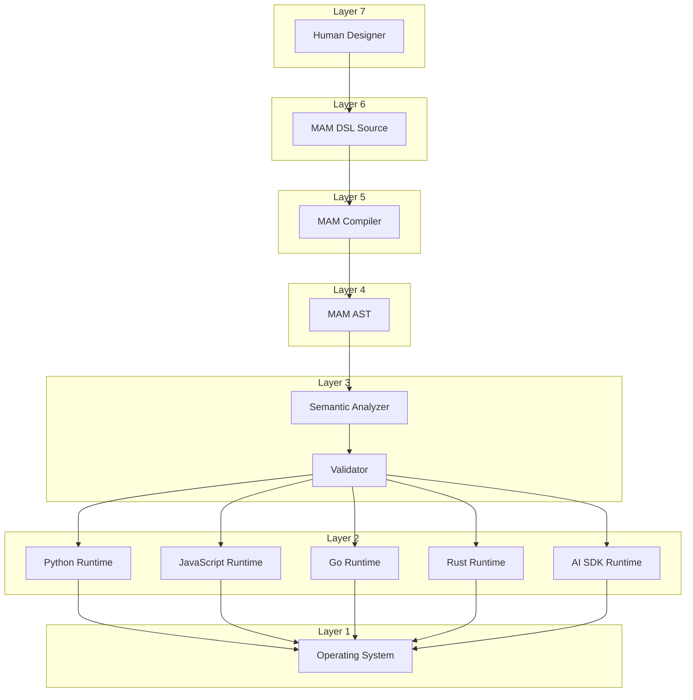
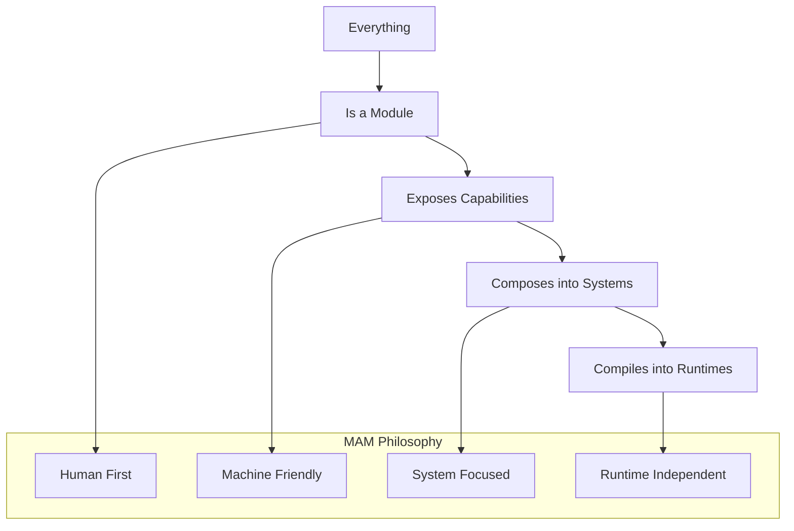
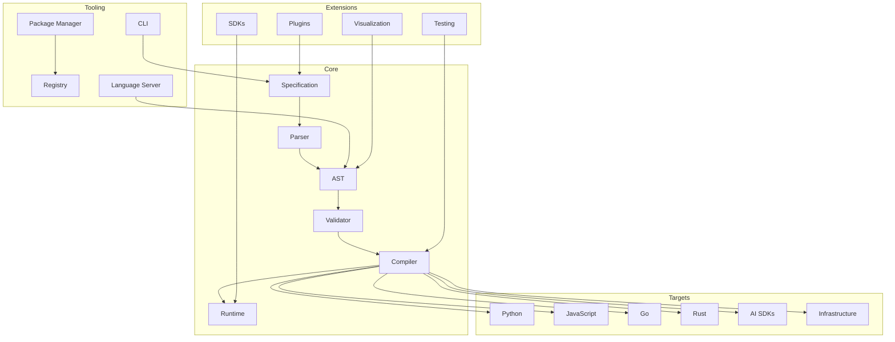
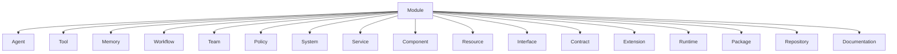
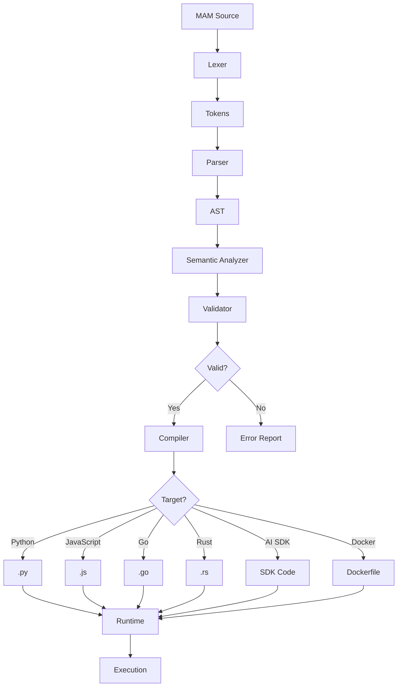
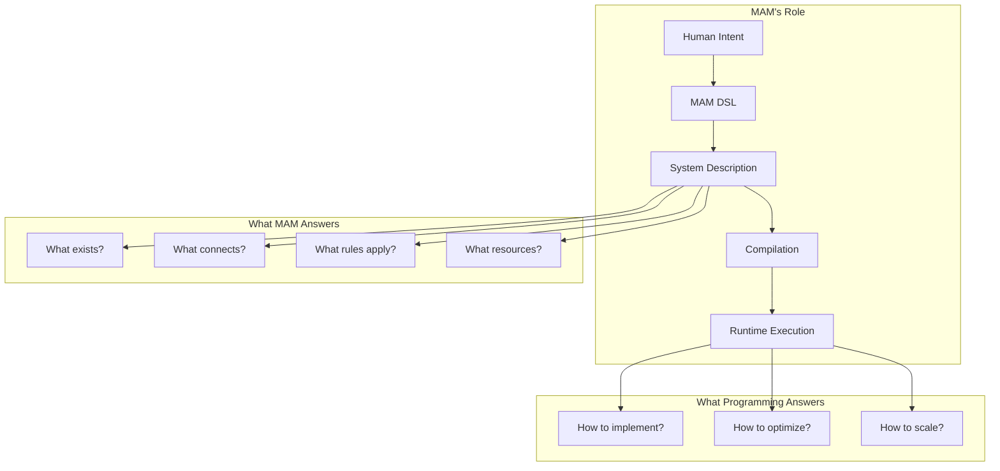
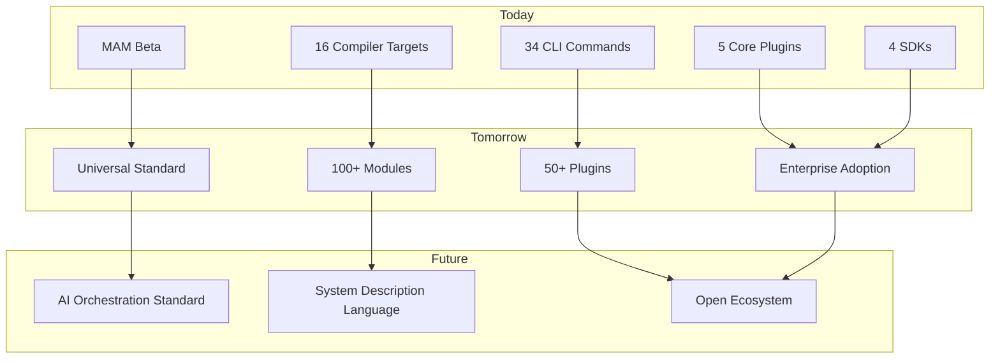

# MAM — The Complete System

> **Markdown as Module**
> *The reference syntax for the Machine Agent Module Specification.*

---

## Identity

MAM has two identities:

### Human Identity

> **Markdown as Module**

This is what users write.

### System Identity

> **Machine Agent Modules**

This is what the compiler understands.



---

## The MAM Stack

```text
Layer 7:  Human (Designer)
Layer 6:  MAM DSL Source (.mam / .mam.md)
Layer 5:  MAM Compiler (mamc)
Layer 4:  MAM AST (Machine Agent Module IR)
Layer 3:  Semantic Analyzer + Validator
Layer 2:  Target Runtime (Python, JS, Go, Rust, OpenAI, LangGraph...)
Layer 1:  Operating System
```



---

## Core Philosophy

> **Everything is a module. Every module exposes capabilities. Modules compose into systems. Systems compile into runtimes.**



---

## What MAM Describes

Not algorithms. **Systems.**

| Category | Examples |
|----------|----------|
| **AI Systems** | Agents, teams, workflows, memory |
| **Cloud Systems** | Services, APIs, databases, caches |
| **Security Systems** | Scanners, analyzers, reporters |
| **Automation Systems** | Pipelines, triggers, schedules |
| **Infrastructure** | Servers, containers, orchestration |
| **Enterprise** | Processes, policies, governance |

---

## The MAM Ecosystem



---

## Tool Names

| Tool | Name | Description |
|------|------|-------------|
| MAM | Machine Agent Modules | The language |
| MAMC | MAM Compiler | Compiler |
| MAMP | MAM Package Manager | Package manager |
| MAM Hub | MAM Registry | Module registry |
| MAM LSP | MAM Language Server | IDE support |
| mam fmt | MAM Formatter | Code formatter |
| mam lint | MAM Linter | Code linter |
| mam build | MAM Builder | Module builder |
| mam run | MAM Runner | Module runner |
| mam test | MAM Test | Test runner |
| mam viz | MAM Visualize | Graph visualization |
| mam audit | MAM Audit | Security audit |

---

## File Types

| Extension | Description |
|-----------|-------------|
| `.mam` | Source module (Markdown syntax) |
| `.mam.md` | Source module (explicit Markdown) |
| `.mamlib` | Library module |
| `.mampkg` | Package (distributable) |
| `.mamlock` | Dependency lock file |

---

## Module Types



---

## Example: Multi-Agent System

```mam
module BugHunter

type:
    system

agents:
    - Planner
    - Recon
    - Analyzer
    - Reporter

edges:
    Planner -> Recon
    Recon -> Analyzer
    Analyzer -> Reporter

memory:
    shared: SharedMemory

policy:
    SafeExecution

module Planner

type:
    agent

role:
    Planning

goal:
    Create execution strategy

memory:
    shared

handoff:
    - Recon

module Recon

type:
    agent

role:
    Reconnaissance

goal:
    Discover attack surfaces

tools:
    - browser
    - python
    - search

handoff:
    - Analyzer

module Analyzer

type:
    agent

role:
    Analysis

goal:
    Analyze vulnerabilities

handoff:
    - Reporter

module Reporter

type:
    agent

role:
    Reporting

goal:
    Generate security reports

module SharedMemory

type:
    memory

format:
    vector

backend:
    sqlite

scope:
    workspace

module SafeExecution

type:
    policy

allow:
    - browser
    - python
    - search

deny:
    - shell.rm
    - network.internal
```

---

## Compilation Flow



---

## The North Star

> **"Describe Systems. Compile Anywhere."**

MAM is not trying to replace Python, JavaScript, or Rust — it occupies the layer above them, where systems are described independently of how they're ultimately implemented.



---

## Long-Term Vision



---

## Summary

MAM is:

- A **declarative language** for describing modular systems
- A **compiler target** for multiple runtimes
- A **package format** for AI and system modules
- An **open standard** for system description
- A **bridge** between human intent and machine execution

MAM is NOT:

- Another programming language
- A replacement for Python/JavaScript/Rust
- A framework-specific configuration
- A prompt engineering tool

---

## The Promise

> **Write once. Describe systems. Compile anywhere.**

MAM enables developers to:

1. **Describe** complex systems in readable Markdown
2. **Compose** modules into larger systems
3. **Compile** to any target runtime
4. **Share** modules across projects and teams
5. **Version** system designs over time

---

## Join the Movement

MAM is an open standard for system description. Whether you're building AI agents, cloud infrastructure, or enterprise workflows, MAM provides a portable, composable, and readable way to describe your systems.

> **"The Language of Systems."**