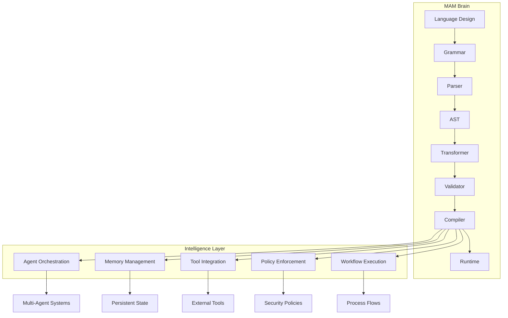
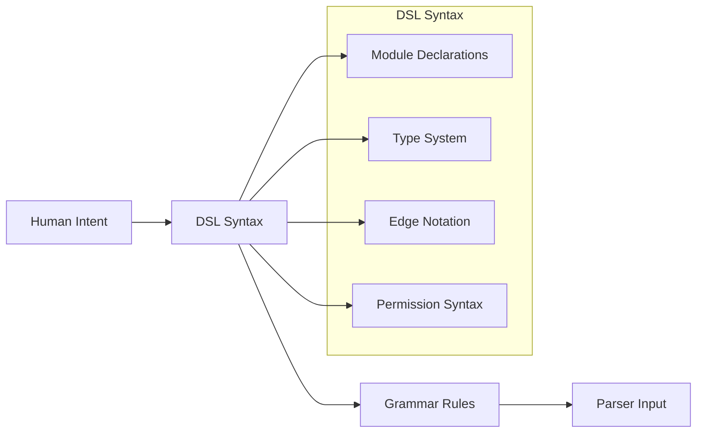
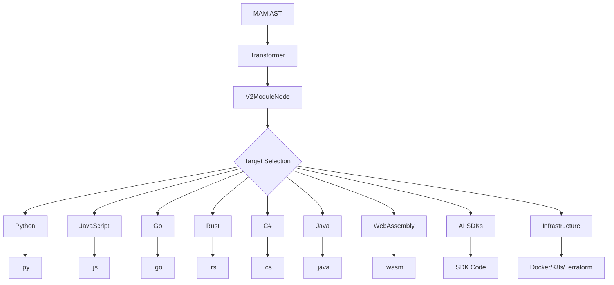
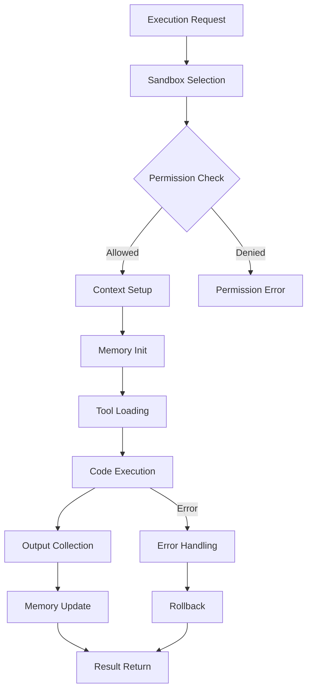
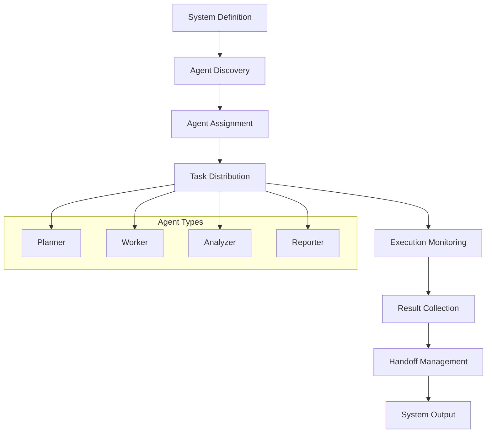
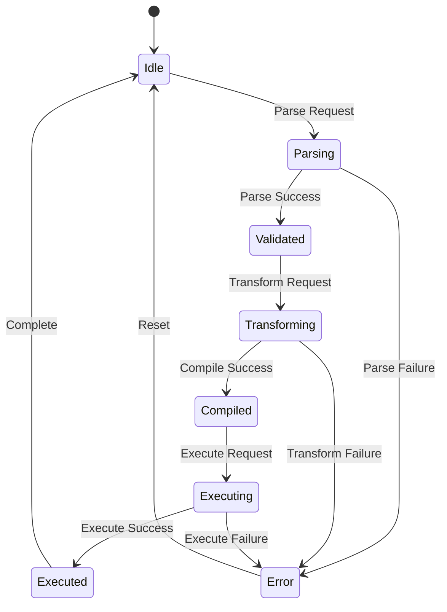
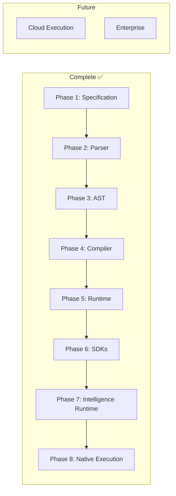
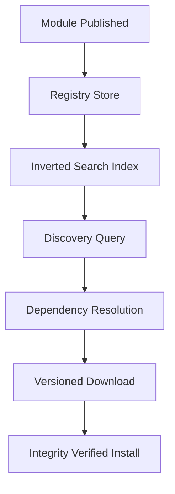

# MAM Brain — The Intelligence Layer

> **The central nervous system of MAM — where design meets execution.**

---

## What is the MAM Brain?

The MAM Brain is the intellectual core of the MAM ecosystem. It encompasses:

- **Language Design** — How MAM expresses systems
- **Compilation Strategy** — How MAM translates to 16 targets
- **Runtime Intelligence** — How MAM executes modules
- **Agent Orchestration** — How MAM coordinates multi-agent systems
- **Knowledge Management** — How MAM handles memory and state

---

## Architecture



---

## Brain Components

### 1. Language Design Engine

The Language Design Engine defines how MAM expresses systems declaratively.



**Key Concepts:**
- Declarative over imperative
- Composition over inheritance
- Readability over cleverness
- Determinism over magic

### 2. Compilation Intelligence

The Compilation Intelligence layer transforms MAM AST into 16 target languages.



**Compilation Pipeline:**
```
.mam.md → Parser → MAMModule → Transformer → V2ModuleNode → Compiler → .mam.{target}
```

**16 Targets:**
- **Languages:** Python, JavaScript, Go, Rust, C#, Java, WebAssembly
- **AI SDKs:** OpenAI, LangGraph, CrewAI, Gemini, AutoGen, Claude
- **Infrastructure:** Kubernetes, Terraform, Docker

### 3. Runtime Intelligence

The Runtime Intelligence layer executes MAM modules safely and efficiently.



**Runtime Features (implemented):**
- Native `.mam` execution (`mam run system.mam`, no compiler)
- Core engines: state, events, permissions, plugins, security, resource manager, policy engine
- Context engine (priority assembly, caching, dedup, compression)
- Token budget (allocation, defragmentation)
- Memory engine + store (search, consolidation, TTL, indexing)
- Knowledge / RAG (TF-IDF, cosine similarity, hybrid retrieval)
- Model engine (fallback, retry, rate limiting)
- Tool engine (validation, caching, retry, permissions)
- Agent engine (composition of model, context, memory, knowledge, tools)
- Evaluation (quality scoring, benchmarks, gates)
- Observability (logs, metrics, traces, token usage, cost)
- Sandboxing (filesystem/network/process policies, limits, timeout)
- Error recovery (95%+ success rate)

### 4. Agent Orchestration

The Agent Orchestration layer coordinates multi-agent systems.



**Orchestration Patterns:**
- **Sequential** — Agents execute in order
- **Parallel** — Agents execute simultaneously
- **Pipeline** — Output feeds next agent
- **Graph** — Complex agent relationships (edges: A -> B -> C)

---

## Brain States



---

## Intelligence Metrics

| Metric | Description | Current | Target |
|--------|-------------|---------|--------|
| Parse Speed | Tokens per millisecond | ~80 | >100 |
| Compile Speed | Lines per millisecond | ~40 | >50 |
| AST Determinism | Same input → same output | 100% | 100% |
| Test Coverage | Tests passing | 7,000+ | >7500 |
| Registry Tests | Service + contract + client + e2e | 654 + 11 | — |
| V2 Runtime Engines | Native execution engines | 22/22 | 22/22 |
| Runtime Code | V2 runtime lines | ~11,000 | — |
| Error Recovery | Success rate after errors | >90% | >95% |
| CLI Startup | Time to ready | ~80ms | <50ms |

---

## Brain Evolution



### Completed Phases

| Phase | Component | Status |
|-------|-----------|--------|
| 1 | Specification | ✅ |
| 2 | Parser (176 tests) | ✅ |
| 3 | AST (480+ tests) | ✅ |
| 4 | Compiler (72 tests, 16 targets) | ✅ |
| 5 | Runtime (487 tests) | ✅ |
| 6 | SDKs (Python, JS, Go, Rust + more) | ✅ |
| 7 | Intelligence Runtime (22/22 engines) | ✅ |
| 8 | Native Execution + Project Composition | ✅ |
| 9 | Registry service (400 + 123 + 131 + 11 e2e tests) | ✅ |

### Future Phases

| Phase | Component | Status |
|-------|-----------|--------|
| 10 | Cloud Execution | ⏳ |
| 11 | Enterprise Features | ⏳ |

---

## Distribution Intelligence

Intelligence is not only execution — it is also how modules find each other.
The production registry (MAM Hub) is the Brain's distribution layer:



- **Discovery:** n-gram indexed search over names, descriptions, tags and authors
- **Resolution:** manifests declare versioned dependencies; the client resolves them
- **Integrity:** every download carries a SHA-256 over the stored files
- **Contract:** OpenAPI for REST, SDL for GraphQL, typed client — all three tested against a live server

---

## Summary

The MAM Brain is the intellectual core that enables MAM to:

1. **Understand** human intent through declarative syntax
2. **Transform** system descriptions via Transformer → V2ModuleNode
3. **Compile** to 16 target languages
4. **Execute** `.mam` natively through a 22-engine runtime
5. **Orchestrate** multi-agent systems
6. **Observe** and evaluate execution (traces, metrics, token usage, cost)

> **The Brain doesn't just compute — it understands systems.**