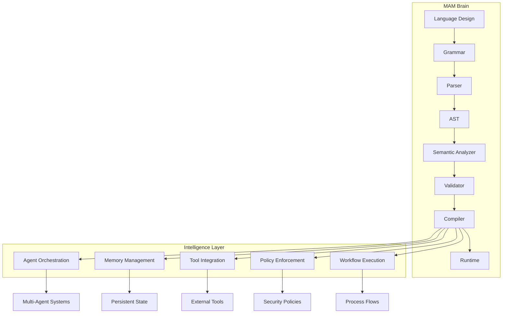
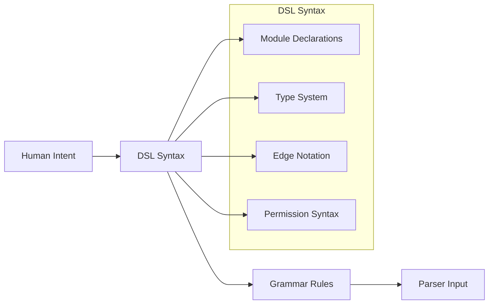
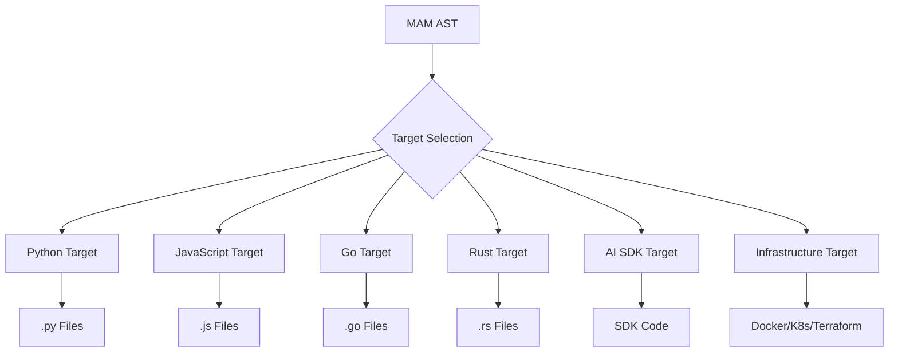
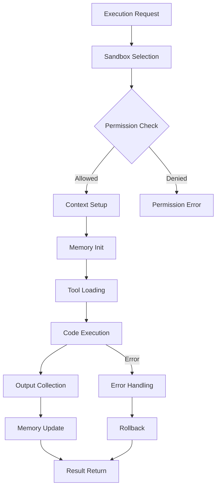
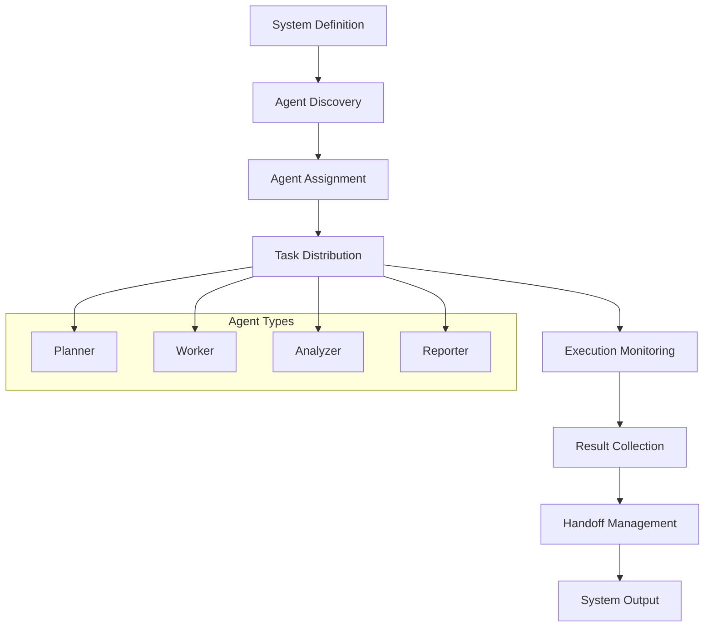
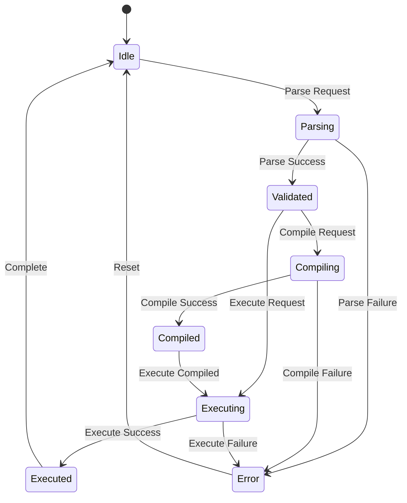
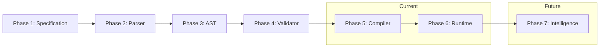

# MAM Brain — The Intelligence Layer

> **The central nervous system of MAM — where design meets execution.**

---

## What is the MAM Brain?

The MAM Brain is the intellectual core of the MAM ecosystem. It encompasses:

- **Language Design** — How MAM expresses systems
- **Compilation Strategy** — How MAM translates to targets
- **Runtime Intelligence** — How MAM executes modules
- **Agent Orchestration** — How MAM coordinates multi-agent systems
- **Knowledge Management** — How MAM handles memory and state

---

## Architecture

---

## Brain Components

### 1. Language Design Engine

The Language Design Engine defines how MAM expresses systems declaratively.

**Key Concepts:**
- Declarative over imperative
- Composition over inheritance
- Readability over cleverness
- Determinism over magic

### 2. Compilation Intelligence

The Compilation Intelligence layer transforms MAM AST into target code.

**Compilation Strategies:**
- **Template-based** — Generate code from templates
- **AST-based** — Transform AST nodes to target code
- **Hybrid** — Combine templates with AST transformations

### 3. Runtime Intelligence

The Runtime Intelligence layer executes MAM modules safely and efficiently.

**Runtime Features:**
- Sandboxed execution
- Memory persistence
- Tool integration
- Error recovery
- State management

### 4. Agent Orchestration

The Agent Orchestration layer coordinates multi-agent systems.

**Orchestration Patterns:**
- **Sequential** — Agents execute in order
- **Parallel** — Agents execute simultaneously
- **Pipeline** — Output feeds next agent
- **Graph** — Complex agent relationships

---

## Brain States

---

## Intelligence Metrics

| Metric | Description | Target |
|--------|-------------|--------|
| Parse Speed | Tokens per millisecond | >100 |
| Compile Speed | Lines per millisecond | >50 |
| Memory Usage | Peak memory during execution | <256MB |
| Agent Latency | Time to handoff between agents | <100ms |
| Error Recovery | Success rate after errors | >95% |

---

## Brain Evolution

---

## Summary

The MAM Brain is the intellectual core that enables MAM to:

1. **Understand** human intent through declarative syntax
2. **Transform** system descriptions into executable code
3. **Execute** modules safely and efficiently
4. **Orchestrate** complex multi-agent systems
5. **Learn** from execution patterns and outcomes

> **The Brain doesn't just compute — it understands systems.**