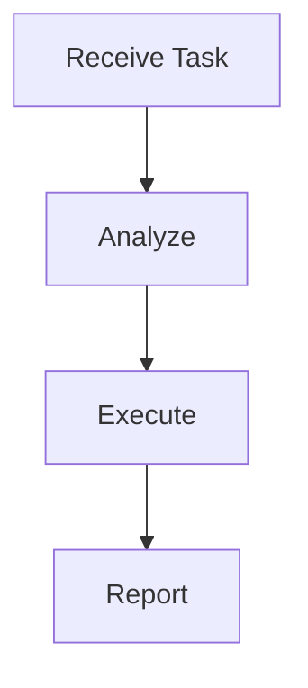

# {{name}}

## Purpose

Describe the agent's role and responsibilities.

## Workflow



## Python

```python
class Agent:
    def __init__(self):
        self.name = "{{name}}"
    
    def execute(self, task: str) -> dict:
        """Execute the agent's task."""
        return {"status": "completed", "result": task}
```

## Examples

### Example 1

Describe how to use this agent.
