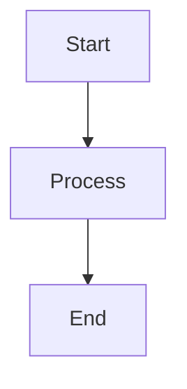

# {{name}}

## Purpose

Describe the purpose of this module.

## Inputs

| Name | Type | Required | Description |
|------|------|----------|-------------|
| input1 | string | Yes | Input description |

## Outputs

| Name | Type | Description |
|------|------|-------------|
| output1 | string | Output description |

## Rules

- Add your rules here

## Workflow



## Python

```python
def process(input1: str) -> dict:
    """Process the input."""
    return {"output1": input1}
```

## Prompt

Describe the prompt for this module.

## Memory

- Type: vector
- Backend: sqlite
- Scope: module

## Examples

### Example 1

Describe an example usage.

## Tests

### Test 1

- Input: test input
- Expected: expected output

## References

- [Reference 1](https://example.com)

## Dependencies

- package-name: ^1.0.0
