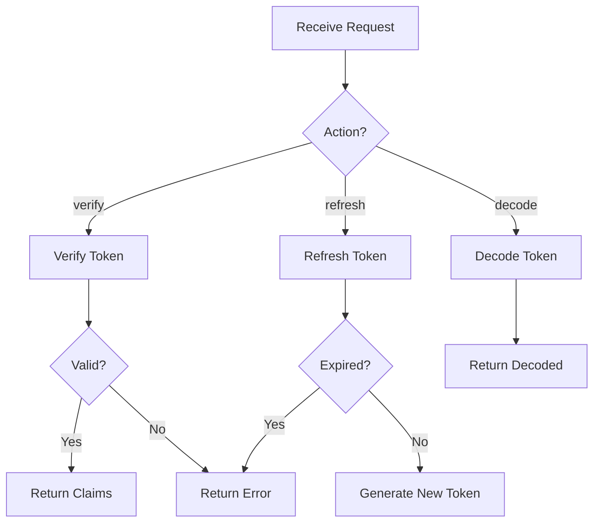

# Advanced Module Examples

> **Complex MAM module examples for production use.**

---

## Authentication Module

Complete JWT authentication system:

```markdown
---
id: authentication
version: 2.0.0
name: Authentication Module
author: LifeJiggy
runtime: python
tags:
  - auth
  - jwt
  - security
dependencies:
  - crypto-utils@^1.0.0
permissions:
  - network
  - filesystem
---

## Purpose

Secure JWT authentication with support for multiple token formats,
automatic token refresh, and rate limiting.

## Inputs

| Name | Type | Required | Default | Description |
|------|------|----------|---------|-------------|
| token | string | Yes | - | JWT token |
| action | string | Yes | - | Action (verify, refresh, decode) |
| audience | string | No | "api" | Expected audience |

## Outputs

| Name | Type | Description |
|------|------|-------------|
| success | boolean | Whether operation succeeded |
| claims | dict | Decoded token claims |
| token | string | New token (for refresh) |
| error | string | Error message if failed |

## Rules

- Never expose secrets in logs
- Use constant-time comparison for tokens
- Validate all inputs before processing
- Rate limit authentication attempts
- Rotate secrets every 90 days

## Workflow



## Python

```python
import jwt
import time
from typing import Optional, Dict
from datetime import datetime, timedelta

SECRET_KEY = "your-secret-key"
ALGORITHM = "HS256"
ACCESS_TOKEN_EXPIRE = 30  # minutes
REFRESH_TOKEN_EXPIRE = 7  # days

def verify_token(token: str, audience: str = "api") -> Dict:
    """Verify JWT token and return claims."""
    try:
        claims = jwt.decode(
            token,
            SECRET_KEY,
            algorithms=[ALGORITHM],
            audience=audience
        )
        return {"success": True, "claims": claims}
    except jwt.ExpiredSignatureError:
        return {"success": False, "error": "Token expired"}
    except jwt.InvalidTokenError as e:
        return {"success": False, "error": str(e)}

def refresh_token(token: str) -> Dict:
    """Refresh an expired token."""
    try:
        # Decode without verification to get claims
        claims = jwt.decode(
            token,
            SECRET_KEY,
            algorithms=[ALGORITHM],
            options={"verify_exp": False}
        )
        
        # Generate new token
        new_claims = {
            "sub": claims["sub"],
            "aud": claims.get("aud", "api"),
            "exp": datetime.utcnow() + timedelta(minutes=ACCESS_TOKEN_EXPIRE),
            "iat": datetime.utcnow()
        }
        
        new_token = jwt.encode(new_claims, SECRET_KEY, algorithm=ALGORITHM)
        
        return {"success": True, "token": new_token}
    except Exception as e:
        return {"success": False, "error": str(e)}

def decode_token(token: str) -> Dict:
    """Decode token without verification."""
    try:
        claims = jwt.decode(
            token,
            SECRET_KEY,
            algorithms=[ALGORITHM],
            options={"verify_signature": False}
        )
        return {"success": True, "claims": claims}
    except Exception as e:
        return {"success": False, "error": str(e)}
```

## Examples

```python
# Create token
claims = {"sub": "user123", "role": "admin"}
token = jwt.encode(claims, SECRET_KEY, algorithm=ALGORITHM)

# Verify token
result = verify_token(token)
print(result)  # {'success': True, 'claims': {...}}

# Refresh token
result = refresh_token(token)
print(result)  # {'success': True, 'token': '...'}

# Decode token
result = decode_token(token)
print(result)  # {'success': True, 'claims': {...}}
```

## Tests

```python
# Test verify
result = verify_token(valid_token)
assert result["success"] is True
assert "claims" in result

# Test invalid token
result = verify_token("invalid")
assert result["success"] is False

# Test refresh
result = refresh_token(valid_token)
assert result["success"] is True
assert "token" in result
```
```

---

## Data Pipeline

ETL pipeline with error handling:

```markdown
---
id: data-pipeline
version: 2.0.0
name: Data Processing Pipeline
author: LifeJiggy
runtime: python
tags:
  - pipeline
  - etl
  - data
permissions:
  - network
  - filesystem
---

## Purpose

Extract, transform, and load data from multiple sources
with comprehensive error handling and logging.

## Inputs

| Name | Type | Required | Description |
|------|------|----------|-------------|
| source | string | Yes | Data source URL |
| format | string | No | Output format (json, csv) |
| batch_size | integer | No | Processing batch size |

## Outputs

| Name | Type | Description |
|------|------|-------------|
| records | integer | Number of records processed |
| output_path | string | Path to output file |
| errors | list | Processing errors |

## Rules

- Validate data before transformation
- Log all errors with context
- Retry failed operations 3 times
- Maintain data lineage

## Python

```python
import requests
import json
from typing import List, Dict, Optional
from datetime import datetime

def extract(url: str) -> List[Dict]:
    """Extract data from source."""
    response = requests.get(url, timeout=30)
    response.raise_for_status()
    return response.json()

def transform(data: List[Dict]) -> List[Dict]:
    """Transform extracted data."""
    transformed = []
    for record in data:
        try:
            transformed.append({
                "id": record.get("id"),
                "value": record.get("value", "").upper(),
                "processed_at": datetime.now().isoformat()
            })
        except Exception as e:
            print(f"Error transforming record: {e}")
    return transformed

def load(data: List[Dict], format: str = "json") -> str:
    """Load transformed data."""
    filename = f"output_{datetime.now().strftime('%Y%m%d_%H%M%S')}.{format}"
    with open(filename, "w") as f:
        json.dump(data, f, indent=2)
    return filename

def pipeline(source: str, format: str = "json", batch_size: int = 100) -> Dict:
    """Main pipeline function."""
    try:
        data = extract(source)
        transformed = transform(data)
        output_path = load(transformed, format)
        
        return {
            "records": len(transformed),
            "output_path": output_path,
            "errors": []
        }
    except Exception as e:
        return {
            "records": 0,
            "output_path": None,
            "errors": [str(e)]
        }
```
```

---

## API Client

REST API client with retry logic:

```markdown
---
id: api-client
version: 2.0.0
name: API Client
author: LifeJiggy
runtime: python
tags:
  - api
  - client
  - http
permissions:
  - network
---

## Purpose

REST API client with automatic retry, rate limiting, and error handling.

## Python

```python
import requests
import time
from typing import Optional, Dict, Any
from functools import wraps

def retry(max_retries: int = 3, delay: float = 1.0):
    """Retry decorator with exponential backoff."""
    def decorator(func):
        @wraps(func)
        def wrapper(*args, **kwargs):
            for attempt in range(max_retries):
                try:
                    return func(*args, **kwargs)
                except Exception as e:
                    if attempt == max_retries - 1:
                        raise
                    time.sleep(delay * (2 ** attempt))
            return None
        return wrapper
    return decorator

class APIClient:
    def __init__(self, base_url: str, api_key: str):
        self.base_url = base_url
        self.headers = {"Authorization": f"Bearer {api_key}"}
    
    @retry(max_retries=3)
    def get(self, endpoint: str, params: Optional[Dict] = None) -> Dict:
        """Make GET request."""
        response = requests.get(
            f"{self.base_url}{endpoint}",
            headers=self.headers,
            params=params,
            timeout=30
        )
        response.raise_for_status()
        return response.json()
    
    @retry(max_retries=3)
    def post(self, endpoint: str, data: Any) -> Dict:
        """Make POST request."""
        response = requests.post(
            f"{self.base_url}{endpoint}",
            headers=self.headers,
            json=data,
            timeout=30
        )
        response.raise_for_status()
        return response.json()
```
```

---

## Next Steps

- [Agent Examples](./agent.md) — AI agent modules
- [Workflow Examples](./workflow.md) — Workflow modules

---

**Last Updated:** 2026-07-24
**MAM Version:** 1.0.0
