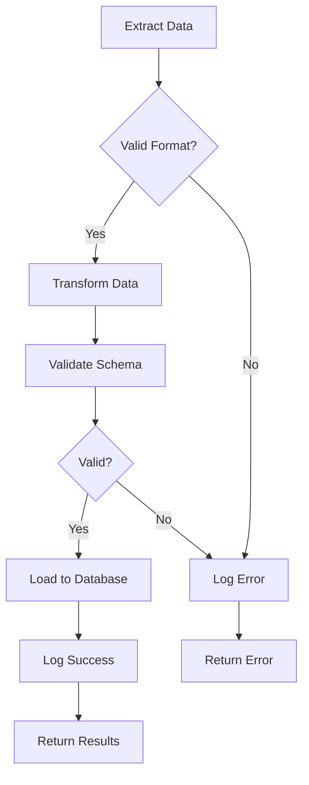
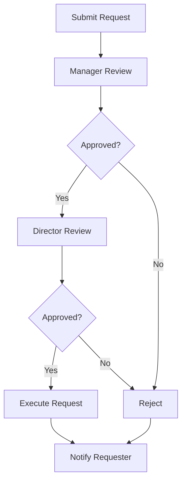
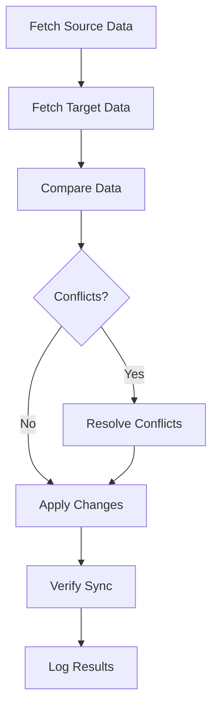
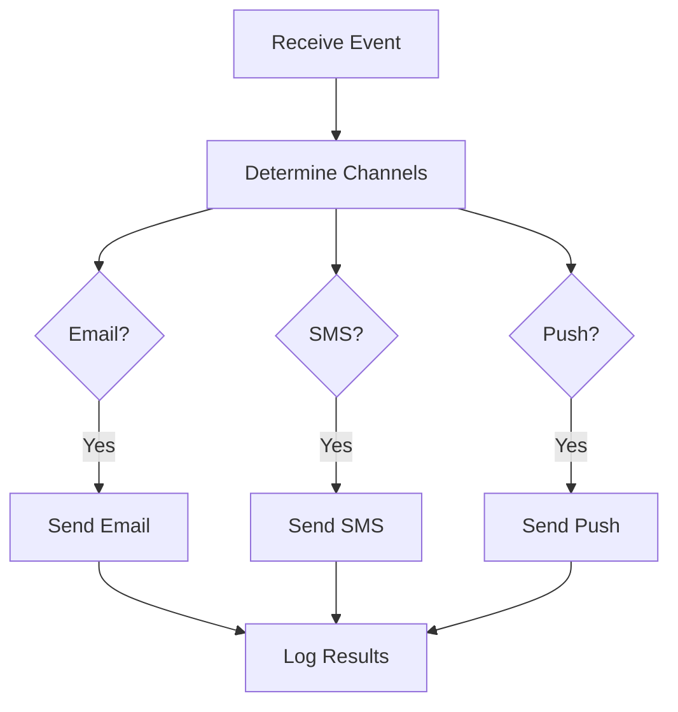

# Workflow Examples

> **Complex workflow patterns in MAM modules.**

---

## ETL Workflow

Extract, Transform, Load pipeline:

```markdown
---
id: etl-pipeline
version: 1.0.0
name: ETL Pipeline
author: LifeJiggy
runtime: python
tags:
  - etl
  - pipeline
  - data
permissions:
  - network
  - filesystem
---

## Purpose

Complete ETL pipeline with error handling and logging.

## Workflow



## Python

```python
def extract(source: str) -> list:
    """Extract data from source."""
    # Implementation
    pass

def transform(data: list) -> list:
    """Transform data."""
    # Implementation
    pass

def load(data: list, destination: str) -> bool:
    """Load data to destination."""
    # Implementation
    pass

def etl_pipeline(source: str, destination: str) -> dict:
    """Main ETL pipeline."""
    try:
        # Extract
        data = extract(source)
        print(f"Extracted {len(data)} records")
        
        # Transform
        transformed = transform(data)
        print(f"Transformed {len(transformed)} records")
        
        # Load
        success = load(transformed, destination)
        if success:
            print("Loaded successfully")
            return {"success": True, "records": len(transformed)}
        else:
            return {"success": False, "error": "Load failed"}
    
    except Exception as e:
        return {"success": False, "error": str(e)}
```
```

---

## Approval Workflow

Multi-step approval process:

```markdown
---
id: approval-workflow
version: 1.0.0
name: Approval Workflow
author: LifeJiggy
runtime: python
tags:
  - approval
  - workflow
  - business
---

## Purpose

Multi-step approval workflow with notifications.

## Workflow



## Python

```python
def submit_request(request: dict) -> dict:
    """Submit request for approval."""
    return {
        "id": generate_id(),
        "status": "pending_manager",
        "request": request,
        "history": [{"action": "submitted", "timestamp": now()}]
    }

def manager_review(request_id: str, approved: bool, comments: str) -> dict:
    """Manager review step."""
    request = get_request(request_id)
    
    if approved:
        request["status"] = "pending_director"
    else:
        request["status"] = "rejected"
    
    request["history"].append({
        "action": "manager_review",
        "approved": approved,
        "comments": comments,
        "timestamp": now()
    })
    
    return request

def director_review(request_id: str, approved: bool, comments: str) -> dict:
    """Director review step."""
    request = get_request(request_id)
    
    if approved:
        request["status"] = "approved"
        execute_request(request)
    else:
        request["status"] = "rejected"
    
    request["history"].append({
        "action": "director_review",
        "approved": approved,
        "comments": comments,
        "timestamp": now()
    })
    
    return request
```
```

---

## Data Sync Workflow

Synchronize data between systems:

```markdown
---
id: data-sync
version: 1.0.0
name: Data Sync Workflow
author: LifeJiggy
runtime: python
tags:
  - sync
  - data
  - integration
permissions:
  - network
---

## Purpose

Synchronize data between multiple systems with conflict resolution.

## Workflow



## Python

```python
def sync_data(source: str, target: str) -> dict:
    """Sync data between source and target."""
    # Fetch data
    source_data = fetch_data(source)
    target_data = fetch_data(target)
    
    # Compare
    conflicts = find_conflicts(source_data, target_data)
    
    # Resolve conflicts
    if conflicts:
        resolved = resolve_conflicts(conflicts)
    else:
        resolved = source_data
    
    # Apply changes
    apply_changes(target, resolved)
    
    # Verify
    verification = verify_sync(source, target)
    
    return {
        "synced": True,
        "conflicts": len(conflicts),
        "verification": verification
    }
```
```

---

## Notification Workflow

Send notifications through multiple channels:

```markdown
---
id: notification-workflow
version: 1.0.0
name: Notification Workflow
author: LifeJiggy
runtime: python
tags:
  - notification
  - messaging
  - workflow
permissions:
  - network
---

## Purpose

Send notifications through email, SMS, and push notifications.

## Workflow



## Python

```python
def send_notification(event: dict, channels: list) -> dict:
    """Send notification through specified channels."""
    results = {}
    
    if "email" in channels:
        results["email"] = send_email(event)
    
    if "sms" in channels:
        results["sms"] = send_sms(event)
    
    if "push" in channels:
        results["push"] = send_push(event)
    
    return results

def send_email(event: dict) -> bool:
    """Send email notification."""
    # Implementation
    return True

def send_sms(event: dict) -> bool:
    """Send SMS notification."""
    # Implementation
    return True

def send_push(event: dict) -> bool:
    """Send push notification."""
    # Implementation
    return True
```
```

---

## Next Steps

- [Agent Examples](./agent.md) — AI agent modules
- [Writing Modules](../guides/writing-modules.md) — How to write modules

---

**Last Updated:** 2026-07-24
**MAM Version:** 1.0.0
