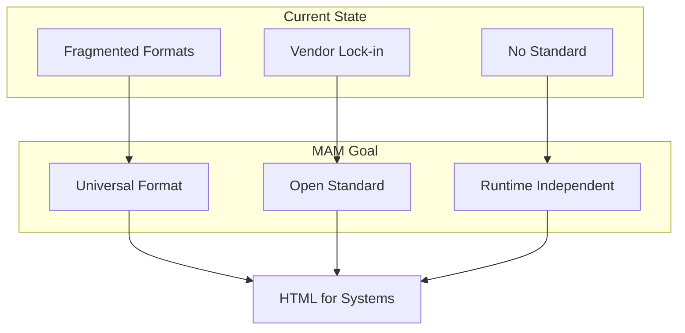
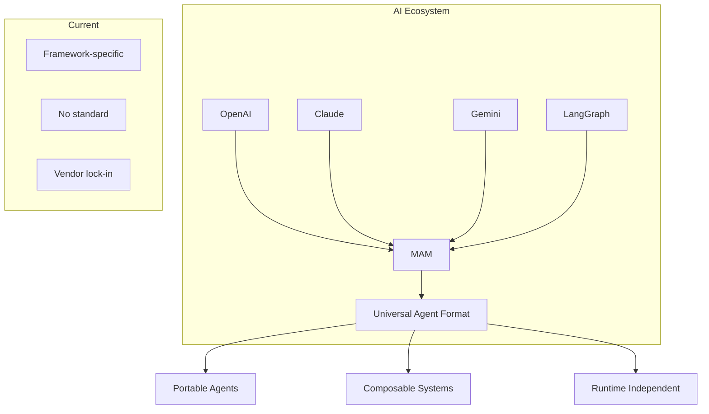
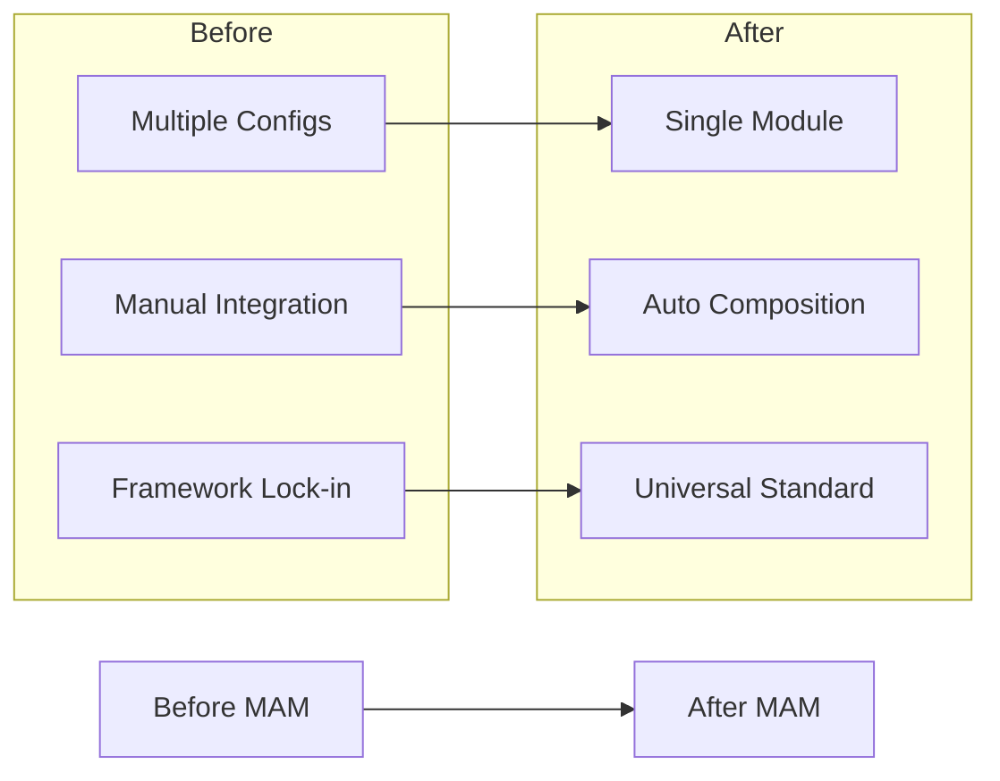
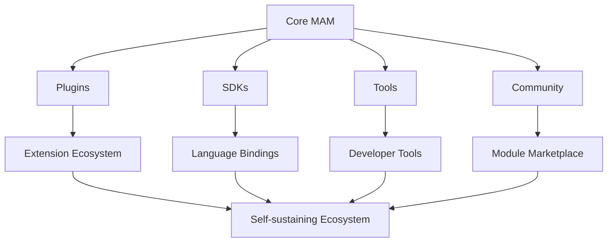
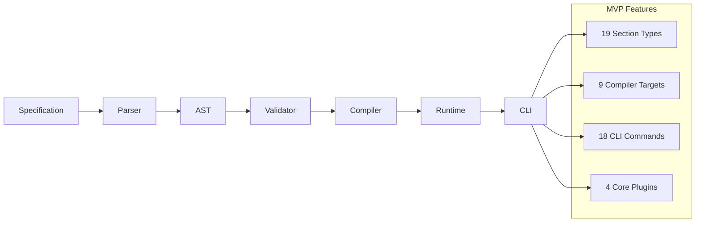
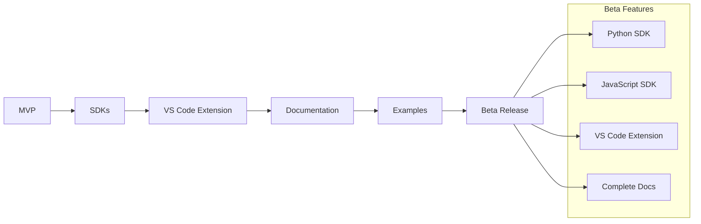
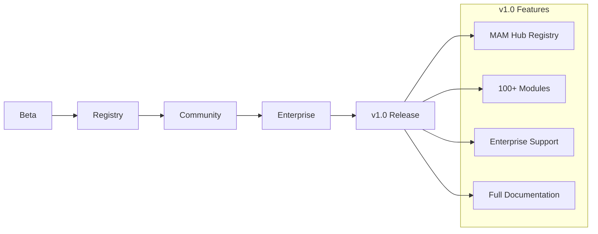
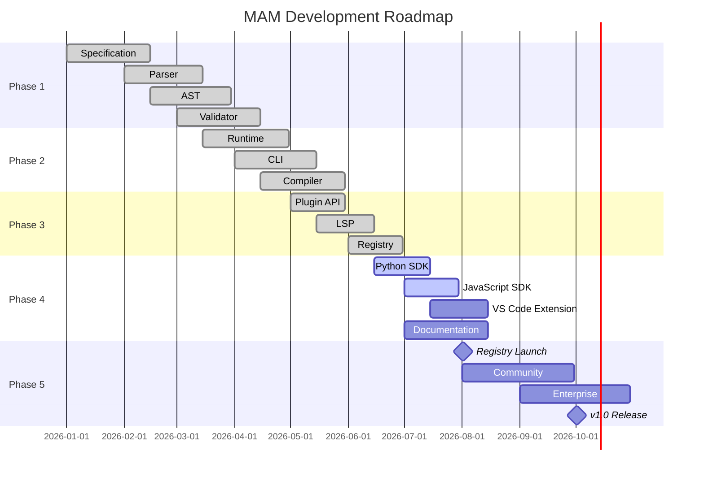

# MAM Goal — What MAM Aims to Achieve

> **MAM aims to become the universal language for describing modular systems.**

---

## Vision Statement

> **"Describe Systems. Compile Anywhere."**

MAM occupies the layer above programming languages, where systems are described independently of how they're ultimately implemented.

---

## Strategic Goals

### Goal 1: Universal System Description Language

**Target:** MAM becomes to systems what HTML became to documents.

### Goal 2: AI Orchestration Standard

**Target:** Every AI framework reads MAM modules.

### Goal 3: Developer Productivity

**Target:** Developers describe systems once, compile anywhere.

### Goal 4: Ecosystem Growth

**Target:** Self-sustaining ecosystem with community contributions.

---

## Success Metrics

### Technical Metrics

| Metric | Target | Current |
|--------|--------|---------|
| Parse Speed | >100 tokens/ms | ~80 tokens/ms |
| Compile Speed | >50 lines/ms | ~40 lines/ms |
| AST Determinism | 100% | 100% |
| Test Coverage | >80% | ~60% |
| CLI Startup | <50ms | ~80ms |
| LSP Latency | <100ms | ~120ms |

### Ecosystem Metrics

| Metric | Target | Current |
|--------|--------|---------|
| GitHub Stars | 1000+ | 0 |
| Community Modules | 100+ | 2 |
| Plugin Authors | 50+ | 0 |
| Framework Integrations | 10+ | 0 |
| Documentation Coverage | >90% | ~40% |

### Adoption Metrics

| Metric | Target | Current |
|--------|--------|---------|
| Monthly Downloads | 10,000+ | 0 |
| Active Users | 1,000+ | 0 |
| Contributors | 50+ | 1 |
| Enterprise Users | 10+ | 0 |

---

## Milestones

### Milestone 1: MVP (Current)

**Status:** ✅ Complete

### Milestone 2: Beta

**Status:** 🔄 In Progress

### Milestone 3: v1.0

**Status:** ⏳ Pending

---

## Roadmap

---

## Key Results

### Q3 2026

- [ ] Python SDK released
- [ ] JavaScript SDK released
- [ ] VS Code Extension published
- [ ] Documentation complete
- [ ] 50+ example modules

### Q4 2026

- [ ] MAM Hub registry launched
- [ ] 100+ community modules
- [ ] 10+ plugin authors
- [ ] Enterprise pilot program
- [ ] v1.0 release

### 2027

- [ ] 1000+ GitHub stars
- [ ] 500+ community modules
- [ ] 50+ plugin authors
- [ ] 10+ framework integrations
- [ ] Enterprise customers

---

## Success Criteria

A successful MAM achieves:

| Criteria | Description |
|----------|-------------|
| **Adoption** | Developers choose MAM for system description |
| **Ecosystem** | Community builds modules and plugins |
| **Integration** | AI frameworks adopt MAM standard |
| **Enterprise** | Organizations use MAM for system design |
| **Sustainability** | Self-sustaining community and governance |

---

## North Star

> **MAM becomes the universal language for describing modular systems.**

Not just AI. Not just infrastructure. **Systems.**

Every system can be described in MAM. Every MAM module can be compiled to any target. Every developer can read and understand MAM.

---

## Summary

MAM aims to:

1. **Become** the universal system description language
2. **Enable** AI orchestration across frameworks
3. **Empower** developers with productivity tools
4. **Build** a self-sustaining ecosystem
5. **Establish** MAM as an open standard

> **"Describe Systems. Compile Anywhere."**