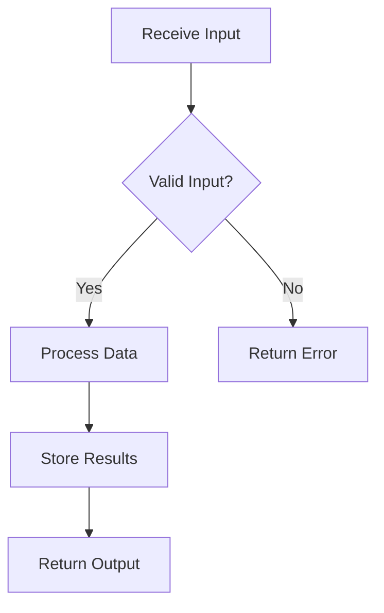
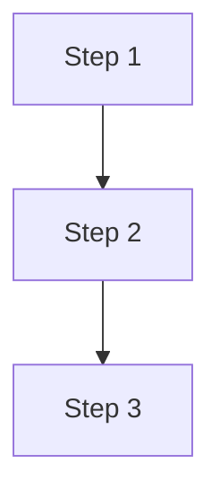
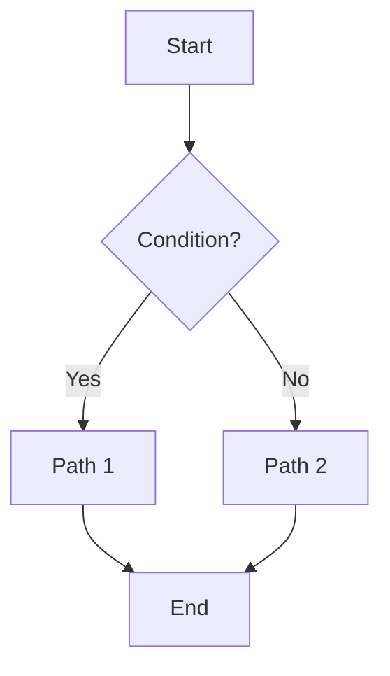
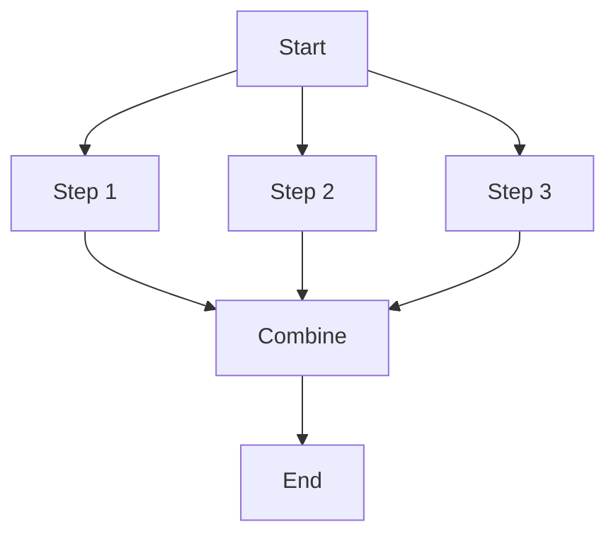
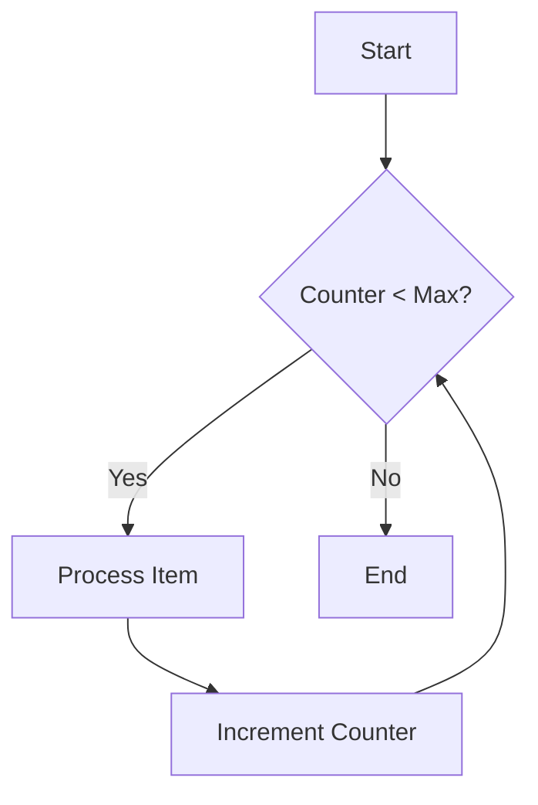
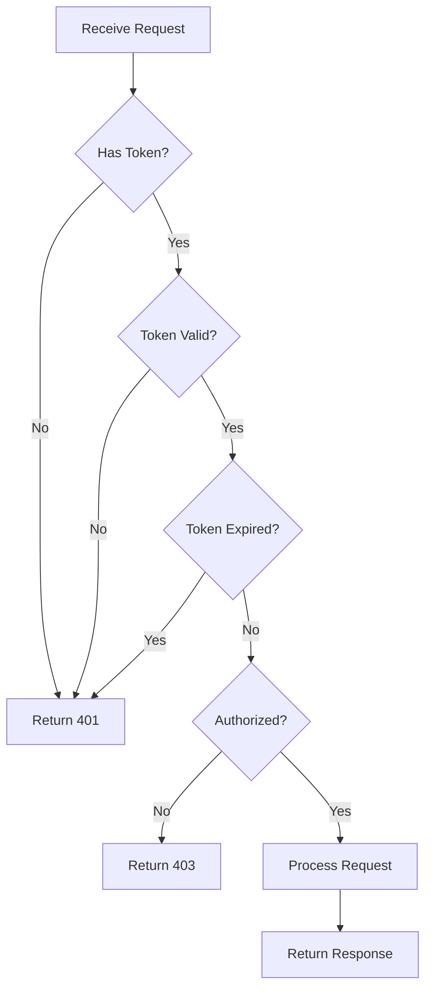
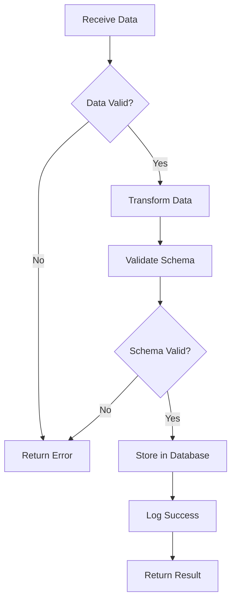
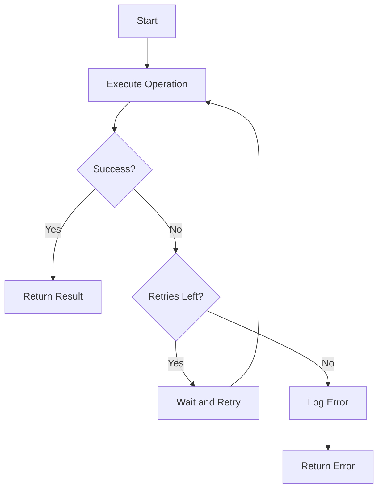
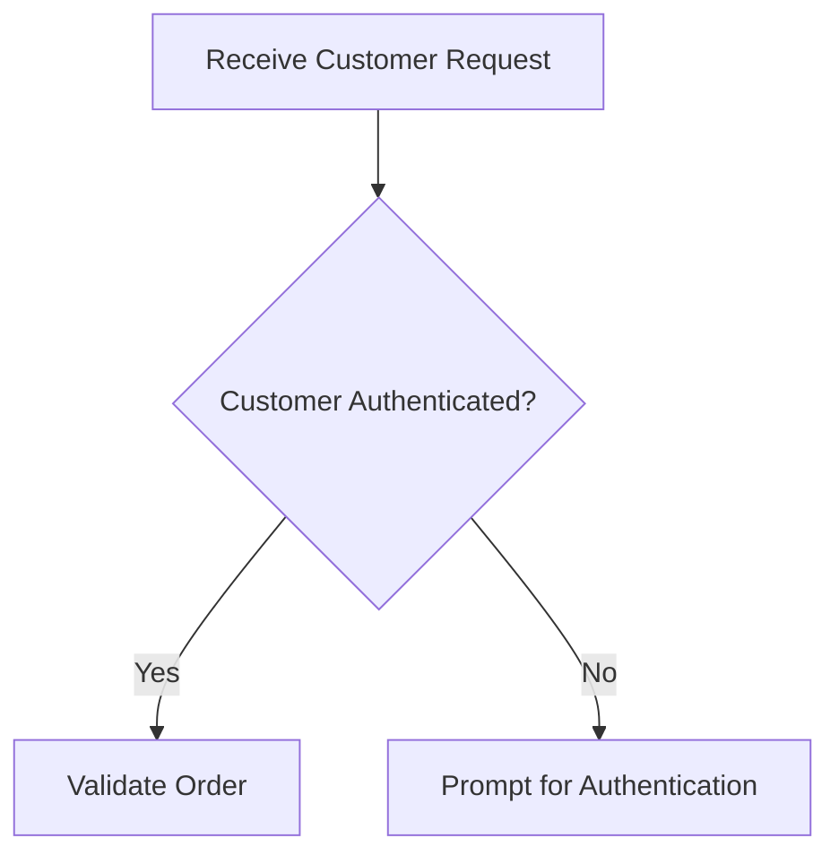

# Workflows Guide

> **Defining complex processes in MAM modules.**

---

## Overview

Workflows define the sequence of steps a module executes. This guide covers workflow definition, Mermaid diagrams, and best practices.

---

## Basic Workflow

Use numbered lists for simple workflows:

```markdown
## Workflow

1. Receive input data
2. Validate input
3. Process data
4. Store results
5. Return output
```

---

## Mermaid Diagrams

Use Mermaid for visual workflow representations:

```markdown
## Workflow


```

---

## Workflow Patterns

### Sequential Pattern

Steps execute in order:

```markdown
## Workflow

1. Load configuration
2. Initialize database connection
3. Process each item
4. Close connection
5. Return results
```

### Conditional Pattern

Steps based on conditions:

```markdown
## Workflow

1. Receive request
2. Check authentication
3. If authenticated:
   - Validate permissions
   - Process request
   - Return success
4. If not authenticated:
   - Return 401 error
```

### Parallel Pattern

Independent steps can run simultaneously:

```markdown
## Workflow

1. Receive request
2. In parallel:
   - Fetch user data
   - Fetch order data
   - Fetch inventory data
3. Combine results
4. Return response
```

### Loop Pattern

Repeat until condition met:

```markdown
## Workflow

1. Initialize counter
2. While counter < max:
   - Process item
   - Increment counter
3. Return results
```

---

## Mermaid Flowchart

### Basic Syntax



### Decision Nodes



### Parallel Steps



### Loops



---

## Workflow Examples

### Authentication Workflow

```markdown
## Workflow


```

### Data Processing Workflow

```markdown
## Workflow


```

### Error Handling Workflow

```markdown
## Workflow


```

---

## Python Implementation

### Basic Workflow

```python
def workflow(data: dict) -> dict:
    """Execute workflow steps."""
    # Step 1: Validate input
    if not validate_input(data):
        return {"error": "Invalid input"}
    
    # Step 2: Process data
    try:
        result = process_data(data)
    except Exception as e:
        return {"error": str(e)}
    
    # Step 3: Store results
    store_results(result)
    
    # Step 4: Return output
    return {"result": result}
```

### Conditional Workflow

```python
def conditional_workflow(request: dict, memory: dict) -> dict:
    """Workflow with conditions."""
    # Check authentication
    if not request.get("token"):
        return {"error": "Unauthorized", "status": 401}
    
    # Validate token
    claims = verify_token(request["token"])
    if not claims:
        return {"error": "Invalid token", "status": 401}
    
    # Check permissions
    if not check_permissions(claims, request["action"]):
        return {"error": "Forbidden", "status": 403}
    
    # Process request
    result = process_request(request)
    
    return {"result": result, "status": 200}
```

### Parallel Workflow

```python
import concurrent.futures

def parallel_workflow(ids: list) -> dict:
    """Execute steps in parallel."""
    with concurrent.futures.ThreadPoolExecutor() as executor:
        # Submit all tasks
        futures = {
            "users": executor.submit(fetch_users, ids),
            "orders": executor.submit(fetch_orders, ids),
            "inventory": executor.submit(fetch_inventory, ids)
        }
        
        # Wait for results
        results = {
            name: future.result()
            for name, future in futures.items()
        }
    
    return combine_results(results)
```

---

## Best Practices

### 1. Keep Steps Atomic

```markdown
## Workflow

1. Validate input (Good - single responsibility)
2. Process data (Good - single responsibility)

vs.

1. Validate, process, and store data (Bad - too many responsibilities)
```

### 2. Document Edge Cases

```markdown
## Workflow

1. Receive input
2. If input is empty, return early
3. Validate input format
4. Process data
5. Handle errors gracefully
6. Return results
```

### 3. Use Meaningful Names



### 4. Handle Errors

```python
def safe_workflow(data: dict) -> dict:
    """Workflow with error handling."""
    try:
        result = workflow(data)
        return {"success": True, "result": result}
    except ValidationError as e:
        return {"success": False, "error": f"Validation failed: {e}"}
    except ProcessingError as e:
        return {"success": False, "error": f"Processing failed: {e}"}
    except Exception as e:
        return {"success": False, "error": f"Unexpected error: {e}"}
```

### 5. Log Steps

```python
def logged_workflow(data: dict) -> dict:
    """Workflow with logging."""
    print("Starting workflow...")
    
    print("Step 1: Validating input...")
    validate_input(data)
    
    print("Step 2: Processing data...")
    result = process_data(data)
    
    print("Step 3: Storing results...")
    store_results(result)
    
    print("Workflow complete.")
    return {"result": result}
```

---

## References

- [Writing Modules](./writing-modules.md)
- [Specification](../specification/sections.md)

---

**Last Updated:** 2026-07-24
**MAM Version:** 1.0.0
