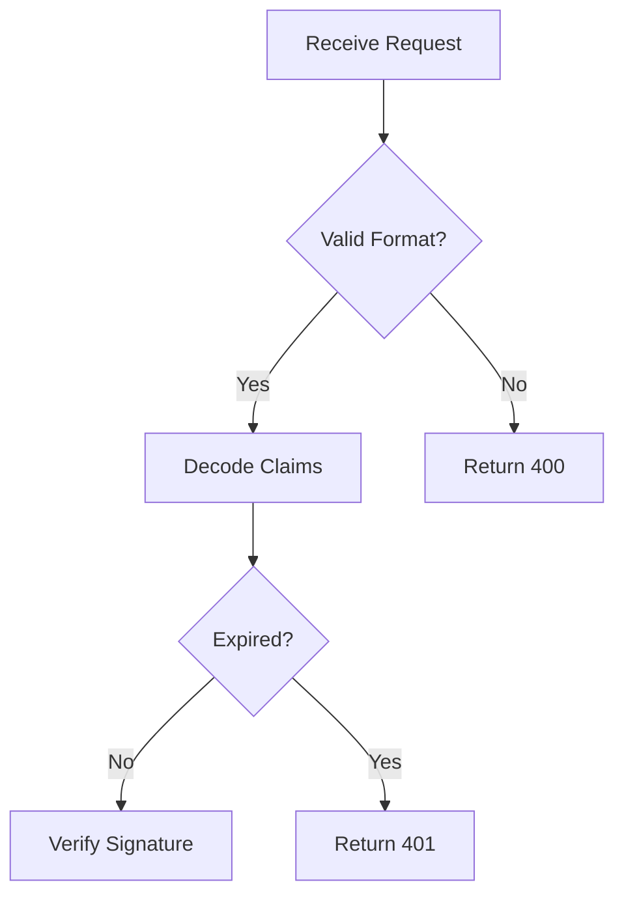

# Writing MAM Modules

> **Comprehensive guide to creating MAM modules.**

---

## Overview

This guide covers everything you need to know about writing MAM modules, from basic structure to advanced features.

---

## Basic Structure

Every MAM module has this structure:

```markdown
---
id: module-name
version: 2.0.0
name: Module Name
author: Your Name
runtime: python
---

## Purpose

What this module does.

## Python

```python
# Your code here
```
```

---

## Step-by-Step Guide

### Step 1: Create Front Matter

Start with YAML front matter containing module metadata:

```yaml
---
id: authentication
version: 2.0.0
name: Authentication Module
author: LifeJiggy
runtime: python
tags:
  - auth
  - security
description: >
  Secure JWT authentication module
dependencies:
  - crypto-utils@^1.0.0
permissions:
  - network
license: MIT
---
```

### Step 2: Add Purpose Section

The Purpose section is required:

```markdown
## Purpose

Authenticate users using JWT tokens.
Support multiple authentication methods.
```

### Step 3: Add Input/Output Definitions

Define what the module expects and produces:

```markdown
## Inputs

| Name | Type | Required | Default | Description |
|------|------|----------|---------|-------------|
| token | string | Yes | - | JWT token |
| audience | string | No | "api" | Expected audience |

## Outputs

| Name | Type | Description |
|------|------|-------------|
| claims | dict | Decoded token claims |
| error | string | Error message if failed |
```

### Step 4: Add Rules

Define behavioral constraints:

```markdown
## Rules

- Never expose secrets in logs
- Validate all inputs before processing
- Use constant-time comparison for tokens
```

### Step 5: Add Code

Include executable code blocks:

```markdown
## Python

```python
import jwt
from typing import Optional

def verify_token(token: str) -> Optional[dict]:
    try:
        return jwt.decode(token, SECRET_KEY, algorithms=["HS256"])
    except jwt.InvalidTokenError:
        return None
```
```

### Step 6: Add Examples

Provide usage examples:

```markdown
## Examples

```python
# Valid token
result = verify_token("eyJhbGciOiJIUzI1NiIs...")
print(result)  # {"sub": "123", "exp": 1700000000}

# Invalid token
result = verify_token("invalid")
print(result)  # None
```
```

### Step 7: Add Tests

Include automated tests:

```markdown
## Tests

```python
assert verify_token(valid_token) is not None
assert verify_token("invalid") is None
```
```

---

## Advanced Features

### Workflow Definition

Use ordered steps or Mermaid diagrams:

```markdown
## Workflow

1. Receive request with token
2. Validate token format
3. Decode token claims
4. Check expiration
5. Verify signature
6. Return claims or error
```

### Mermaid Diagrams

Add visual representations:

```markdown
## Mermaid


```

### Memory Management

Maintain state across executions:

```markdown
## Memory

```yaml
failed_attempts: 0
last_cleanup: "2026-01-15T10:30:00Z"
active_sessions: {}
```
```

### LLM Prompts

Define AI agent instructions:

```markdown
## Prompt

You are a secure authentication module. Follow these rules:

1. Always validate input before processing
2. Never expose internal errors to users
3. Log all failed authentication attempts
4. Return structured responses only
```

---

## Section Reference

| Section | Purpose | Required |
|---------|---------|----------|
| Purpose | Module objective | Yes |
| Inputs | Input parameters | No |
| Outputs | Output values | No |
| Rules | Behavioral constraints | No |
| Workflow | Process definition | No |
| Mermaid | Visual diagrams | No |
| Python | Python code | No |
| JavaScript | JavaScript code | No |
| Prompt | LLM instructions | No |
| Memory | Persistent state | No |
| Examples | Usage examples | No |
| Tests | Validation rules | No |
| References | External links | No |
| Dependencies | Required modules | No |
| Exports | Public interface | No |
| Imports | Required imports | No |
| Plugins | Plugin requirements | No |
| Permissions | Security requirements | No |
| Capabilities | System capabilities | No |

---

## Best Practices

### 1. Keep It Simple

```markdown
## Purpose

Authenticate users. (Good)

## Purpose

This module provides a comprehensive authentication system
that supports multiple authentication methods including
JWT tokens, OAuth, and basic authentication with
rate limiting and session management. (Too verbose)
```

### 2. Be Explicit

```markdown
## Rules

- Validate inputs (Bad)
- Validate all inputs before processing using the schema validator (Good)
```

### 3. Document Everything

```markdown
## Python

```python
def verify_token(token: str) -> Optional[dict]:
    """Verify a JWT token and return claims.
    
    Args:
        token: The JWT token to verify
        
    Returns:
        Decoded claims if valid, None otherwise
    """
```
```

### 4. Use Type Hints

```python
def process(data: List[str], config: Dict[str, Any]) -> Optional[str]:
    pass
```

### 5. Handle Errors

```python
def safe_process(data: str) -> dict:
    try:
        result = process(data)
        return {"success": True, "result": result}
    except Exception as e:
        return {"success": False, "error": str(e)}
```

---

## Validation

Validate your module before publishing:

```bash
mam validate my-module.mam.md
```

Fix any errors and warnings before proceeding.

---

## Next Steps

- [Code Blocks Guide](./codeblocks.md) — Advanced code block usage
- [Memory Guide](./memory.md) — Memory management
- [Workflows Guide](./workflows.md) — Complex workflows
- [Plugins Guide](./plugins.md) — Extending MAM
- [Testing Guide](./testing.md) — Writing tests

---

**Last Updated:** 2026-07-24
**MAM Version:** 1.0.0
