# MAM Documentation Index

> **Complete documentation for MAM (Machine Agent Modules)**

---

## Quick Links

| Document | Description |
|----------|-------------|
| [MAM.md](../MAM.md) | The complete MAM system overview |
| [README.md](../README.md) | Project introduction and quick start |
| [ARCHITECTURE.md](../ARCHITECTURE.md) | System architecture |
| [plan.md](../plan.md) | Project plan (v1) |
| [plan-v2.md](../plan-doc/plan-v2.md) | Project plan (v2) |
| [usage.md](./usage.md) | Complete usage guide |

---

## Documentation Structure

```mermaid
graph TB
    A[Documentation Index] --> B[Getting Started]
    A --> C[Specification]
    A --> D[Architecture]
    A --> E[Guides]
    A --> F[API Reference]
    A --> G[Examples]
    
    B --> B1[Installation]
    B --> B2[Quickstart]
    B --> B3[Tutorial]
    
    C --> C1[Overview]
    C --> C2[Sections]
    C --> C3[Front Matter]
    C --> C4[Code Blocks]
    C --> C5[Validation]
    
    D --> D1[Overview]
    D --> D2[Parser]
    D --> D3[AST]
    D --> D4[Validator]
    D --> D5[Runtime]
    D --> D6[Plugins]
    D --> D7[Registry]
    
    E --> E1[Creating Modules]
    E --> E2[Building Plugins]
    E --> E3[Custom Runtimes]
    E --> E4[CLI Usage]
    E --> E5[SDK Usage]
    E --> E6[Publishing]
    
    F --> F1[Parser API]
    F --> F2[AST API]
    F --> F3[Validator API]
    F --> F4[Runtime API]
    F --> F5[Plugin API]
    F --> F6[CLI API]
    
    G --> G1[Basic Module]
    G --> G2[Agent Module]
    G --> G3[Workflow Module]
    G --> G4[Integration]
```

---

## Core Documents

### System Overview

| Document | Path | Description |
|----------|------|-------------|
| MAM Overview | `MAM.md` | Complete system overview with diagrams |
| README | `README.md` | Project introduction and quick start |
| Architecture | `ARCHITECTURE.md` | System architecture details |
| Project Plan v1 | `plan.md` | Original project plan |
| Project Plan v2 | `plan-doc/plan-v2.md` | v2 evolution plan |

### Design Philosophy

| Document | Path | Description |
|----------|------|-------------|
| Brain | `docs/brain.md` | The intelligence layer |
| Scope | `docs/scope.md` | What MAM covers |
| Purpose | `docs/purpose.md` | Why MAM exists |
| Goal | `docs/goal.md` | What MAM aims to achieve |

### Usage

| Document | Path | Description |
|----------|------|-------------|
| Usage Guide | `docs/usage.md` | Complete usage guide |
| Quick Start | `docs/getting-started/quickstart.md` | Getting started |
| Installation | `docs/getting-started/installation.md` | Installation guide |
| Tutorial | `docs/getting-started/tutorial.md` | Step-by-step tutorial |

---

## Specification

| Document | Path | Description |
|----------|------|-------------|
| Specification | `spec/SPEC.md` | Formal MAM specification |
| Changelog | `spec/CHANGELOG.md` | Specification version history |
| Grammar | `spec/grammar/grammar.bnf` | BNF grammar definition |
| Tokens | `spec/grammar/tokens.md` | Token definitions |
| v2 Grammar | `spec/grammar/grammar-v2.bnf` | v2 DSL grammar |
| JSON Schema | `spec/schema/mam.schema.json` | JSON Schema for validation |
| Metadata Schema | `spec/schema/metadata.schema.json` | Metadata schema |

### Section Definitions

| Section | Path | Description |
|---------|------|-------------|
| Purpose | `spec/sections/purpose.md` | Module objective |
| Inputs | `spec/sections/inputs.md` | Input parameters |
| Outputs | `spec/sections/outputs.md` | Output values |
| Rules | `spec/sections/rules.md` | Behavioral constraints |
| Workflow | `spec/sections/workflow.md` | Process definition |
| Mermaid | `spec/sections/mermaid.md` | Visual diagrams |
| Python | `spec/sections/python.md` | Python code blocks |
| JavaScript | `spec/sections/javascript.md` | JavaScript code blocks |
| Prompt | `spec/sections/prompt.md` | LLM instructions |
| Memory | `spec/sections/memory.md` | Persistent state |
| Examples | `spec/sections/examples.md` | Usage demonstrations |
| Tests | `spec/sections/tests.md` | Validation rules |
| References | `spec/sections/references.md` | External links |
| Dependencies | `spec/sections/dependencies.md` | Module dependencies |
| Exports | `spec/sections/exports.md` | Public interface |
| Imports | `spec/sections/imports.md` | Required imports |
| Plugins | `spec/sections/plugins.md` | Plugin requirements |
| Permissions | `spec/sections/permissions.md` | Security permissions |
| Capabilities | `spec/sections/capabilities.md` | System capabilities |

---

## Architecture

| Document | Path | Description |
|----------|------|-------------|
| Overview | `docs/architecture/overview.md` | Architecture overview |
| Parser | `docs/architecture/parser.md` | Parser architecture |
| AST | `docs/architecture/ast.md` | AST architecture |
| Validator | `docs/architecture/validator.md` | Validator architecture |
| Runtime | `docs/architecture/runtime.md` | Runtime architecture |
| Plugins | `docs/architecture/plugins.md` | Plugin architecture |
| Registry | `docs/architecture/registry.md` | Registry architecture |

---

## Guides

| Document | Path | Description |
|----------|------|-------------|
| Creating Modules | `docs/guides/creating-modules.md` | How to create modules |
| Building Plugins | `docs/guides/building-plugins.md` | How to build plugins |
| Custom Runtimes | `docs/guides/custom-runtimes.md` | How to add runtimes |
| CLI Usage | `docs/guides/cli-usage.md` | CLI command guide |
| SDK Usage | `docs/guides/sdk-usage.md` | SDK usage guide |
| Publishing | `docs/guides/publishing.md` | How to publish modules |

---

## API Reference

| Document | Path | Description |
|----------|------|-------------|
| Parser API | `docs/api/parser-api.md` | Parser API reference |
| AST API | `docs/api/ast-api.md` | AST API reference |
| Validator API | `docs/api/validator-api.md` | Validator API reference |
| Runtime API | `docs/api/runtime-api.md` | Runtime API reference |
| Plugin API | `docs/api/plugin-api.md` | Plugin API reference |
| CLI API | `docs/api/cli-api.md` | CLI API reference |

---

## Examples

| Document | Path | Description |
|----------|------|-------------|
| Basic Module | `docs/examples/basic-module.md` | Simple module example |
| Agent Module | `docs/examples/agent-module.md` | AI agent example |
| Workflow Module | `docs/examples/workflow-module.md` | Workflow example |
| Integration | `docs/examples/integration.md` | Integration example |
| Authentication | `modules/examples/authentication.mam.md` | Auth module |
| Bug Hunter | `modules/examples/bug-hunter.mam.md` | Multi-agent system |

---

## CLI Commands

| Command | Description | Guide |
|---------|-------------|-------|
| `mam init` | Initialize module | [Guide](usage.md#initialize-module) |
| `mam build` | Build module | [Guide](usage.md#build-module) |
| `mam validate` | Validate module | [Guide](usage.md#validate-module) |
| `mam lint` | Lint module | [Guide](usage.md#lint-module) |
| `mam format` | Format module | [Guide](usage.md#format-module) |
| `mam compile` | Compile module | [Guide](usage.md#compile-module) |
| `mam run` | Run module | [Guide](usage.md#run-module) |
| `mam test` | Test module | [Guide](usage.md#test-module) |
| `mam graph` | Show graph | [Guide](usage.md#show-graph) |
| `mam ast` | Show AST | [Guide](usage.md#display-ast) |
| `mam doctor` | Check environment | [Guide](usage.md#check-environment) |
| `mam docs` | Generate docs | [Guide](usage.md#generate-docs) |
| `mam export` | Export module | [Guide](usage.md#export-module) |
| `mam install` | Install deps | [Guide](usage.md#install-dependencies) |
| `mam publish` | Publish module | [Guide](usage.md#publish-module) |
| `mam serve` | Start server | [Guide](usage.md#start-dev-server) |
| `mam migrate` | Migrate module | [Guide](usage.md#migrate-module) |

---

## v2 DSL Reference

| Topic | Description | Guide |
|-------|-------------|-------|
| Module Declaration | `module Name` | [Guide](usage.md#module-declaration) |
| Type System | `type: agent\|tool\|memory\|...` | [Guide](usage.md#type-system) |
| Edge Syntax | `Source -> Target` | [Guide](usage.md#edge-syntax) |
| Tool References | `tools: - name` | [Guide](usage.md#tool-references) |
| Memory References | `memory: shared` | [Guide](usage.md#memory-references) |
| Handoff Syntax | `handoff: - Agent` | [Guide](usage.md#handoff-syntax) |
| Permission Syntax | `permissions:` | [Guide](usage.md#permission-syntax) |
| Allow/Deny | `allow: - item` | [Guide](usage.md#allowdeny-syntax) |
| Steps/Edges | `steps:` / `edges:` | [Guide](usage.md#stepsedges-syntax) |
| Members | `members: - Agent` | [Guide](usage.md#members-syntax) |

---

## Contributing

| Document | Path | Description |
|----------|------|-------------|
| Contributing | `CONTRIBUTING.md` | Contribution guidelines |
| Development | `docs/contributing/development.md` | Development setup |
| Testing | `docs/contributing/testing.md` | Testing guide |
| Release | `docs/contributing/release.md` | Release process |
| Code of Conduct | `docs/contributing/code-of-conduct.md` | Community guidelines |

---

## Support

- **Issues:** GitHub Issues
- **Discussions:** GitHub Discussions
- **Documentation:** This index
- **Examples:** `modules/examples/`

---

**Last Updated:** 2026-07-24
**Version:** 2.0.0