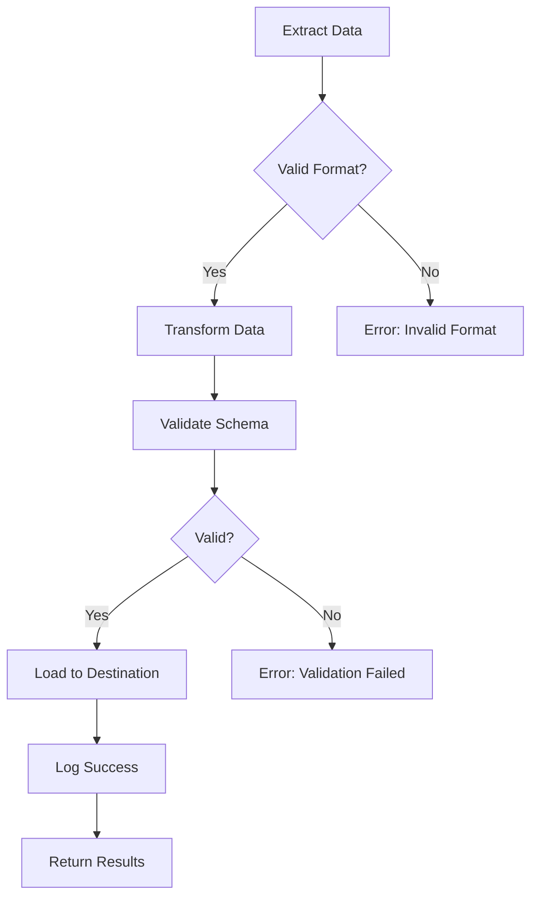

# Specification Examples

> **Complete examples of MAM modules.**

---

## Minimal Module

The simplest valid MAM module:

```markdown
---
id: hello
version: 1.0.0
name: Hello
author: LifeJiggy
runtime: python
---

## Purpose

A simple hello world module.

## Python

```python
def greet(name: str) -> str:
    return f"Hello, {name}!"
```
```

---

## Basic Module

A module with inputs, outputs, and rules:

```markdown
---
id: greeting
version: 1.0.0
name: Greeting Module
author: LifeJiggy
runtime: python
tags:
  - greeting
  - example
---

## Purpose

Generate personalized greetings in multiple languages.

## Inputs

| Name | Type | Required | Default | Description |
|------|------|----------|---------|-------------|
| name | string | Yes | - | Person to greet |
| language | string | No | "en" | Language code |

## Outputs

| Name | Type | Description |
|------|------|-------------|
| greeting | string | Formatted greeting |
| success | boolean | Whether greeting succeeded |

## Rules

- Always return a string greeting
- Support at least 3 languages
- Never expose internal errors

## Python

```python
def greet(name: str, language: str = "en") -> dict:
    greetings = {
        "en": f"Hello, {name}!",
        "es": f"Hola, {name}!",
        "fr": f"Bonjour, {name}!",
    }
    return {
        "greeting": greetings.get(language, greetings["en"]),
        "success": True,
    }
```

## Examples

```python
# English
result = greet("World")
print(result["greeting"])  # Hello, World!

# Spanish
result = greet("Mundo", "es")
print(result["greeting"])  # Hola, Mundo!
```

## Tests

```python
assert greet("World")["success"] == True
assert greet("World")["greeting"] == "Hello, World!"
assert greet("Mundo", "es")["greeting"] == "Hola, Mundo!"
```
```

---

## Agent Module

An AI agent module with prompt and memory:

```markdown
---
id: customer-support
version: 1.0.0
name: Customer Support Agent
author: LifeJiggy
runtime: python
tags:
  - agent
  - support
  - ai
permissions:
  - network
---

## Purpose

AI agent that handles customer support queries with memory of past interactions.

## Inputs

| Name | Type | Required | Description |
|------|------|----------|-------------|
| query | string | Yes | Customer query |
| session_id | string | Yes | Session identifier |

## Outputs

| Name | Type | Description |
|------|------|-------------|
| response | string | Agent response |
| actions | list | Actions taken |

## Rules

- Always be polite and professional
- Escalate complex issues to humans
- Remember past interactions
- Never share internal information
- Log all interactions

## Prompt

You are a helpful customer support agent. Your role is to:

1. Understand customer queries
2. Provide accurate information
3. Resolve issues when possible
4. Escalate when necessary

When responding:
- Use a friendly, professional tone
- Be concise but thorough
- Reference past interactions when relevant
- Offer next steps

## Memory

```yaml
interactions: []
known_issues: {}
escalation_count: 0
```

## Python

```python
def handle_query(query: str, session_id: str, memory: dict) -> dict:
    # Store interaction
    memory["interactions"].append({
        "query": query,
        "session_id": session_id,
        "timestamp": datetime.now().isoformat()
    })
    
    # Process query
    response = generate_response(query, memory)
    
    return {
        "response": response,
        "actions": ["logged_interaction"]
    }
```

## Workflow

1. Receive customer query
2. Check memory for context
3. Generate response
4. Store interaction in memory
5. Return response

## Examples

```python
# First interaction
memory = {"interactions": [], "known_issues": {}}
result = handle_query("How do I reset my password?", "session-1", memory)
print(result["response"])

# Follow-up (memory retains context)
result = handle_query("I still can't login", "session-1", memory)
print(result["response"])
```
```

---

## Workflow Module

A complex workflow with Mermaid diagrams:

```markdown
---
id: data-pipeline
version: 2.0.0
name: Data Processing Pipeline
author: LifeJiggy
runtime: python
tags:
  - pipeline
  - etl
  - data
permissions:
  - network
  - filesystem
---

## Purpose

ETL pipeline that extracts, transforms, and loads data from multiple sources.

## Inputs

| Name | Type | Required | Description |
|------|------|----------|-------------|
| source | string | Yes | Data source URL |
| format | string | No | Output format (json, csv) |

## Outputs

| Name | Type | Description |
|------|------|-------------|
| records | integer | Number of records processed |
| output_path | string | Path to output file |

## Workflow



## Rules

- Validate data before transformation
- Log all errors with context
- Retry failed operations 3 times
- Maintain data lineage

## Python

```python
def extract(url: str) -> list:
    """Extract data from source."""
    response = requests.get(url)
    return response.json()

def transform(data: list) -> list:
    """Transform extracted data."""
    return [transform_record(r) for r in data]

def load(data: list, format: str) -> str:
    """Load transformed data."""
    path = f"output.{format}"
    with open(path, "w") as f:
        json.dump(data, f)
    return path

def pipeline(source: str, format: str = "json") -> dict:
    """Main pipeline function."""
    data = extract(source)
    transformed = transform(data)
    output_path = load(transformed, format)
    return {
        "records": len(transformed),
        "output_path": output_path
    }
```
```

---

## Plugin Module

A module that declares plugin requirements:

```markdown
---
id: custom-validator
version: 1.0.0
name: Custom Validation Plugin
author: LifeJiggy
runtime: python
tags:
  - plugin
  - validation
---

## Purpose

Custom validation rules for domain-specific modules.

## Plugins

- yaml-validator@^1.0.0
- mermaid-renderer@^1.0.0

## Rules

- All dates must be ISO 8601 format
- All emails must be valid
- All URLs must be HTTPS

## Python

```python
def validate_date(date_str: str) -> bool:
    """Validate ISO 8601 date format."""
    try:
        datetime.fromisoformat(date_str)
        return True
    except ValueError:
        return False

def validate_email(email: str) -> bool:
    """Validate email format."""
    pattern = r'^[a-zA-Z0-9._%+-]+@[a-zA-Z0-9.-]+\.[a-zA-Z]{2,}$'
    return bool(re.match(pattern, email))

def validate_url(url: str) -> bool:
    """Validate HTTPS URL format."""
    return url.startswith('https://')
```
```

---

## Security Module

A module with strict permissions:

```markdown
---
id: secret-manager
version: 1.0.0
name: Secret Manager
author: LifeJiggy
runtime: python
tags:
  - security
  - secrets
permissions:
  - filesystem
  - network
---

## Purpose

Securely manage and retrieve secrets from a vault.

## Permissions

- filesystem: read-only access to config
- network: HTTPS only
- cpu: max 50% for 10 seconds
- memory: max 128MB

## Rules

- Never log secrets
- Never expose secrets in errors
- Use constant-time comparison
- Rotate secrets every 90 days
- Encrypt at rest and in transit

## Python

```python
import os
from typing import Optional

def get_secret(name: str) -> Optional[str]:
    """Retrieve a secret from the vault."""
    # Never log the secret value
    print(f"Retrieving secret: {name}")
    
    secret = os.environ.get(f"SECRET_{name.upper()}")
    if secret is None:
        raise ValueError(f"Secret not found: {name}")
    
    return secret

def compare_secrets(a: str, b: str) -> bool:
    """Constant-time secret comparison."""
    import hmac
    return hmac.compare_digest(a.encode(), b.encode())
```
```

---

## Module with Dependencies

A module that depends on other modules:

```markdown
---
id: auth-api
version: 1.0.0
name: Authentication API
author: LifeJiggy
runtime: python
tags:
  - api
  - auth
dependencies:
  - secret-manager@^1.0.0
  - logging@^2.0.0
  - rate-limiter@^1.0.0
---

## Purpose

REST API for user authentication.

## Dependencies

- secret-manager@^1.0.0
- logging@^2.0.0
- rate-limiter@^1.0.0

## Imports

- jwt
- hashlib
- time
- json

## Python

```python
def authenticate(token: str) -> dict:
    """Authenticate a user token."""
    # Verify token
    claims = jwt.decode(token, get_secret("JWT_KEY"))
    
    # Rate limit check
    if rate_limiter.is_limited(claims["sub"]):
        raise RateLimitError("Too many attempts")
    
    # Log success
    logging.info(f"User authenticated: {claims['sub']}")
    
    return claims
```
```

---

## References

- [Specification Overview](./overview.md)
- [Section Types](./sections.md)
- [Front Matter](./frontmatter.md)
- [Code Blocks](./codeblocks.md)

---

**Last Updated:** 2026-07-24
**MAM Version:** 1.0.0
