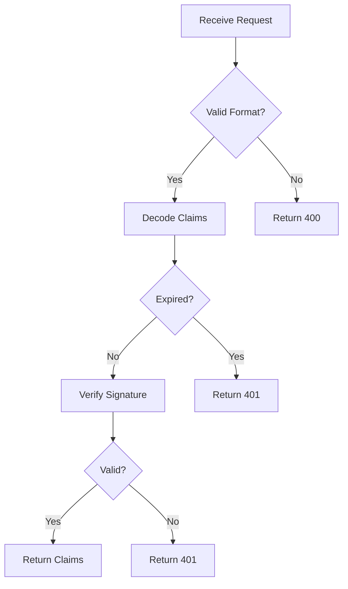
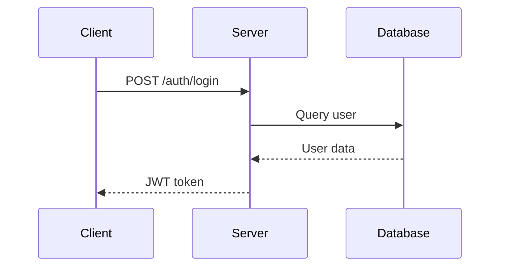

# Section Types Reference

> **Complete reference for all MAM section types.**

---

## Overview

MAM sections are Markdown headings (`##`) that define structured content areas. Each section type has specific semantics and content requirements.

---

## Purpose (Required)

The module's objective. Every MAM module MUST include this section.

```markdown
## Purpose

Authenticate users securely using JWT tokens.
Support multiple authentication methods.
```

### Rules

- MUST be present in every module
- SHOULD be a concise description (1-3 paragraphs)
- MUST NOT contain executable code
- SHOULD be readable without tooling

---

## Inputs

Defines expected input parameters.

```markdown
## Inputs

| Name | Type | Required | Default | Description |
|------|------|----------|---------|-------------|
| token | string | Yes | - | JWT token |
| audience | string | No | "api" | Expected audience |
| timeout | integer | No | 30 | Timeout in seconds |
```

### Table Columns

| Column | Required | Description |
|--------|----------|-------------|
| Name | Yes | Parameter name |
| Type | Yes | Data type |
| Required | Yes | Whether parameter is required |
| Default | No | Default value |
| Description | Yes | Parameter description |

---

## Outputs

Defines expected output values.

```markdown
## Outputs

| Name | Type | Description |
|------|------|-------------|
| claims | dict | Decoded token claims |
| error | string | Error message if failed |
| status | integer | HTTP status code |
```

---

## Rules

Behavioral constraints the module must follow.

```markdown
## Rules

- Never expose secrets in logs
- Validate all inputs before processing
- Use constant-time comparison for tokens
- Rotate secrets every 90 days
- Log all authentication attempts
```

### Format

- MUST be a Markdown list
- Each item MUST be a constraint
- SHOULD be actionable and specific

---

## Workflow

Process definition using ordered steps or Mermaid diagrams.

```markdown
## Workflow

1. Receive request with token
2. Validate token format
3. Decode token claims
4. Check token expiration
5. Verify signature
6. Extract user permissions
7. Return claims or error
```

### With Mermaid

```markdown
## Workflow


```

---

## Mermaid

Visual diagrams using Mermaid syntax.

```markdown
## Mermaid


```

---

## Python

Python code blocks.

```markdown
## Python

```python
from typing import Optional
import jwt

def verify_token(token: str) -> Optional[dict]:
    try:
        return jwt.decode(token, SECRET_KEY, algorithms=["HS256"])
    except jwt.InvalidTokenError:
        return None
```
```

### Metadata Comments

```python
# @mam:exec
# @mam:timeout=30s
# @mam:memory=256MB
# @mam:requires=network
```

---

## JavaScript

JavaScript/TypeScript code blocks.

```markdown
## JavaScript

```javascript
function verifyToken(token) {
  try {
    return jwt.verify(token, SECRET_KEY);
  } catch (error) {
    return null;
  }
}
```
```

---

## Prompt

LLM instructions for AI agents.

```markdown
## Prompt

You are a secure authentication module. Follow these rules:

1. Always validate input before processing
2. Never expose internal errors to users
3. Log all failed authentication attempts
4. Return structured responses only
5. Use constant-time string comparison

When handling tokens:
- Decode the header first
- Verify the signature
- Check expiration
- Validate audience
- Extract permissions
```

---

## Memory

Persistent state that survives between executions.

```markdown
## Memory

```yaml
failed_attempts: 0
last_cleanup: "2026-01-15T10:30:00Z"
rate_limit_window: 300
active_sessions: {}
```
```

---

## Examples

Usage demonstrations.

```markdown
## Examples

### Basic Authentication

```python
result = verify_token("eyJhbGciOiJIUzI1NiIs...")
print(result)  # {"sub": "123", "exp": 1700000000}
```

### Invalid Token

```python
result = verify_token("invalid-token")
print(result)  # None
```
```

---

## Tests

Validation rules for automated testing.

```markdown
## Tests

```python
# Valid token
assert verify_token(valid_token) is not None

# Invalid token
assert verify_token("invalid") is None

# Expired token
assert verify_token(expired_token) is None

# Wrong audience
assert verify_token(wrong_audience_token) is None
```
```

---

## References

External links and documentation.

```markdown
## References

- [JWT Specification](https://tools.ietf.org/html/rfc7519)
- [OAuth 2.0](https://tools.ietf.org/html/rfc6749)
- [OWASP Authentication](https://cheatsheetseries.owasp.org/cheatsheets/Authentication_Cheat_Sheet.html)
```

---

## Dependencies

Required modules.

```markdown
## Dependencies

- crypto-utils@^1.2.0
- logging@^2.0.0
- rate-limiter@^1.0.0
```

---

## Exports

Public interface of the module.

```markdown
## Exports

- `verify_token(token: string) -> dict`
- `decode_claims(token: string) -> dict`
- `validate_audience(claims: dict, audience: string) -> bool`
```

---

## Imports

Required imports for the module.

```markdown
## Imports

- jwt
- hashlib
- time
- logging
```

---

## Plugins

Plugin requirements.

```markdown
## Plugins

- yaml-validator@^1.0.0
- mermaid-renderer@^1.0.0
```

---

## Permissions

Security requirements.

```markdown
## Permissions

- network: outbound HTTP requests
- filesystem: read-only access to config
- cpu: max 50% for 30 seconds
- memory: max 256MB
```

---

## Capabilities

System capabilities required.

```markdown
## Capabilities

- python3.10+
- jwt library
- network access
```

---

## Section Ordering

Recommended order (not enforced unless strict mode):

1. Purpose
2. Inputs
3. Outputs
4. Rules
5. Workflow
6. Mermaid
7. Python / JavaScript
8. Prompt
9. Memory
10. Examples
11. Tests
12. References
13. Dependencies
14. Exports
15. Imports
16. Plugins
17. Permissions
18. Capabilities

---

## Custom Sections

Plugins can register custom section types:

```typescript
interface SectionDefinition {
  name: string;
  description: string;
  required: boolean;
  contentTypes: ContentType[];
  validator?: (content: ContentNode[]) => ValidationResult[];
}
```

---

## References

- [Specification Overview](./overview.md)
- [Front Matter](./frontmatter.md)
- [Code Blocks](./codeblocks.md)

---

**Last Updated:** 2026-07-24
**MAM Version:** 1.0.0
