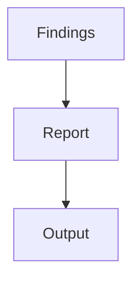

# Reporter

## Purpose

Turns ranked findings into a structured report suitable for stakeholders.

## Inputs

| Name | Type | Required | Description |
|------|------|----------|-------------|
| findings | list | Yes | Ranked findings from analysis |

## Outputs

| Name | Type | Description |
|------|------|-------------|
| report | object | Structured report |

## Capabilities

### report

Generate a structured report from findings.

## Rules

- Findings must be validated before reporting.

## Workflow



## Python

```python
def report(findings: list) -> dict:
    """Build a structured report from findings."""
    return {"count": len(findings), "findings": findings}
```

## Tests

### Input

```yaml
findings:
  - severity: medium
```

### Expected

```yaml
report: present
```

## References

- MAM documentation
