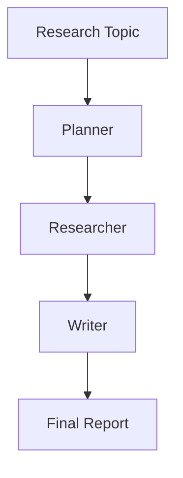

# Research Agent System

## Purpose

A coordinated multi agent system where a Planner delegates research tasks to a
Researcher agent, which produces structured findings that a Writer agent
compiles into a final report.

## Inputs

| Name | Type | Required | Description |
|------|------|----------|-------------|
| topic | string | Yes | Research topic to investigate |
| depth | int | No | Maximum number of sub questions |

## Outputs

| Name | Type | Description |
|------|------|-------------|
| report | string | Final compiled research report |

## Capabilities

### plan

Decompose a research topic into focused sub questions.

### research

Gather structured findings for each sub question.

### write

Compile findings into a coherent final report.

## Rules

- Operate only against authorized sources.
- Preserve citations for every finding.
- Validate results before reporting.

## System Definition

module ResearchSystem

type:
    system

agents:
    - Planner
    - Researcher
    - Writer

edges:
    Planner -> Researcher
    Researcher -> Writer

memory:
    shared: ResearchMemory

policy:
    ReadOnlyPolicy

## Agent: Planner

module Planner

type:
    agent

role:
    Planning

goal:
    Decompose a research topic into focused sub-questions and assign them to the Researcher

memory:
    shared

tools:
    - PlannerTool

handoff:
    - Researcher

## Agent: Researcher

module Researcher

type:
    agent

role:
    Research

goal:
    Gather information for each sub-question from available sources and return structured findings

memory:
    shared

tools:
    - Python
    - Search

handoff:
    - Writer

## Agent: Writer

module Writer

type:
    agent

role:
    Writing

goal:
    Synthesize all findings into a coherent, well-structured report

memory:
    shared

tools:
    - Python

## Tool: Search

module SearchTool

type:
    tool

provider:
    search-api

permissions:
    network: internet

capabilities:
    - search
    - summarize

## Tool: PlannerTool

module PlannerTool

type:
    tool

provider:
    planner

capabilities:
    - plan
    - prioritize

## Tool: Python

module PythonRuntime

type:
    tool

provider:
    python

permissions:
    python: sandbox

capabilities:
    - execute
    - analyze

## Memory: ResearchMemory

module ResearchMemory

type:
    memory

format:
    vector

backend:
    sqlite

scope:
    workspace

ttl:
    12h

## Policy: ReadOnlyPolicy

module ReadOnlyPolicy

type:
    policy

allow:
    - search
    - python

deny:
    - shell.rm
    - network.internal
    - filesystem.write

permissions:
    filesystem: read
    network: internet
    python: sandbox

## Workflow



## Python

```python
def research(topic: str, depth: int = 3) -> dict:
    """Plan, research and write a structured report for a topic."""
    return {"topic": topic, "sub_questions": depth, "report": f"Report on {topic}"}
```

## Tests

### Input

```yaml
topic: MAM
```

### Expected

```yaml
report: present
```

```python
def test_research() -> None:
    result = research("MAM")
    assert result["report"]
```

## Examples

```python
result = research("Markdown as Module", depth=2)
print(result["report"])
```

## References

- MAM documentation
- plan-doc/full-mam.md