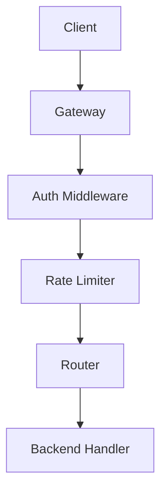

# API Gateway with Rate Limiting

## Purpose

A modular API gateway that enforces rate limits, authenticates incoming
requests, and routes them to appropriate backend handlers. Each component is a
distinct tool module with well defined responsibilities and permissions.

## Inputs

| Name | Type | Required | Description |
|------|------|----------|-------------|
| method | string | Yes | HTTP method of the request |
| path | string | Yes | Request path to route |
| token | string | No | Bearer token or API key |

## Outputs

| Name | Type | Description |
|------|------|-------------|
| status | int | HTTP status code of the response |
| body | object | Response payload |

## Capabilities

### receive-request

Accept incoming HTTP requests for processing.

### check-limit

Enforce per client rate limits using a sliding window.

### validate-token

Validate bearer tokens and API keys.

### match-route

Map requests to backend handlers by path and method.

## Rules

- Reject unauthenticated requests before routing.
- Enforce rate limits before forwarding.
- Never expose secrets in responses.

## System Definition

module APIGateway

type:
    system

modules:
    - Gateway
    - RateLimiter
    - AuthMiddleware
    - Router

edges:
    Gateway -> AuthMiddleware
    AuthMiddleware -> RateLimiter
    RateLimiter -> Router

## Module: Gateway

module Gateway

type:
    tool

provider:
    python

role:
    Orchestrator

goal:
    Accept incoming HTTP requests and orchestrate the auth, rate-limit, and routing pipeline

permissions:
    network: inbound
    exec: true

capabilities:
    - receive-request
    - forward-request
    - return-response

## Module: RateLimiter

module RateLimiter

type:
    tool

provider:
    python

role:
    Throttling

goal:
    Enforce per-client rate limits using a sliding window algorithm and reject excess requests

permissions:
    filesystem: read
    exec: true

capabilities:
    - check-limit
    - record-request
    - get-remaining

## Module: AuthMiddleware

module AuthMiddleware

type:
    tool

provider:
    python

role:
    Authentication

goal:
    Validate bearer tokens and API keys, rejecting unauthenticated requests before they reach backend services

permissions:
    network: internet
    exec: true

capabilities:
    - validate-token
    - extract-claims
    - reject-unauthorized

## Module: Router

module Router

type:
    tool

provider:
    python

role:
    Routing

goal:
    Map incoming requests to backend handlers based on path, method, and versioning rules

permissions:
    network: internal
    exec: true

capabilities:
    - match-route
    - forward-to-backend
    - handle-not-found

## Policy: GatewayPolicy

module GatewayPolicy

type:
    policy

allow:
    - network.inbound
    - network.internal
    - filesystem.read
    - exec

deny:
    - shell.rm
    - filesystem.write
    - network.external

permissions:
    network: inbound, internal
    filesystem: read
    exec: true

## Workflow



## Python

```python
def handle_request(method: str, path: str, token: str | None = None) -> dict:
    """Authenticate, rate limit and route a single request."""
    if not token:
        return {"status": 401, "body": {"error": "Unauthorized"}}
    return {"status": 200, "body": {"method": method, "path": path}}
```

## Tests

### Input

```yaml
method: GET
path: /api/hello
token: secret-token-123
```

### Expected

```yaml
status: 200
```

```python
def test_handle_request() -> None:
    response = handle_request("GET", "/api/hello", "secret-token-123")
    assert response["status"] == 200
```

## Examples

```python
response = handle_request("GET", "/api/user", "secret-token-123")
print(response["status"])
```

## References

- MAM documentation
- plan-doc/full-mam.md