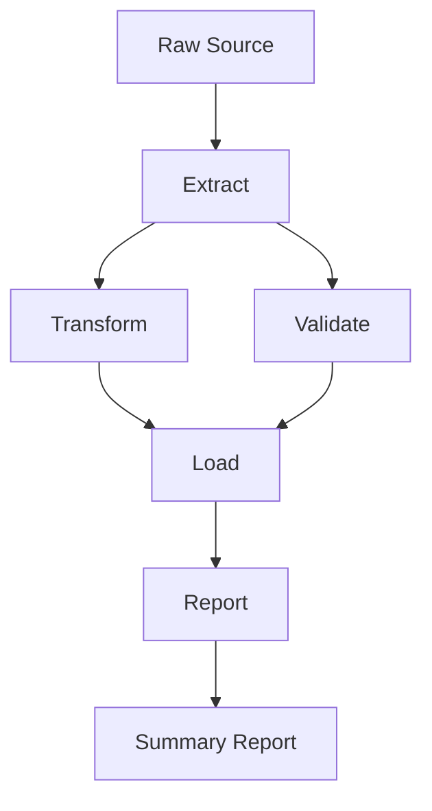

# ETL Data Pipeline

## Purpose

A robust ETL workflow that extracts raw data, applies parallel transformation
and validation steps, loads clean records into a target store, and generates a
summary report. Parallel execution of Transform and Validate improves
throughput while maintaining data quality guarantees.

## Inputs

| Name | Type | Required | Description |
|------|------|----------|-------------|
| source | list | Yes | Raw data records to process |
| transform_rules | list | No | Rules for the transform step |

## Outputs

| Name | Type | Description |
|------|------|-------------|
| report | object | Pipeline summary report |

## Capabilities

### extract

Read and normalize raw source records.

### transform

Clean, map and aggregate records.

### validate

Check constraints and verify types.

### load

Write valid records into the target store.

### report

Summarize pipeline results.

## Rules

- Preserve every record through the pipeline.
- Reject invalid records before loading.
- Report all errors in the summary.

## Workflow Definition

module ETLPipeline

type:
    workflow

steps:
    - Extract
    - Branch:
        parallel:
            - Transform
            - Validate
    - Load
    - Report

## Step: Extract

module Extract

type:
    tool

provider:
    python

capabilities:
    - read
    - parse
    - normalize

## Step: Transform

module Transform

type:
    tool

provider:
    python

capabilities:
    - clean
    - map
    - aggregate

## Step: Validate

module Validate

type:
    tool

provider:
    python

capabilities:
    - check-constraints
    - verify-types
    - detect-outliers

## Step: Load

module Load

type:
    tool

provider:
    python

capabilities:
    - write
    - upsert
    - index

## Step: Report

module Report

type:
    tool

provider:
    python

capabilities:
    - summarize
    - export

## Workflow



## Python

```python
def run_pipeline(source: list, transform_rules: list | None = None) -> dict:
    """Extract, transform, validate and load a batch of records."""
    rules = transform_rules or []
    extracted = len(source)
    loaded = max(0, extracted - len(rules))
    return {"extracted": extracted, "transformed": extracted, "loaded": loaded, "errors": []}
```

## Tests

### Input

```yaml
source:
  - name: Alice
  - name: Bob
```

### Expected

```yaml
loaded: 2
```

```python
def test_run_pipeline() -> None:
    report = run_pipeline([{"name": "Alice"}, {"name": "Bob"}])
    assert report["loaded"] == 2
```

## Examples

```python
report = run_pipeline([{"name": "Alice"}, {"name": "Bob"}])
print(report["extracted"])
```

## References

- MAM documentation
- plan-doc/full-mam.md