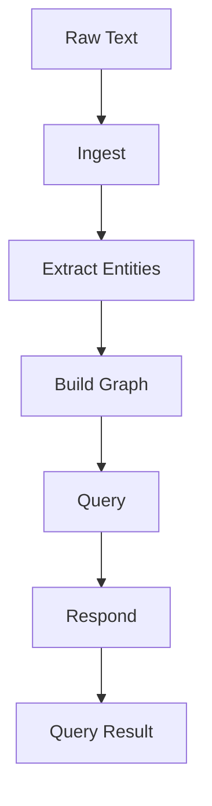

# Knowledge Graph Builder

## Purpose

A structured workflow that processes raw text into a queryable knowledge
graph. Each step progressively enriches the data: extraction identifies
entities and relations, graph construction links them, and the query step
supports natural language lookups.

## Inputs

| Name | Type | Required | Description |
|------|------|----------|-------------|
| text | string | Yes | Raw text to process |
| query_name | string | No | Entity name to look up |

## Outputs

| Name | Type | Description |
|------|------|-------------|
| entity_count | int | Number of entities in the graph |
| relationship_count | int | Number of relationships in the graph |

## Capabilities

### ingest

Read and normalize raw text.

### extract-entities

Detect named entities and relationships.

### build-graph

Create nodes and edges from extracted data.

### query

Search and traverse the graph.

### respond

Format query results for the caller.

## Rules

- Operate only on provided text.
- Deduplicate entities before insertion.
- Validate results before responding.

## Workflow Definition

module KnowledgeGraphPipeline

type:
    workflow

steps:
    - Ingest
    - ExtractEntities
    - BuildGraph
    - Query
    - Respond

## Step: Ingest

module Ingest

type:
    tool

provider:
    python

capabilities:
    - read
    - normalize
    - chunk

## Step: ExtractEntities

module ExtractEntities

type:
    tool

provider:
    python

capabilities:
    - named-entity-recognition
    - relation-detection

## Step: BuildGraph

module BuildGraph

type:
    tool

provider:
    python

capabilities:
    - create-nodes
    - create-edges
    - deduplicate

## Step: Query

module Query

type:
    tool

provider:
    python

capabilities:
    - search
    - traverse
    - filter

## Step: Respond

module Respond

type:
    tool

provider:
    python

capabilities:
    - format
    - summarize

## Memory: KnowledgeMemory

module KnowledgeMemory

type:
    memory

format:
    vector

backend:
    sqlite

scope:
    workspace

ttl:
    24h

## Policy: ReadOnlyPolicy

module ReadOnlyPolicy

type:
    policy

allow:
    - python
    - knowledge-query

deny:
    - shell.rm
    - filesystem.write

permissions:
    filesystem: read
    python: sandbox

## Workflow



## Python

```python
def run_pipeline(text: str, query_name: str | None = None) -> dict:
    """Build a knowledge graph from text and optionally run a query."""
    entities = {"text": text}
    result = {"entity_count": len(entities), "relationship_count": 0}
    if query_name:
        result["query_result"] = {"found": query_name in text}
    return result
```

## Tests

### Input

```yaml
text: Alice works at Acme Corp.
```

### Expected

```yaml
entity_count: 1
```

```python
def test_run_pipeline() -> None:
    result = run_pipeline("Alice works at Acme Corp.")
    assert result["entity_count"] >= 1
```

## Examples

```python
result = run_pipeline("Alice works at Acme Corp.", query_name="Alice")
print(result["entity_count"])
```

## References

- MAM documentation
- plan-doc/full-mam.md