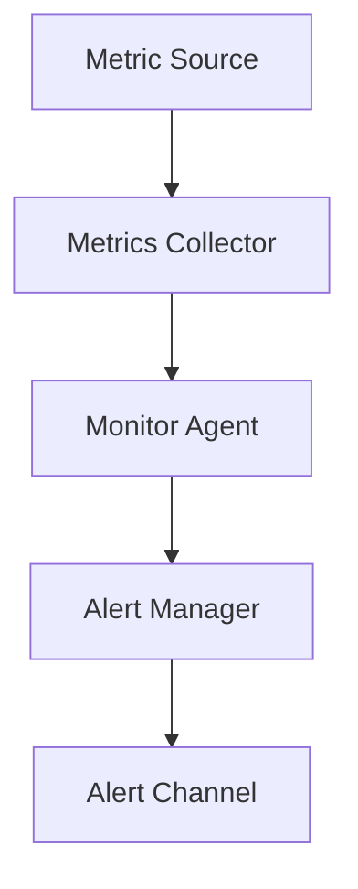

# System Monitoring Agent

## Purpose

An autonomous monitoring agent that continuously collects system metrics,
detects anomalies through statistical analysis and threshold comparison, and
dispatches alerts to configured channels. The system enforces a
MonitoringPolicy that allows read only observation while preventing
destructive actions.

## Inputs

| Name | Type | Required | Description |
|------|------|----------|-------------|
| metric_name | string | Yes | Metric to monitor |
| value | float | Yes | Observed metric value |
| thresholds | object | No | Anomaly thresholds |

## Outputs

| Name | Type | Description |
|------|------|-------------|
| summary | object | Metric and alert summary |
| alerts | list | Generated alerts |

## Capabilities

### collect

Gather system metrics at intervals.

### detect-anomalies

Detect anomalies with statistical analysis.

### send-alert

Dispatch alerts to configured channels.

## Rules

- Observe metrics without modifying state.
- Deduplicate repeated alerts.
- Prevent destructive actions.

## System Definition

module MonitoringSystem

type:
    system

modules:
    - MonitorAgent
    - AlertManager
    - MetricsCollector

edges:
    MonitorAgent -> MetricsCollector
    MonitorAgent -> AlertManager

## Module: MonitorAgent

module MonitorAgent

type:
    agent

role:
    Monitor

goal:
    Continuously observe system metrics, detect anomalies early, and trigger alerts before incidents escalate

permissions:
    network: outbound
    filesystem: read

tools:
    - Python

handoff:
    - AlertManager

## Module: AlertManager

module AlertManager

type:
    tool

provider:
    python

role:
    Alerting

goal:
    Dispatch structured alerts to configured channels (email, webhook, log) with severity classification and deduplication

permissions:
    network: outbound
    filesystem: write

capabilities:
    - send-alert
    - deduplicate
    - classify-severity

## Module: MetricsCollector

module MetricsCollector

type:
    tool

provider:
    python

role:
    Collection

goal:
    Gather system metrics including CPU usage, memory consumption, disk I/O, and network throughput at configurable intervals

permissions:
    filesystem: read
    exec: true

capabilities:
    - collect-cpu
    - collect-memory
    - collect-disk
    - collect-network

## Policy: MonitoringPolicy

module MonitoringPolicy

type:
    policy

allow:
    - python
    - metrics-read
    - alert-send
    - filesystem.read

deny:
    - shell.rm
    - filesystem.write
    - network.internal
    - process.kill

permissions:
    filesystem: read
    network: outbound
    python: sandbox

## Workflow



## Python

```python
def monitor_system(metric_name: str, value: float) -> dict:
    """Collect a metric and return an alert summary."""
    alerts = []
    if value > 90.0:
        alerts.append({"severity": "critical", "metric": metric_name})
    return {"summary": {"total_metrics": 1, "total_alerts": len(alerts)}, "alerts": alerts}
```

## Tests

### Input

```yaml
metric_name: cpu_percent
value: 95.0
```

### Expected

```yaml
total_alerts: 1
```

```python
def test_monitor_system() -> None:
    result = monitor_system("cpu_percent", 95.0)
    assert result["summary"]["total_alerts"] == 1
```

## Examples

```python
result = monitor_system("memory_percent", 88.0)
print(result["alerts"])
```

## References

- MAM documentation
- plan-doc/full-mam.md