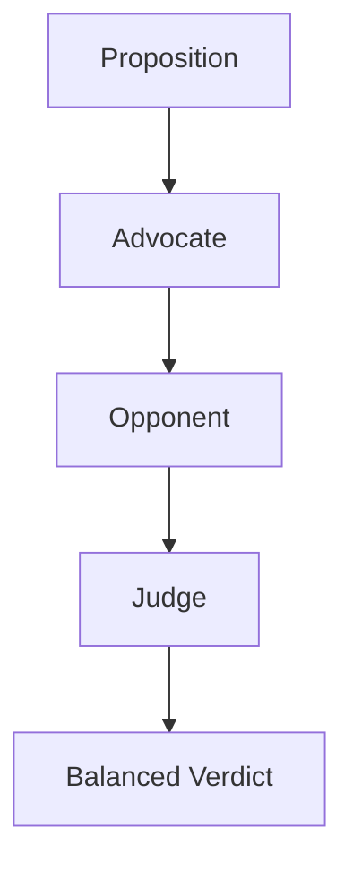

# Multi-Agent Debate System

## Purpose

A coordinated multi agent system that simulates structured debate. The
Advocate defends a proposition, the Opponent challenges it, and the Judge
assesses both arguments for logical soundness and evidence quality. Shared
memory ensures all agents have full context throughout the exchange.

## Inputs

| Name | Type | Required | Description |
|------|------|----------|-------------|
| proposition | string | Yes | Statement to debate |
| advocate_evidence | list | No | Evidence for the proposition |
| opponent_evidence | list | No | Evidence against the proposition |

## Outputs

| Name | Type | Description |
|------|------|-------------|
| winner | string | Winning side of the debate |
| reasoning | string | Explanation of the verdict |

## Capabilities

### argue

Construct a strong argument for a proposition.

### rebut

Challenge claims with counter evidence.

### judge

Evaluate both sides and render a verdict.

## Rules

- Never use personal attacks.
- Evaluate evidence objectively.
- Return a balanced verdict.

## System Definition

module DebateSystem

type:
    system

agents:
    - Advocate
    - Opponent
    - Judge

edges:
    Advocate -> Opponent
    Opponent -> Judge

memory:
    shared: DebateMemory

policy:
    DebatePolicy

## Agent: Advocate

module Advocate

type:
    agent

role:
    Debate

goal:
    Construct the strongest possible argument in favor of the given proposition using evidence, logic, and rhetorical clarity

memory:
    shared

tools:
    - Python

handoff:
    - Opponent

## Agent: Opponent

module Opponent

type:
    agent

role:
    Debate

goal:
    Challenge the Advocate's argument by identifying logical fallacies, presenting counter-evidence, and offering alternative interpretations

memory:
    shared

tools:
    - Python

handoff:
    - Judge

## Agent: Judge

module Judge

type:
    agent

role:
    Evaluation

goal:
    Objectively evaluate both arguments on evidence quality, logical consistency, and persuasiveness to render a balanced verdict

memory:
    shared

tools:
    - Python

## Tool: Python

module PythonRuntime

type:
    tool

provider:
    python

permissions:
    python: sandbox

capabilities:
    - execute
    - analyze
    - evaluate

## Memory: DebateMemory

module DebateMemory

type:
    memory

format:
    key-value

backend:
    sqlite

scope:
    session

ttl:
    1h

## Policy: DebatePolicy

module DebatePolicy

type:
    policy

allow:
    - python
    - debate

deny:
    - personal-attacks
    - ad-hominem
    - hate-speech

permissions:
    filesystem: read
    python: sandbox

## Workflow



## Python

```python
def run_debate(proposition: str, advocate_evidence: list | None = None,
               opponent_evidence: list | None = None) -> dict:
    """Run a structured debate and return the verdict."""
    adv = len(advocate_evidence or [])
    opp = len(opponent_evidence or [])
    if adv > opp:
        return {"winner": "advocate", "reasoning": "Stronger evidence"}
    if opp > adv:
        return {"winner": "opponent", "reasoning": "Stronger counter evidence"}
    return {"winner": "tie", "reasoning": "Balanced arguments"}
```

## Tests

### Input

```yaml
proposition: AI will transform work
```

### Expected

```yaml
winner: tie
```

```python
def test_run_debate() -> None:
    verdict = run_debate("AI will transform work")
    assert verdict["winner"] in ["advocate", "opponent", "tie"]
```

## Examples

```python
verdict = run_debate("AI will transform work",
                     ["Evidence A"], ["Evidence B"])
print(verdict["winner"])
```

## References

- MAM documentation
- plan-doc/full-mam.md