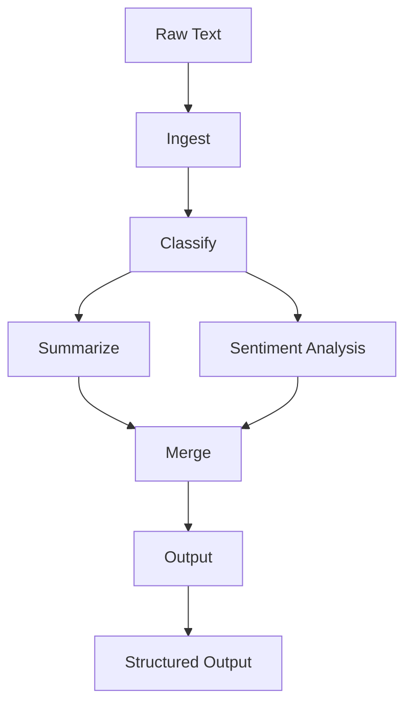

# Content Pipeline Workflow

## Purpose

An automated content pipeline that ingests raw text, classifies it, runs
parallel enrichment tasks for summarization and sentiment analysis, then
merges results into a final structured output.

## Inputs

| Name | Type | Required | Description |
|------|------|----------|-------------|
| text | string | Yes | Raw content to process |
| max_sentences | int | No | Maximum sentences in the summary |

## Outputs

| Name | Type | Description |
|------|------|-------------|
| content_type | string | Detected content type |
| summary | string | Extractive summary |
| sentiment | string | Detected sentiment label |

## Capabilities

### ingest

Normalize raw text input.

### classify

Detect the content type.

### summarize

Produce an extractive summary.

### analyze-sentiment

Score the sentiment of the content.

### merge

Combine results into a structured output.

## Rules

- Normalize input before analysis.
- Run enrichment steps in parallel.
- Return structured output only.

## Workflow Definition

module ContentPipeline

type:
    workflow

steps:
    - Ingest
    - Classify
    - Branch:
        parallel:
            - Summarize
            - SentimentAnalysis
    - Merge
    - Output

## Step: Ingest

module Ingest

type:
    tool

provider:
    python

capabilities:
    - read
    - normalize

## Step: Classify

module Classify

type:
    tool

provider:
    python

capabilities:
    - classify
    - tag

## Step: Summarize

module Summarize

type:
    tool

provider:
    python

capabilities:
    - summarize
    - extract-key-points

## Step: SentimentAnalysis

module SentimentAnalysis

type:
    tool

provider:
    python

capabilities:
    - analyze-sentiment
    - score

## Step: Merge

module Merge

type:
    tool

provider:
    python

capabilities:
    - merge
    - format

## Step: Output

module Output

type:
    tool

provider:
    python

capabilities:
    - write
    - export

## Workflow



## Python

```python
def run_pipeline(text: str, max_sentences: int = 3) -> dict:
    """Ingest, classify, enrich and merge content."""
    words = text.split()
    sentences = [s.strip() for s in text.split(".") if s.strip()]
    summary = ". ".join(sentences[:max_sentences])
    return {"content_type": "article", "summary": summary, "sentiment": "neutral",
            "word_count": len(words)}
```

## Tests

### Input

```yaml
text: This is a good test document.
```

### Expected

```yaml
content_type: article
```

```python
def test_run_pipeline() -> None:
    result = run_pipeline("This is a good test document.")
    assert result["word_count"] > 0
```

## Examples

```python
result = run_pipeline("MAM is a specification first project.")
print(result["summary"])
```

## References

- MAM documentation
- plan-doc/full-mam.md