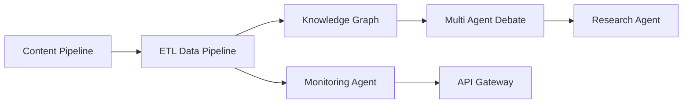

# Advanced System

## Purpose

Entry system that composes the project modules into a single advanced
demonstration: multi agent research, API gateway behavior, data pipelines,
knowledge graphs, monitoring, and structured debate.

## Modules

- Research Agent System
- API Gateway with Rate Limiting
- ETL Data Pipeline
- Knowledge Graph Builder
- System Monitoring Agent
- Multi-Agent Debate System
- Content Pipeline Workflow

## Capabilities

### orchestrate

Run the composed modules in dependency order.

## Rules

- All modules operate within the declared scope.
- Results must be validated before reporting.
- Permissions are enforced per module.

## Workflow



## Tests

### Input

```yaml
mode: demo
```

### Expected

```yaml
report: present
```

## References

- MAM documentation
- plan-doc/full-mam.md