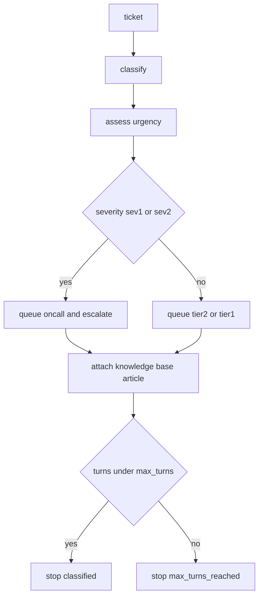

# Support Triage Agent

## Purpose

A concrete `agent`: the front desk of a SaaS support queue. It takes one inbound
ticket, works out what kind of problem it is, how urgent it is, and where it
should go, then stops. The agent is deliberately boring — no model calls, no
network — because the interesting part of an agent is not its intelligence but
its contract: what it is allowed to do, and the conditions under which it
declares itself finished.

The agent may call three tools: a knowledge base search, a customer context
lookup and a ticket note writer. It never deletes a ticket, never contacts the
customer and never changes account state.

## Inputs

| Name | Type | Required | Description |
|------|------|----------|-------------|
| ticket | object | Yes | The inbound ticket with `id`, `subject` and `body` |
| knowledge_base | object | No | Mapping of topic key to article title |
| max_turns | number | No | Maximum reasoning turns, defaults to 6 |

## Outputs

| Name | Type | Description |
|------|------|-------------|
| category | string | One of billing, technical, account, feature-request, other |
| severity | string | One of sev1, sev2, sev3, sev4 |
| queue | string | The destination queue: oncall, tier2 or tier1 |
| escalate | boolean | True when a human must look at the ticket |
| suggested_article | string | Knowledge base article title, empty when none matched |
| stop_reason | string | Why the agent finished: classified or max_turns_reached |

## Capabilities

### classify

Map a ticket to exactly one support category using an ordered keyword table.

### assess_urgency

Score a ticket on the sev1 to sev4 severity scale using its category and any
urgency signals in the text.

### plan

Turn a category and a severity into a routing decision, an escalation flag and
a suggested knowledge base article.

## Rules

- The agent must never write to the ticket store; it may only produce a plan.
- Exactly one category is assigned per ticket, chosen by highest keyword hit
  count with ties broken by table order.
- A ticket containing an outage, data loss or "blocked" signal is at least sev2.
- A sev1 or sev2 ticket always escalates and routes to the oncall queue.
- The agent must stop after `max_turns` turns and report `max_turns_reached`.
- The agent must never invent an article; `suggested_article` is empty when no
  keyword matches the knowledge base.

## Workflow



## Python

```python
from typing import Any, Dict, List, Optional

CATEGORY_KEYWORDS: Dict[str, tuple] = {
    "billing": ("invoice", "charge", "charged", "refund", "payment", "subscription"),
    "technical": ("error", "crash", "500", "timeout", "bug", "broken", "stack trace"),
    "account": ("login", "password", "mfa", "2fa", "sso", "locked out", "access"),
    "feature-request": ("feature request", "please add", "would be nice", "roadmap"),
}

BASE_SEVERITY = {
    "billing": "sev3",
    "technical": "sev3",
    "account": "sev3",
    "feature-request": "sev4",
    "other": "sev4",
}

SEVERITY_ORDER = ["sev1", "sev2", "sev3", "sev4"]

CRITICAL_SIGNALS = ("outage", "data loss", "data lost", "breach")
URGENT_SIGNALS = ("cannot access", "blocked", "urgent", "asap", "production down")

QUEUE_BY_SEVERITY = {"sev1": "oncall", "sev2": "oncall", "sev3": "tier2", "sev4": "tier1"}

ESCALATING_SEVERITIES = ("sev1", "sev2")


class SupportTriageAgent:
    """Classify, score and route inbound support tickets."""

    role = "Support Triage"
    goal = "Turn an inbound ticket into a routing decision and stop with a reason."
    tools = ("knowledge_base_search", "customer_context", "create_ticket_note")
    max_turns = 6

    def __init__(self, knowledge_base: Optional[Dict[str, str]] = None,
                 max_turns: Optional[int] = None) -> None:
        self.knowledge_base = dict(knowledge_base or {})
        if max_turns is not None:
            if max_turns < 1:
                raise ValueError("max_turns must be at least 1")
            self.max_turns = max_turns
        self.turns = 0

    def _text(self, ticket: Dict[str, Any]) -> str:
        return f"{ticket.get('subject', '')} {ticket.get('body', '')}".lower()

    def classify(self, ticket: Dict[str, Any]) -> str:
        text = self._text(ticket)
        best = "other"
        best_hits = 0
        for category in CATEGORY_KEYWORDS:
            hits = sum(1 for keyword in CATEGORY_KEYWORDS[category] if keyword in text)
            if hits > best_hits:
                best_hits = hits
                best = category
        return best

    def assess_urgency(self, ticket: Dict[str, Any], category: Optional[str] = None) -> str:
        category = category or self.classify(ticket)
        text = self._text(ticket)
        severity = BASE_SEVERITY[category]
        if any(signal in text for signal in CRITICAL_SIGNALS):
            return "sev1"
        index = SEVERITY_ORDER.index(severity)
        if any(signal in text for signal in URGENT_SIGNALS):
            index = max(0, index - 1)
        return SEVERITY_ORDER[index]

    def _suggest_article(self, category: str) -> str:
        return self.knowledge_base.get(category, "")

    def plan(self, ticket: Dict[str, Any]) -> Dict[str, Any]:
        category = self.classify(ticket)
        severity = self.assess_urgency(ticket, category)
        return {
            "category": category,
            "severity": severity,
            "queue": QUEUE_BY_SEVERITY[severity],
            "escalate": severity in ESCALATING_SEVERITIES,
            "suggested_article": self._suggest_article(category),
        }

    def run(self, ticket: Dict[str, Any]) -> Dict[str, Any]:
        self.turns += 1
        decision = self.plan(ticket)
        decision["stop_reason"] = "classified" if self.turns < self.max_turns else "max_turns_reached"
        return decision


def run(ticket: Dict[str, Any], knowledge_base: Optional[Dict[str, str]] = None) -> Dict[str, Any]:
    return SupportTriageAgent(knowledge_base).run(ticket)
```

## Tests

### Input

```yaml
ticket:
  id: T-1042
  subject: "Charged twice for September"
  body: "I was charged twice for the same invoice and need a refund."
```

### Expected

```yaml
category: billing
severity: sev3
queue: tier2
escalate: false
```

```python
def test_classifies_billing_ticket():
    decision = run({"id": "T-1", "subject": "Charged twice", "body": "I need a refund on the invoice."})
    assert decision["category"] == "billing"
    assert decision["queue"] == "tier2"
    assert decision["escalate"] is False


def test_outage_escalates_to_oncall():
    decision = run({"id": "T-2", "subject": "API outage", "body": "We have a full outage, data loss possible."})
    assert decision["severity"] == "sev1"
    assert decision["queue"] == "oncall"
    assert decision["escalate"] is True
    assert decision["stop_reason"] == "classified"


def test_untitled_ticket_falls_back_to_other():
    decision = run({"id": "T-3", "subject": "hello", "body": "just saying hi"})
    assert decision["category"] == "other"
    assert decision["severity"] == "sev4"
    assert decision["queue"] == "tier1"
    assert decision["suggested_article"] == ""


def test_agent_stops_at_max_turns():
    agent = SupportTriageAgent(max_turns=1)
    ticket = {"id": "T-4", "subject": "crash", "body": "the app crashes"}
    assert agent.run(ticket)["stop_reason"] == "max_turns_reached"
    assert agent.run(ticket)["stop_reason"] == "max_turns_reached"


def test_agent_rejects_invalid_max_turns():
    try:
        SupportTriageAgent(max_turns=0)
    except ValueError:
        return
    raise AssertionError("expected ValueError")


def test_knowledge_base_article_is_attached():
    kb = {"billing": "Refunds and duplicate charges"}
    decision = run({"id": "T-5", "subject": "charged", "body": "duplicate charge"}, kb)
    assert decision["suggested_article"] == "Refunds and duplicate charges"
```

## Examples

```python
KNOWLEDGE_BASE = {
    "billing": "Refunds and duplicate charges",
    "account": "Recovering a locked account",
}

for ticket in [
    {"id": "T-1", "subject": "Charged twice", "body": "please refund the invoice"},
    {"id": "T-2", "subject": "API outage", "body": "total outage, production down"},
    {"id": "T-3", "subject": "Feature request", "body": "please add a dark mode"},
]:
    print(ticket["id"], run(ticket, KNOWLEDGE_BASE))
```

## References

- [MAM Specification](../../plan-doc/full-mam.md)
- [Agent templates](../../templates/agent/)
- [Text Statistics module](../module/module.mam)
