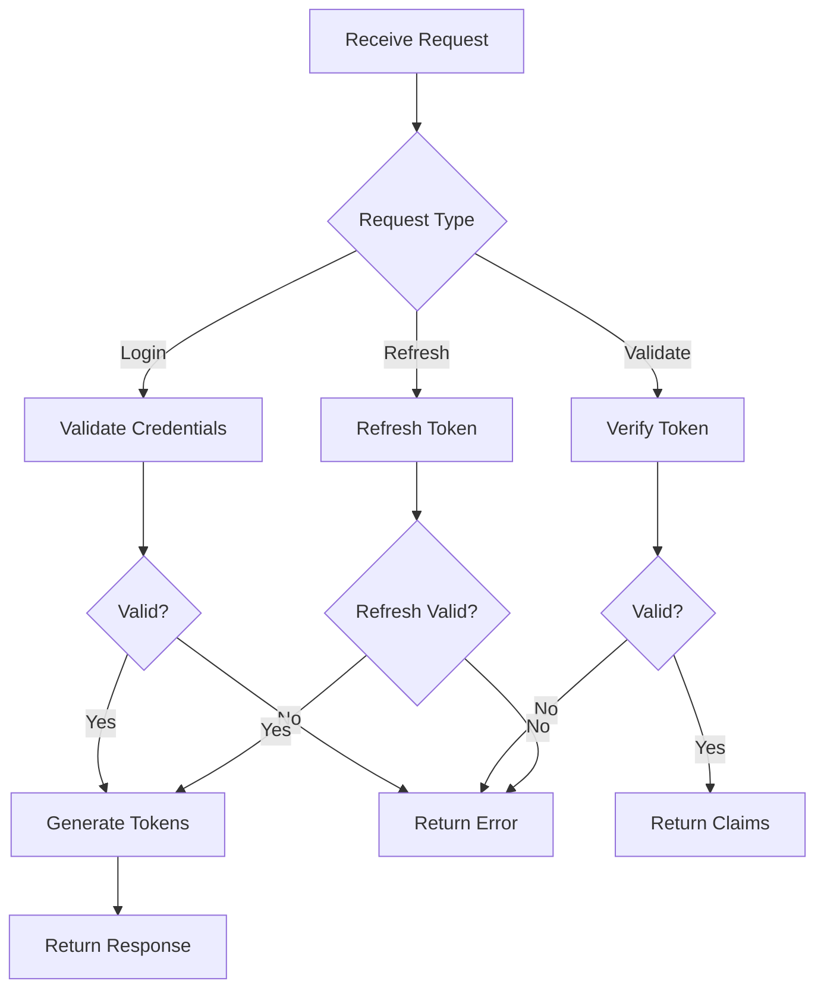

# Authentication Module

## Purpose

Provide secure user authentication using JWT tokens. This module handles token generation, validation, and refresh operations with built-in security best practices.

## Inputs

| Name | Type | Required | Description |
|------|------|----------|-------------|
| username | string | Yes | User identifier |
| password | string | Yes | User password |
| token | string | No | Existing JWT token for validation |
| refresh_token | string | No | Refresh token for renewal |

## Outputs

| Name | Type | Description |
|------|------|-------------|
| access_token | string | JWT access token |
| refresh_token | string | JWT refresh token |
| expires_in | int | Token expiration in seconds |
| user | dict | Authenticated user data |
| error | string | Error message if failed |

## Rules

- Never expose secrets in logs or error messages
- Use constant-time comparison for token validation
- Rotate secrets every 90 days
- Implement rate limiting on login attempts
- Use secure HTTP-only cookies when possible
- Validate all inputs before processing
- Log authentication events for audit trail

## Workflow



## Python

```python
# @mam:timeout=10s
# @mam:requires=network

import jwt
import hashlib
import secrets
from datetime import datetime, timedelta
from typing import Optional, Dict, Any

class Authenticator:
    def __init__(self, secret_key: str, algorithm: str = "HS256"):
        self.secret_key = secret_key
        self.algorithm = algorithm
        self.token_expiry = timedelta(hours=1)
        self.refresh_expiry = timedelta(days=30)
    
    def generate_token(self, user_id: str, claims: Dict[str, Any] = None) -> Dict[str, str]:
        """Generate JWT access and refresh tokens"""
        now = datetime.utcnow()
        
        access_payload = {
            "sub": user_id,
            "iat": now,
            "exp": now + self.token_expiry,
            "type": "access",
            **(claims or {})
        }
        
        refresh_payload = {
            "sub": user_id,
            "iat": now,
            "exp": now + self.refresh_expiry,
            "type": "refresh",
            "jti": secrets.token_hex(16)
        }
        
        return {
            "access_token": jwt.encode(access_payload, self.secret_key, self.algorithm),
            "refresh_token": jwt.encode(refresh_payload, self.secret_key, self.algorithm),
            "expires_in": int(self.token_expiry.total_seconds())
        }
    
    def validate_token(self, token: str) -> Optional[Dict[str, Any]]:
        """Validate JWT token and return claims"""
        try:
            payload = jwt.decode(token, self.secret_key, algorithms=[self.algorithm])
            return payload
        except jwt.ExpiredSignatureError:
            return None
        except jwt.InvalidTokenError:
            return None
    
    def refresh_access_token(self, refresh_token: str) -> Optional[Dict[str, str]]:
        """Generate new access token from refresh token"""
        payload = self.validate_token(refresh_token)
        
        if not payload or payload.get("type") != "refresh":
            return None
        
        return self.generate_token(payload["sub"])

def verify_password(password: str, hashed: str) -> bool:
    """Verify password against hash using constant-time comparison"""
    password_hash = hashlib.sha256(password.encode()).hexdigest()
    return secrets.compare_digest(password_hash, hashed)

def hash_password(password: str) -> str:
    """Hash password with salt"""
    return hashlib.sha256(password.encode()).hexdigest()
```

## Prompt

When using this authentication module:

1. Always validate tokens before processing requests
2. Use HTTPS in production environments
3. Implement proper error handling for expired tokens
4. Store refresh tokens securely (HTTP-only cookies)
5. Log authentication attempts for security auditing

## Examples

```python
# Initialize authenticator
auth = Authenticator("your-secret-key-here")

# Generate tokens
tokens = auth.generate_token("user123", {"role": "admin"})
print(tokens)

# Validate token
claims = auth.validate_token(tokens["access_token"])
print(claims)

# Refresh token
new_tokens = auth.refresh_access_token(tokens["refresh_token"])
print(new_tokens)
```

## Tests

```python
def test_token_generation():
    auth = Authenticator("test-secret")
    tokens = auth.generate_token("test-user")
    
    assert "access_token" in tokens
    assert "refresh_token" in tokens
    assert "expires_in" in tokens
    assert tokens["expires_in"] == 3600

def test_token_validation():
    auth = Authenticator("test-secret")
    tokens = auth.generate_token("test-user")
    
    claims = auth.validate_token(tokens["access_token"])
    assert claims is not None
    assert claims["sub"] == "test-user"

def test_password_hashing():
    password = "secure-password"
    hashed = hash_password(password)
    
    assert verify_password(password, hashed)
    assert not verify_password("wrong-password", hashed)
```

## References

- [JWT RFC 7519](https://datatracker.ietf.org/doc/html/rfc7519)
- [OWASP Authentication Cheat Sheet](https://cheatsheetseries.owasp.org/cheatsheets/Authentication_Cheat_Sheet.html)
- [Python JWT Library](https://pyjwt.readthedocs.io/)

## Dependencies

- PyJWT >= 2.8.0
- cryptography >= 41.0.0

## Exports

- `Authenticator` class
- `verify_password` function
- `hash_password` function

## Permissions

- `network`: Required for token validation with external services
- `filesystem`: Required for secure key storage
