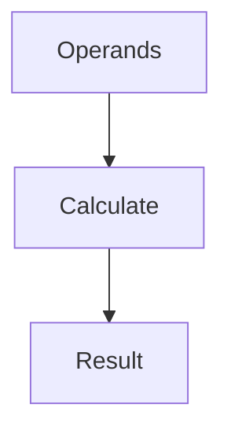

# Calculator

## Purpose

A simple calculator module that performs basic arithmetic operations
(addition, subtraction, multiplication, division) with proper input
validation, division by zero handling, and operation logging.

## Inputs

| Name | Type | Required | Description |
|------|------|----------|-------------|
| operation | string | Yes | The arithmetic operation: add, subtract, multiply, divide |
| a | number | Yes | The first operand |
| b | number | Yes | The second operand |

## Outputs

| Name | Type | Description |
|------|------|-------------|
| result | number | The result of the arithmetic operation |
| operation_performed | string | Description of the operation performed |

## Capabilities

### calculate

Perform an arithmetic operation on two operands.

## Rules

- Division by zero must return an error message, not raise an exception.
- Invalid operation types must return an error message.
- All numeric inputs must be validated before processing.
- The operation_performed field must describe the operation in human readable form.
- Results must be rounded to 10 decimal places to avoid floating point artifacts.

## Workflow



## Python

```python
def add(a: float, b: float) -> float:
    """Add two numbers."""
    return a + b


def subtract(a: float, b: float) -> float:
    """Subtract b from a."""
    return a - b


def multiply(a: float, b: float) -> float:
    """Multiply two numbers."""
    return a * b


def divide(a: float, b: float) -> float | str:
    """Divide a by b. Returns error string if b is zero."""
    if b == 0:
        return "Error: Division by zero"
    return a / b


def calculate(operation: str, a: float, b: float) -> dict:
    """
    Perform a calculation based on the operation type.

    Args:
        operation: One of add, subtract, multiply, divide.
        a: The first operand.
        b: The second operand.

    Returns:
        dict with result and operation_performed keys.
    """
    operations = {
        "add": ("+", add),
        "subtract": ("-", subtract),
        "multiply": ("*", multiply),
        "divide": ("/", divide),
    }

    if operation not in operations:
        return {
            "result": None,
            "operation_performed": f"Error: Unknown operation '{operation}'",
        }

    symbol, func = operations[operation]
    result = func(a, b)

    if isinstance(result, str):
        return {"result": None, "operation_performed": result}

    result = round(result, 10)
    return {
        "result": result,
        "operation_performed": f"{a} {symbol} {b} = {result}",
    }
```

## Tests

### Input

```yaml
operation: add
a: 5
b: 3
```

### Expected

```yaml
result: 8
```

```python
def test_add():
    result = calculate("add", 5, 3)
    assert result["result"] == 8
    assert "5 + 3 = 8" in result["operation_performed"]


def test_subtract():
    result = calculate("subtract", 10, 4)
    assert result["result"] == 6
    assert "10 - 4 = 6" in result["operation_performed"]


def test_multiply():
    result = calculate("multiply", 6, 7)
    assert result["result"] == 42
    assert "6 * 7 = 42" in result["operation_performed"]


def test_divide():
    result = calculate("divide", 20, 4)
    assert result["result"] == 5.0
    assert "20 / 4 = 5.0" in result["operation_performed"]


def test_divide_by_zero():
    result = calculate("divide", 10, 0)
    assert result["result"] is None
    assert "Division by zero" in result["operation_performed"]


def test_divide_floating_point():
    result = calculate("divide", 10, 3)
    assert result["result"] == round(10 / 3, 10)


def test_unknown_operation():
    result = calculate("modulo", 10, 3)
    assert result["result"] is None
    assert "Unknown operation" in result["operation_performed"]


def test_negative_numbers():
    result = calculate("add", -5, -3)
    assert result["result"] == -8

    result = calculate("subtract", -5, -3)
    assert result["result"] == -2
```

## Examples

```python
result = calculate("add", 10, 5)
print(result["operation_performed"])

result = calculate("divide", 10, 3)
print(result["result"])

result = calculate("divide", 10, 0)
print(result["operation_performed"])

result = calculate("modulo", 10, 3)
print(result["operation_performed"])
```

## References

- MAM documentation