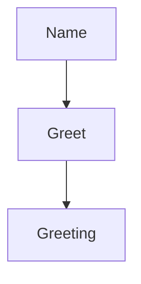

# Hello World

## Purpose

A minimal MAM module that introduces the core concepts: metadata, purpose
driven design, behavioral rules, and executable Python code.

## Inputs

| Name | Type | Required | Description |
|------|------|----------|-------------|
| name | string | No | Name to greet (defaults to World) |

## Outputs

| Name | Type | Description |
|------|------|-------------|
| greeting | string | The generated greeting message |
| timestamp | string | ISO 8601 timestamp of execution |

## Capabilities

### greet

Return a greeting message with a timestamp.

## Rules

- Always return a greeting message.
- Include a timestamp with every response.
- Never expose internal errors to the caller.

## Workflow



## Python

```python
from datetime import datetime, timezone

def greet(name: str = "World") -> dict:
    """
    Generate a greeting with a timestamp.

    Args:
        name: The name to greet.

    Returns:
        dict with greeting and timestamp keys.
    """
    greeting = f"Hello, {name}! Welcome to MAM."
    timestamp = datetime.now(timezone.utc).isoformat()
    return {"greeting": greeting, "timestamp": timestamp}
```

## Tests

### Input

```yaml
name: World
```

### Expected

```yaml
greeting: present
```

```python
def test_default_greeting():
    result = greet()
    assert result["greeting"] == "Hello, World! Welcome to MAM."
    assert "timestamp" in result


def test_custom_name():
    result = greet("MAM")
    assert result["greeting"] == "Hello, MAM! Welcome to MAM."
```

## Examples

```python
result = greet()
print(result["greeting"])

result = greet("Alice")
print(result["greeting"])
```

## References

- MAM documentation