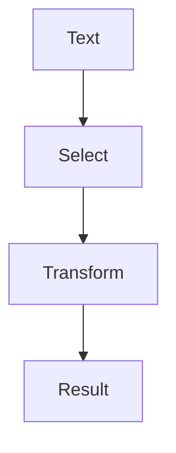

# String Utilities

## Purpose

A collection of common string manipulation utilities including reversal, word
counting, palindrome detection, truncation, and email extraction. Handles
empty strings gracefully and supports Unicode characters.

## Inputs

| Name | Type | Required | Description |
|------|------|----------|-------------|
| text | string | Yes | The input text to process |
| operation | string | Yes | Operation: reverse, count_words, is_palindrome, truncate, extract_emails |

## Outputs

| Name | Type | Description |
|------|------|-------------|
| result | string/number/list | The result of the operation (type varies by operation) |

## Capabilities

### manipulate

Apply a string operation such as reversal, counting, or extraction.

## Rules

- Empty strings must return appropriate empty results, not errors.
- Truncation must add three dots when text exceeds the max length.
- Email extraction must use pattern matching, not external libraries.
- Palindrome detection must be case insensitive and ignore non alphanumeric characters.
- Word counting must handle multiple spaces and leading or trailing whitespace.
- Unicode characters must be handled correctly throughout.

## Workflow



## Python

```python
import re


def reverse(text: str) -> str:
    """Reverse a string."""
    return text[::-1]


def count_words(text: str) -> int:
    """Count the number of words in a string."""
    text = text.strip()
    if not text:
        return 0
    return len(text.split())


def is_palindrome(text: str) -> bool:
    """Check if text is a palindrome (case insensitive, alphanumeric only)."""
    cleaned = re.sub(r'[^a-zA-Z0-9]', '', text).lower()
    return cleaned == cleaned[::-1] and len(cleaned) > 0


def truncate(text: str, max_length: int = 100) -> str:
    """Truncate text to max_length, adding three dots if truncated."""
    if len(text) <= max_length:
        return text
    return text[:max_length - 3] + "..."


def extract_emails(text: str) -> list:
    """Extract all email addresses from text using pattern matching."""
    pattern = r'[a-zA-Z0-9._%+-]+@[a-zA-Z0-9.-]+\.[a-zA-Z]{2,}'
    return re.findall(pattern, text)


def perform_operation(text: str, operation: str, **kwargs) -> dict:
    """
    Perform a string operation.

    Args:
        text: The input text.
        operation: The operation to perform.
        **kwargs: Additional arguments (for example max_length for truncate).

    Returns:
        dict with result key containing the operation output.
    """
    operations = {
        "reverse": lambda t: reverse(t),
        "count_words": lambda t: count_words(t),
        "is_palindrome": lambda t: is_palindrome(t),
        "truncate": lambda t: truncate(t, kwargs.get("max_length", 100)),
        "extract_emails": lambda t: extract_emails(t),
    }

    if operation not in operations:
        return {"result": None, "error": f"Unknown operation: {operation}"}

    result = operations[operation](text)
    return {"result": result}
```

## Tests

### Input

```yaml
text: hello world
operation: count_words
```

### Expected

```yaml
result: 2
```

```python
def test_reverse():
    result = perform_operation("hello", "reverse")
    assert result["result"] == "olleh"


def test_reverse_empty():
    result = perform_operation("", "reverse")
    assert result["result"] == ""


def test_count_words():
    result = perform_operation("hello world", "count_words")
    assert result["result"] == 2


def test_count_words_empty():
    result = perform_operation("", "count_words")
    assert result["result"] == 0


def test_count_words_whitespace():
    result = perform_operation("  hello   world  ", "count_words")
    assert result["result"] == 2


def test_is_palindrome():
    result = perform_operation("racecar", "is_palindrome")
    assert result["result"] is True


def test_is_palindrome_case_insensitive():
    result = perform_operation("RaceCar", "is_palindrome")
    assert result["result"] is True


def test_is_palindrome_with_punctuation():
    result = perform_operation("A man, a plan, a canal: Panama", "is_palindrome")
    assert result["result"] is True


def test_is_not_palindrome():
    result = perform_operation("hello", "is_palindrome")
    assert result["result"] is False


def test_truncate_short():
    result = perform_operation("short", "truncate", max_length=10)
    assert result["result"] == "short"


def test_truncate_long():
    result = perform_operation("this is a long text", "truncate", max_length=10)
    assert result["result"] == "this is a..."
    assert len(result["result"]) == 10


def test_extract_emails():
    text = "Contact alice@example.com or bob@test.org"
    result = perform_operation(text, "extract_emails")
    assert result["result"] == ["alice@example.com", "bob@test.org"]


def test_extract_emails_none():
    result = perform_operation("no emails here", "extract_emails")
    assert result["result"] == []


def test_unknown_operation():
    result = perform_operation("hello", "unknown_op")
    assert result["result"] is None
    assert "error" in result


def test_unicode_support():
    result = perform_operation("héllo wörld", "reverse")
    assert result["result"] == "dlröw olleh"

    result = perform_operation("日本語テスト", "reverse")
    assert result["result"] == "トステツ語本日"
```

## Examples

```python
result = perform_operation("Hello, World!", "reverse")
print(result["result"])

result = perform_operation("  Hello   World  ", "count_words")
print(result["result"])

result = perform_operation("A man a plan a canal Panama", "is_palindrome")
print(result["result"])

result = perform_operation("This is a long text", "truncate", max_length=10)
print(result["result"])
```

## References

- MAM documentation