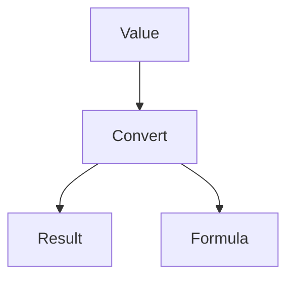

# Temperature Converter

## Purpose

A temperature conversion module that converts values between Celsius,
Fahrenheit, and Kelvin scales. Provides accurate conversions with human
readable formula descriptions for auditability.

## Inputs

| Name | Type | Required | Description |
|------|------|----------|-------------|
| value | number | Yes | The temperature value to convert |
| from_unit | string | Yes | Source unit: C, F, or K |
| to_unit | string | Yes | Target unit: C, F, or K |

## Outputs

| Name | Type | Description |
|------|------|-------------|
| result | number | The converted temperature value |
| formula | string | The formula used for the conversion |

## Capabilities

### convert

Convert a temperature value between the supported scales.

## Rules

- Support only Celsius (C), Fahrenheit (F), and Kelvin (K).
- Invalid units must return an error message.
- Results must be rounded to 2 decimal places.
- Same unit conversions must return the input value unchanged.
- Absolute zero must be enforced as the minimum on each scale.

## Workflow



## Python

```python
def celsius_to_fahrenheit(c: float) -> float:
    """Convert Celsius to Fahrenheit."""
    return (c * 9 / 5) + 32


def fahrenheit_to_celsius(f: float) -> float:
    """Convert Fahrenheit to Celsius."""
    return (f - 32) * 5 / 9


def celsius_to_kelvin(c: float) -> float:
    """Convert Celsius to Kelvin."""
    return c + 273.15


def kelvin_to_celsius(k: float) -> float:
    """Convert Kelvin to Celsius."""
    return k - 273.15


def convert_temperature(value: float, from_unit: str, to_unit: str) -> dict:
    """
    Convert a temperature value between units.

    Args:
        value: The temperature value.
        from_unit: Source unit (C, F, or K).
        to_unit: Target unit (C, F, or K).

    Returns:
        dict with result and formula keys.
    """
    valid_units = {"C", "F", "K"}

    if from_unit not in valid_units:
        return {
            "result": None,
            "formula": f"Error: Invalid source unit '{from_unit}'. Use C, F, or K.",
        }

    if to_unit not in valid_units:
        return {
            "result": None,
            "formula": f"Error: Invalid target unit '{to_unit}'. Use C, F, or K.",
        }

    if from_unit == to_unit:
        return {
            "result": round(value, 2),
            "formula": f"No conversion needed: {value} {from_unit} = {value} {to_unit}",
        }

    conversion_key = f"{from_unit}_{to_unit}"

    conversions = {
        "C_F": (celsius_to_fahrenheit, "F = (C * 9/5) + 32"),
        "C_K": (celsius_to_kelvin, "K = C + 273.15"),
        "F_C": (fahrenheit_to_celsius, "C = (F - 32) * 5/9"),
        "F_K": (lambda f: celsius_to_kelvin(fahrenheit_to_celsius(f)), "K = (F - 32) * 5/9 + 273.15"),
        "K_C": (kelvin_to_celsius, "C = K - 273.15"),
        "K_F": (lambda k: celsius_to_fahrenheit(kelvin_to_celsius(k)), "F = (K - 273.15) * 9/5 + 32"),
    }

    func, formula = conversions[conversion_key]
    result = round(func(value), 2)

    return {
        "result": result,
        "formula": f"{value} {from_unit} -> {result} {to_unit} ({formula})",
    }
```

## Tests

### Input

```yaml
value: 100
from_unit: C
to_unit: F
```

### Expected

```yaml
result: 212.0
```

```python
def test_celsius_to_fahrenheit():
    result = convert_temperature(100, "C", "F")
    assert result["result"] == 212.0


def test_fahrenheit_to_celsius():
    result = convert_temperature(32, "F", "C")
    assert result["result"] == 0.0


def test_celsius_to_kelvin():
    result = convert_temperature(0, "C", "K")
    assert result["result"] == 273.15


def test_kelvin_to_celsius():
    result = convert_temperature(273.15, "K", "C")
    assert result["result"] == 0.0


def test_fahrenheit_to_kelvin():
    result = convert_temperature(32, "F", "K")
    assert result["result"] == 273.15


def test_kelvin_to_fahrenheit():
    result = convert_temperature(273.15, "K", "F")
    assert result["result"] == 32.0


def test_same_unit():
    result = convert_temperature(100, "C", "C")
    assert result["result"] == 100
    assert "No conversion needed" in result["formula"]


def test_invalid_from_unit():
    result = convert_temperature(100, "X", "C")
    assert result["result"] is None
    assert "Invalid source unit" in result["formula"]


def test_invalid_to_unit():
    result = convert_temperature(100, "C", "X")
    assert result["result"] is None
    assert "Invalid target unit" in result["formula"]


def test_negative_celsius():
    result = convert_temperature(-40, "C", "F")
    assert result["result"] == -40.0


def test_boiling_point():
    result = convert_temperature(100, "C", "F")
    assert result["result"] == 212.0

    result = convert_temperature(100, "C", "K")
    assert result["result"] == 373.15


def test_absolute_zero():
    result = convert_temperature(0, "K", "C")
    assert result["result"] == -273.15

    result = convert_temperature(0, "K", "F")
    assert result["result"] == -459.67
```

## Examples

```python
result = convert_temperature(100, "C", "F")
print(result["result"])
print(result["formula"])

result = convert_temperature(32, "F", "C")
print(result["result"])

result = convert_temperature(0, "C", "K")
print(result["result"])

result = convert_temperature(100, "C", "C")
print(result["result"])
```

## References

- MAM documentation