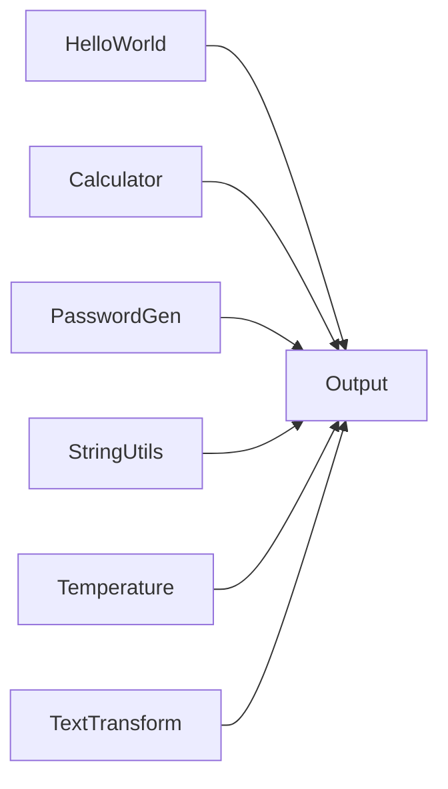

# Basic System

## Purpose

Entry system that composes the project modules into a single utility set:
hello world, calculator, password generator, string utilities, temperature
converter, and text transform.

## Modules

- Hello World
- Calculator
- Password Generator
- String Utilities
- Temperature Converter
- Text Transform

## Capabilities

### orchestrate

Run the composed modules in dependency order.

## Rules

- All modules operate within the declared scope.
- Results must be validated before use.

## Workflow



## Tests

### Input

```yaml
name: World
```

### Expected

```yaml
output: present
```

## References

- MAM documentation