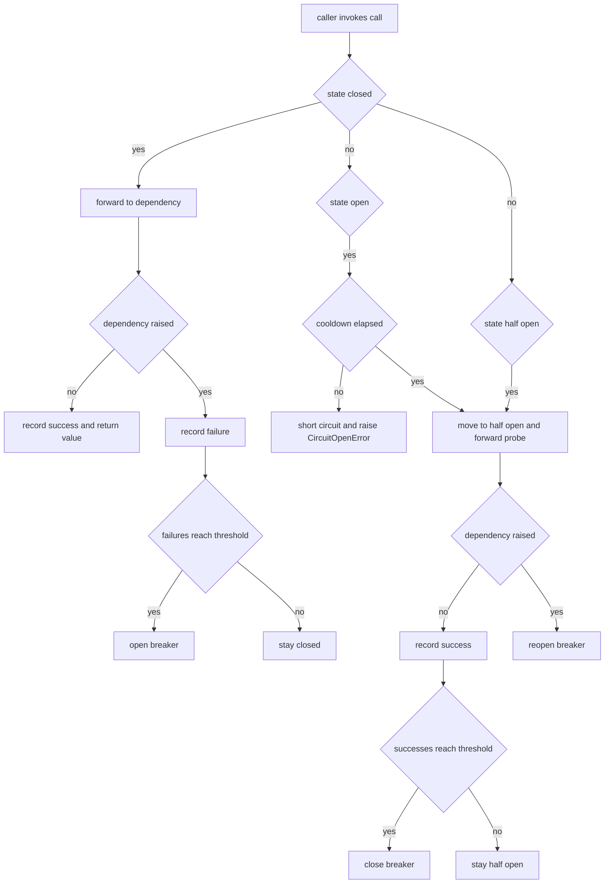

# Circuit Breaker

## Purpose

A `component` is a part of a bigger system that other code is allowed to
depend on: it has a contract, a state machine, and no opinion about what it
protects. This one is the classic circuit breaker. While closed it forwards
calls and counts failures; after a threshold it opens and short-circuits every
call without touching the dependency; after a cooldown it admits a single
half-open probe and closes again if that probe succeeds.

The contract callers program against is three methods: `call`, `record_success`
and `record_failure`. `call` is the convenient path; the explicit record
methods exist so a caller that cannot express its work as a callable — a
streaming read, a manual retry loop — can still drive the breaker correctly.
The clock is injected so the cooldown is testable without sleeping.

## Inputs

| Name | Type | Required | Description |
|------|------|----------|-------------|
| operation | object | Yes | Zero-argument callable guarded by the breaker |
| failure_threshold | number | No | Consecutive failures before opening, defaults to 3 |
| reset_timeout | number | No | Seconds open before a half-open probe, defaults to 30 |
| success_threshold | number | No | Consecutive probes before closing, defaults to 2 |
| clock | object | Yes | Zero-argument callable returning seconds |
| name | string | No | Label used in the snapshot, defaults to dependency |

## Outputs

| Name | Type | Description |
|------|------|-------------|
| state | string | One of closed, open, half_open |
| state_of | string | Snapshot string such as `open after 3 failures` |
| calls | number | Calls forwarded to the dependency since reset |
| short_circuited | number | Calls rejected without touching the dependency |
| failures | number | Consecutive failures counted in the current state |

## Capabilities

### call

Forward a guarded operation to the dependency, recording success or failure
and short-circuiting when the breaker is open.

### record_success

Mark one successful call and move the breaker toward closed.

### record_failure

Mark one failed call and open the breaker when the threshold is reached.

### state_of

Return a human readable snapshot of the breaker for logs and health output.

## Rules

- The breaker starts closed and forwards every call.
- `failure_threshold` consecutive failures open the breaker and set the cooldown
  start to the current clock value.
- While open every call is short-circuited and the dependency is never invoked.
- Once the cooldown has elapsed the first call moves the breaker to half-open
  and is forwarded as a probe.
- `success_threshold` consecutive half-open successes close the breaker and
  reset the failure count.
- Any failure in half-open reopens the breaker immediately.
- A short-circuited call must raise `CircuitOpenError`; it must not return a
  fabricated value.
- The clock is only read through the injected callable, never `time` directly.

## Workflow



## Python

```python
from typing import Any, Callable, Dict, Optional

CLOSED = "closed"
OPEN = "open"
HALF_OPEN = "half_open"

STATE_VALUES = (CLOSED, OPEN, HALF_OPEN)


class CircuitOpenError(RuntimeError):
    """Raised when a call is refused because the breaker is open."""


class CircuitBreaker:
    """Three-state circuit breaker guarding one dependency."""

    def __init__(self, failure_threshold: int = 3, reset_timeout: float = 30.0,
                 success_threshold: int = 2, clock: Optional[Callable[[], float]] = None,
                 name: str = "dependency") -> None:
        if failure_threshold < 1 or success_threshold < 1:
            raise ValueError("thresholds must be at least 1")
        if reset_timeout <= 0:
            raise ValueError("reset_timeout must be positive")
        if clock is not None and not callable(clock):
            raise TypeError("clock must be callable")
        self.failure_threshold = failure_threshold
        self.reset_timeout = reset_timeout
        self.success_threshold = success_threshold
        self.clock = clock or _default_clock
        self.name = name
        self.state = CLOSED
        self.failures = 0
        self.successes = 0
        self.calls = 0
        self.short_circuited = 0
        self.opened_at: Optional[float] = None

    def _cooldown_elapsed(self) -> bool:
        if self.opened_at is None:
            return False
        return (self.clock() - self.opened_at) >= self.reset_timeout

    def _to_half_open(self) -> None:
        self.state = HALF_OPEN
        self.successes = 0

    def record_success(self) -> None:
        self.failures = 0
        if self.state == HALF_OPEN:
            self.successes += 1
            if self.successes >= self.success_threshold:
                self.state = CLOSED
                self.successes = 0
                self.opened_at = None
            return
        self.successes = 0

    def record_failure(self) -> None:
        self.successes = 0
        self.failures += 1
        if self.state == HALF_OPEN:
            self.state = OPEN
            self.opened_at = self.clock()
            return
        if self.failures >= self.failure_threshold:
            self.state = OPEN
            self.opened_at = self.clock()

    def call(self, operation: Callable[[], Any]) -> Any:
        if self.state == OPEN:
            if self._cooldown_elapsed():
                self._to_half_open()
            else:
                self.short_circuited += 1
                raise CircuitOpenError(f"{self.name} circuit is open")
        self.calls += 1
        try:
            value = operation()
        except Exception:
            self.record_failure()
            raise
        self.record_success()
        return value

    def state_of(self) -> str:
        if self.state == OPEN:
            return f"open after {self.failures} failures"
        if self.state == HALF_OPEN:
            return f"half open, {self.successes} of {self.success_threshold} probes passed"
        return "closed"

    def snapshot(self) -> Dict[str, Any]:
        return {"name": self.name, "state": self.state, "description": self.state_of(),
                "calls": self.calls, "short_circuited": self.short_circuited,
                "failures": self.failures}


def _default_clock() -> float:
    import time
    return time.monotonic()


class FakeClock:
    """Deterministic clock for tests and examples."""

    def __init__(self, start: float = 0.0) -> None:
        self.now = start

    def __call__(self) -> float:
        return self.now

    def advance(self, seconds: float) -> None:
        self.now += seconds
```

## Tests

### Input

```yaml
operation: raises RuntimeError
failure_threshold: 2
reset_timeout: 10
```

### Expected

```yaml
state: open
state_of: open after 2 failures
```

```python
def failing():
    raise RuntimeError("dependency down")


def succeeding():
    return "ok"


def make_breaker(**kwargs):
    return CircuitBreaker(clock=FakeClock(), **kwargs)


def test_starts_closed_and_forwards():
    breaker = make_breaker()
    assert breaker.state == CLOSED
    assert breaker.call(succeeding) == "ok"
    assert breaker.calls == 1


def test_opens_after_threshold():
    breaker = make_breaker(failure_threshold=2)
    for _ in range(2):
        try:
            breaker.call(failing)
        except RuntimeError:
            pass
    assert breaker.state == OPEN
    assert breaker.state_of() == "open after 2 failures"


def test_open_circuit_short_circuits():
    breaker = make_breaker(failure_threshold=1)
    try:
        breaker.call(failing)
    except RuntimeError:
        pass
    try:
        breaker.call(succeeding)
    except CircuitOpenError:
        assert breaker.short_circuited == 1
        assert breaker.calls == 1
        return
    raise AssertionError("expected CircuitOpenError")


def test_half_open_probe_closes_after_successes():
    clock = FakeClock()
    breaker = CircuitBreaker(failure_threshold=1, reset_timeout=10,
                             success_threshold=2, clock=clock)
    try:
        breaker.call(failing)
    except RuntimeError:
        pass
    clock.advance(10)
    assert breaker.call(succeeding) == "ok"
    assert breaker.state == HALF_OPEN
    assert breaker.call(succeeding) == "ok"
    assert breaker.state == CLOSED
    assert breaker.failures == 0


def test_half_open_failure_reopens_immediately():
    clock = FakeClock()
    breaker = CircuitBreaker(failure_threshold=5, reset_timeout=10, clock=clock)
    breaker.state = OPEN
    breaker.opened_at = clock.now
    clock.advance(11)
    try:
        breaker.call(failing)
    except RuntimeError:
        pass
    assert breaker.state == OPEN


def test_success_resets_the_failure_run():
    breaker = make_breaker(failure_threshold=3)
    for _ in range(2):
        try:
            breaker.call(failing)
        except RuntimeError:
            pass
    breaker.call(succeeding)
    assert breaker.failures == 0
    try:
        breaker.call(failing)
    except RuntimeError:
        pass
    assert breaker.state == CLOSED


def test_snapshot_shape():
    snapshot = make_breaker().snapshot()
    assert snapshot["state"] == CLOSED
    assert snapshot["description"] == "closed"
    assert set(snapshot) == {"name", "state", "description", "calls",
                            "short_circuited", "failures"}


def test_invalid_configuration_is_rejected():
    for kwargs in ({"failure_threshold": 0}, {"success_threshold": 0},
                   {"reset_timeout": 0}):
        try:
            CircuitBreaker(**kwargs)
        except ValueError:
            continue
        raise AssertionError(f"expected ValueError for {kwargs}")
```

## Examples

```python
class Clock:
    def __init__(self):
        self.t = 0.0

    def __call__(self):
        return self.t

    def tick(self, seconds):
        self.t += seconds


def flaky(should_fail):
    if should_fail():
        raise ConnectionError("dependency refused the connection")
    return {"status": 200}


clock = Clock()
breaker = CircuitBreaker(failure_threshold=2, reset_timeout=5, clock=clock)
down = [True]
should_fail = lambda: down[0]

for attempt in range(7):
    try:
        print(attempt, "returned", breaker.call(lambda: flaky(should_fail)))
    except CircuitOpenError as exc:
        print(attempt, "refused:", exc)
    except ConnectionError as exc:
        print(attempt, "dependency error:", exc)
    if attempt == 1:
        down[0] = False
        clock.tick(5)
    print("   ", breaker.snapshot())
```

## References

- [MAM Specification](../../plan-doc/full-mam.md)
- [Component templates](../../templates/component/)
- [Worker Health Service](../service/service.mam)
