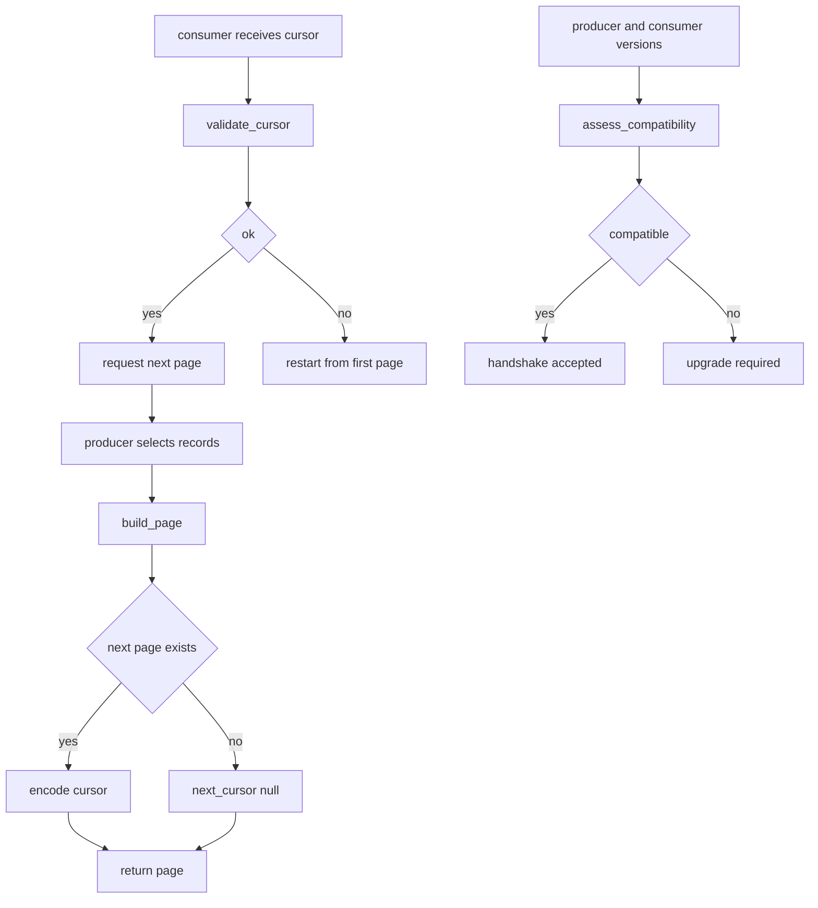

# Cursor Pagination Contract

## Purpose

A contract is not an implementation, it is an agreement. This one fixes the
wiring between a producer that serves collections and a consumer that walks
them. It defines the shape of a page, the exact encoding of the opaque cursor
token, the window of major versions that may interoperate, and the deadline
after which a deprecated field is deleted instead of merely discouraged.

The reference implementation below is small enough to read in one sitting and
behaves like a conformance kit: a producer can use it to mint cursors, a
consumer can use it to validate the cursors it receives, and both sides can ask
it whether the two versions they run are allowed to talk.

## Inputs

| Name | Type | Required | Description |
|------|------|----------|-------------|
| items | list | Yes | The records the producer is returning for this page |
| next_offset | integer | No | Offset of the following page, or `null` on the last page |
| limit | integer | Yes | Page size the producer used when minting the cursor |
| cursor | string | No | An opaque cursor a consumer received from a producer |
| producer_version | string | Yes | Semantic version of the producer implementation |
| consumer_version | string | Yes | Semantic version of the consumer implementation |

## Outputs

| Name | Type | Description |
|------|------|-------------|
| page | object | The page envelope: `contract`, `data`, `next_cursor`, `has_more` |
| cursor | string | URL-safe base64 token with no padding, safe in a query string |
| validation | object | `ok` flag plus a list of human-readable `errors` |
| compatibility | object | `compatible` flag, ordered `reasons`, and any `sunset_fields` |

## Capabilities

### build_page

Wrap a slice of records in the page envelope this contract version defines.

### validate_cursor

Check that a cursor handed back by a consumer is well formed and in range.

### assess_compatibility

Decide whether a producer and a consumer version may interoperate, and say why
not when they may not.

## Guarantees

- A page is an object with exactly the keys `contract`, `data`, `next_cursor`
  and `has_more`; producers never add or remove keys within a major version.
- `has_more` is `true` if and only if `next_cursor` is a non-null string.
- A cursor is opaque: consumers may only store it and hand it back, never parse
  it, and any change to its internal encoding is a non-breaking change.
- A cursor minted for offset `n` always resumes at `n`, never at `n - 1`.
- Ordering of `data` is stable for a given query and cursor; a consumer
  re-reading the same cursor sees the same records until they are deleted.

## Compatibility Window

- Published majors are `1` and `2`; a producer never skips a major.
- A consumer may be at most `COMPATIBILITY_WINDOW` (1) major behind its
  producer, so a v1 consumer keeps working against a v2 producer.
- A consumer may never be ahead of its producer; the contract does not define
  fields it has never heard of.
- `offset` and `total` are deprecated in v2. They are still returned by a v2
  producer and are removed entirely when the v3 contract is published.

## Breaking Change Policy

- A removal of a key, a narrowing of a type, or a change to cursor encoding
  requires a new major version.
- A deprecation is announced in the contract version that introduces the
  replacement, lists the field in `DEPRECATED_FIELDS`, and survives for at
  least one full major version before removal.
- Adding an optional key is a minor version change and requires no consumer
  action, because consumers must ignore unknown keys.

## Rules

- Every page carries the contract version that produced it.
- A cursor encodes an offset and a limit; both must be non-negative and the
  limit strictly positive.
- Cursors are URL-safe base64 with the padding stripped.
- A cursor that cannot be decoded, or that carries the wrong field types, is
  rejected rather than repaired.
- Compatibility is reported as a boolean plus ordered reasons, never as a bare
  boolean.
- No network or filesystem access: the contract is pure and can be audited
  offline.

## Workflow



## Python

```python
import base64
import json
from typing import Any, Dict, List, Optional

CONTRACT_VERSION = "2.0.0"
PUBLISHED_MAJORS = (1, 2)
COMPATIBILITY_WINDOW = 1
DEPRECATED_FIELDS = ("offset", "total")


def _major(version: str) -> int:
    bits = str(version).split(".")
    if len(bits) != 3 or not all(part.isdigit() for part in bits):
        raise ValueError(f"version must be MAJOR.MINOR.PATCH, got {version!r}")
    return int(bits[0])


def encode_cursor(offset: int, limit: int) -> str:
    """Mint an opaque cursor for the page that starts at `offset`."""
    if not isinstance(offset, int) or isinstance(offset, bool) or offset < 0:
        raise ValueError("offset must be a non-negative integer")
    if not isinstance(limit, int) or isinstance(limit, bool) or limit <= 0:
        raise ValueError("limit must be a positive integer")
    payload = json.dumps(
        {"o": offset, "l": limit, "v": CONTRACT_VERSION},
        separators=(",", ":"),
        sort_keys=True,
    )
    token = base64.urlsafe_b64encode(payload.encode("utf-8")).decode("ascii")
    return token.rstrip("=")


def build_page(
    items: List[Any],
    next_offset: Optional[int],
    limit: int,
) -> Dict[str, Any]:
    """Wrap records in the page envelope this contract version defines."""
    has_more = next_offset is not None
    return {
        "contract": CONTRACT_VERSION,
        "data": list(items),
        "next_cursor": encode_cursor(next_offset, limit) if has_more else None,
        "has_more": has_more,
    }


def validate_cursor(cursor: str) -> Dict[str, Any]:
    """Check a cursor without trusting anything inside it."""
    errors: List[str] = []
    payload: Dict[str, Any] = {}
    if not isinstance(cursor, str) or not cursor:
        errors.append("cursor must be a non-empty string")
    else:
        padded = cursor + "=" * (-len(cursor) % 4)
        try:
            decoded = base64.urlsafe_b64decode(padded.encode("ascii")).decode("utf-8")
            candidate = json.loads(decoded)
        except (ValueError, UnicodeDecodeError):
            candidate = None
        if not isinstance(candidate, dict):
            errors.append("cursor is not decodable")
        else:
            payload = candidate
            if not isinstance(payload.get("o"), int) or isinstance(payload.get("o"), bool):
                errors.append("cursor is missing an integer offset")
            elif payload["o"] < 0:
                errors.append("cursor offset must be non-negative")
            if not isinstance(payload.get("l"), int) or isinstance(payload.get("l"), bool):
                errors.append("cursor is missing an integer limit")
            elif payload["l"] <= 0:
                errors.append("cursor limit must be positive")
    return {
        "ok": not errors,
        "errors": errors,
        "offset": payload.get("o"),
        "limit": payload.get("l"),
        "minted_by": payload.get("v"),
    }


def assess_compatibility(producer_version: str, consumer_version: str) -> Dict[str, Any]:
    """Decide whether two versions may interoperate, and why not when they may not."""
    reasons: List[str] = []
    producer_major = _major(producer_version)
    consumer_major = _major(consumer_version)
    if producer_major not in PUBLISHED_MAJORS:
        reasons.append(f"producer major {producer_major} is not published by this contract")
    if consumer_major not in PUBLISHED_MAJORS:
        reasons.append(f"consumer major {consumer_major} has no contract in this family")
    elif consumer_major > producer_major:
        reasons.append("consumer requires a newer major than the producer publishes")
    elif producer_major - consumer_major > COMPATIBILITY_WINDOW:
        reasons.append(
            f"consumer is {producer_major - consumer_major} majors behind, "
            f"the window is {COMPATIBILITY_WINDOW}"
        )
    return {
        "producer": producer_version,
        "consumer": consumer_version,
        "compatible": not reasons,
        "reasons": reasons,
        "sunset_fields": list(DEPRECATED_FIELDS) if consumer_major < producer_major else [],
    }
```

## Tests

### Input

```yaml
items: [alpha, beta]
next_offset: 2
limit: 2
```

### Expected

```yaml
has_more: true
data_length: 2
contract: 2.0.0
```

```python
def test_build_page_shape():
    page = build_page(["alpha", "beta"], next_offset=2, limit=2)
    assert set(page) == {"contract", "data", "next_cursor", "has_more"}
    assert page["contract"] == "2.0.0"
    assert page["data"] == ["alpha", "beta"]
    assert page["has_more"] is True
    assert isinstance(page["next_cursor"], str)


def test_build_page_last_page_has_no_cursor():
    page = build_page(["gamma"], next_offset=None, limit=2)
    assert page["has_more"] is False
    assert page["next_cursor"] is None


def test_cursor_round_trips():
    cursor = encode_cursor(7, 25)
    assert "=" not in cursor
    report = validate_cursor(cursor)
    assert report["ok"] is True
    assert report["offset"] == 7
    assert report["limit"] == 25
    assert report["minted_by"] == "2.0.0"


def test_validate_cursor_rejects_garbage():
    report = validate_cursor("not-a-cursor!!")
    assert report["ok"] is False
    assert report["errors"] == ["cursor is not decodable"]


def test_validate_cursor_rejects_empty():
    assert validate_cursor("")["ok"] is False


def test_encode_cursor_rejects_bad_arguments():
    for bad in (("x", 5), (1, 0), (-1, 5)):
        try:
            encode_cursor(*bad)
        except ValueError:
            continue
        raise AssertionError(f"expected ValueError for {bad}")


def test_assess_compatibility_within_window():
    report = assess_compatibility("2.0.0", "1.4.2")
    assert report["compatible"] is True
    assert report["reasons"] == []
    assert report["sunset_fields"] == ["offset", "total"]


def test_assess_compatibility_same_major():
    assert assess_compatibility("2.1.0", "2.0.0")["compatible"] is True


def test_assess_compatibility_rejects_consumer_ahead():
    report = assess_compatibility("1.0.0", "2.0.0")
    assert report["compatible"] is False
    assert "newer major" in report["reasons"][0]


def test_assess_compatibility_rejects_unknown_major():
    assert assess_compatibility("3.0.0", "3.0.0")["compatible"] is False


def test_assess_compatibility_reports_every_reason():
    report = assess_compatibility("2.0.0", "5.0.0")
    assert report["compatible"] is False
    assert report["reasons"] == ["consumer major 5 has no contract in this family"]
    both = assess_compatibility("4.0.0", "3.0.0")
    assert both["compatible"] is False
    assert both["reasons"] == [
        "producer major 4 is not published by this contract",
        "consumer major 3 has no contract in this family",
    ]
```

## Examples

```python
LEDGER = ["alpha", "beta", "gamma", "delta", "epsilon"]


def walk_all_pages(records, page_size):
    """A consumer that only ever treats the cursor as an opaque token."""
    seen, offset = [], 0
    while offset is not None:
        window = records[offset:offset + page_size]
        next_offset = offset + page_size if offset + page_size < len(records) else None
        page = build_page(window, next_offset=next_offset, limit=page_size)
        assert page["has_more"] == (page["next_cursor"] is not None)
        if page["next_cursor"] is not None:
            report = validate_cursor(page["next_cursor"])
            assert report["ok"], report["errors"]
            next_offset = report["offset"]
        seen.extend(page["data"])
        offset = next_offset
    return seen


def main():
    walked = walk_all_pages(LEDGER, page_size=2)
    assert walked == LEDGER
    print("walked", len(walked), "records in", (len(LEDGER) + 1) // 2, "pages")
    for pair in (("2.0.0", "1.4.2"), ("2.0.0", "2.0.0"), ("2.0.0", "5.0.0")):
        report = assess_compatibility(*pair)
        print(pair, "->", "ok" if report["compatible"] else report["reasons"])


main()
# walked 5 records in 3 pages
# ('2.0.0', '1.4.2') -> ok
# ('2.0.0', '2.0.0') -> ok
# ('2.0.0', '5.0.0') -> ['consumer major 5 has no contract in this family']
```

## References

- [MAM Specification](../../plan-doc/full-mam.md)
- [Contract templates](../../templates/contract/)
- [MAM core surfaces](../../plan-doc/full-mam.md#22-mams-current-core)
