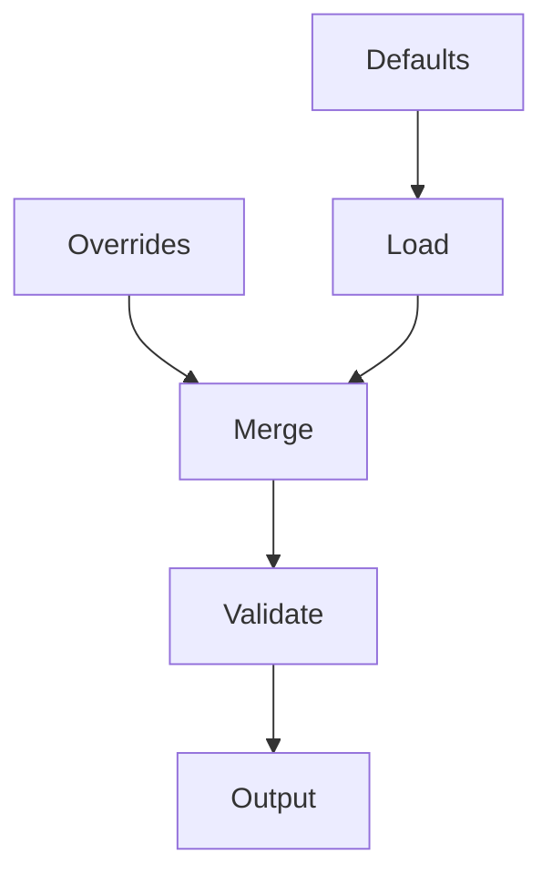

# Configuration

## Purpose

Shows how MAM modules manage runtime configuration: load values, merge defaults with overrides, and validate against a schema.

## Inputs

| Name | Type | Required | Description |
|------|------|----------|-------------|
| base | object | No | Default configuration |
| overrides | object | No | Overrides applied on top of defaults |

## Outputs

| Name | Type | Description |
|------|------|-------------|
| config | object | Merged configuration |
| issues | list | Validation issues found |

## Capabilities

### load

Load configuration from a defaults object.

### merge

Merge defaults with override values.

### validate

Validate the merged configuration against required keys.

## Rules

- Overrides take precedence over defaults.
- Required keys must be present after merging.
- Validation must not raise; it returns issues.

## Workflow



## Python

```python
REQUIRED = ["name", "timeout"]

def load(base: dict) -> dict:
    return dict(base)

def merge(base: dict, overrides: dict) -> dict:
    merged = dict(base)
    merged.update(overrides or {})
    return merged

def validate(config: dict) -> list:
    return [k for k in REQUIRED if k not in config]
```

## Tests

### Input

```yaml
base:
  name: app
  timeout: 30
overrides:
  timeout: 60
```

### Expected

```yaml
config:
  name: app
  timeout: 60
```

```python
def test_merge_overrides():
    cfg = merge({"name": "app", "timeout": 30}, {"timeout": 60})
    assert cfg["timeout"] == 60

def test_validate_missing():
    assert validate({"name": "app"}) == ["timeout"]

def test_validate_ok():
    assert validate({"name": "app", "timeout": 30}) == []
```

## Examples

### Basic Usage

```python
cfg = merge({"name": "app", "timeout": 30}, {"timeout": 60})
print(cfg)
```

### Expected Flow

```text
Defaults → Load → Merge → Validate → Output
```

## References

- MAM documentation