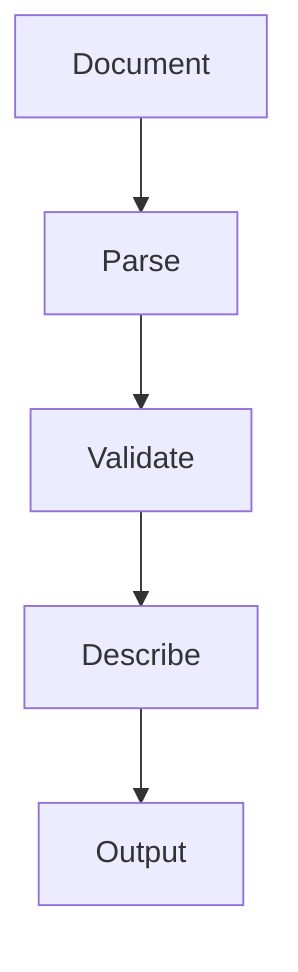

# Metadata

## Purpose

Shows how MAM modules carry machine readable identity in front matter: id, name, version, author, license, tags, runtime, capabilities, and permissions. This module parses, validates, and describes a metadata document.

## Inputs

| Name | Type | Required | Description |
|------|------|----------|-------------|
| document | string | Yes | YAML front matter text to parse |
| strict | bool | No | Require all mandatory fields (default: true) |

## Outputs

| Name | Type | Description |
|------|------|-------------|
| parsed | object | Parsed metadata document |
| valid | bool | Whether mandatory fields are present |
| missing | list | Missing mandatory fields |

## Capabilities

### parse

Parse a YAML front matter document into a structured object.

### validate

Check that mandatory identity fields are present.

### describe

Produce a human readable summary of the metadata.

## Rules

- Every module must declare an id, name, version, author, and runtime.
- Unknown fields are preserved, not dropped.
- Validation must not raise; it returns the missing fields.

## Workflow



## Python

```python
import re

MANDATORY = ["id", "name", "version", "author", "runtime"]

def parse(document: str) -> dict:
    """Parse a simple YAML front matter block."""
    data = {}
    for line in document.splitlines():
        line = line.strip()
        if ":" not in line:
            continue
        key, value = line.split(":", 1)
        data[key.strip()] = value.strip().strip("\"'")
    return data

def validate(document: str) -> dict:
    data = parse(document)
    missing = [f for f in MANDATORY if f not in data]
    return {"parsed": data, "valid": not missing, "missing": missing}

def describe(document: str) -> str:
    data = parse(document)
    return f"{data.get('name', 'unnamed')} v{data.get('version', '?')} by {data.get('author', 'unknown')}"
```

## Tests

### Input

```yaml
document: |
  id: hello
  name: Hello
  version: 2.0.0
  author: MAM Team
  runtime: python
```

### Expected

```yaml
valid: true
```

```python
def test_parse():
    doc = "id: a\nname: A\nversion: 2.0.0\nauthor: x\nruntime: python"
    data = parse(doc)
    assert data["id"] == "a"

def test_validate_ok():
    doc = "id: a\nname: A\nversion: 2.0.0\nauthor: x\nruntime: python"
    assert validate(doc)["valid"] is True

def test_validate_missing():
    assert validate("name: A")["missing"] == ["id", "version", "author", "runtime"]
```

## Examples

### Basic Usage

```python
doc = "id: hello\nname: Hello\nversion: 2.0.0\nauthor: MAM Team\nruntime: python"
print(describe(doc))
```

### Expected Flow

```text
Document → Parse → Validate → Describe → Output
```

## References

- MAM documentation