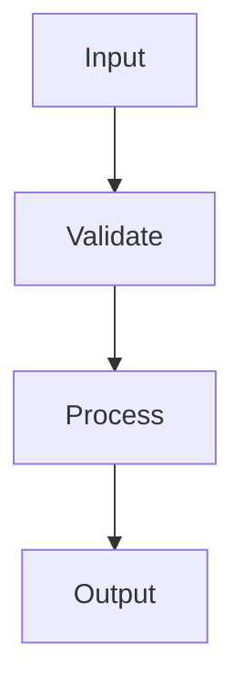

# Module

## Purpose

Shows the anatomy of a reusable MAM module: a purpose, declared inputs and outputs, exposed capabilities, behavioral rules, and a runnable implementation.

## Inputs

| Name | Type | Required | Description |
|------|------|----------|-------------|
| data | string | Yes | Input value to process |
| flag | bool | No | Processing flag (default: false) |

## Outputs

| Name | Type | Description |
|------|------|-------------|
| result | string | Processed value |
| checks | list | Validation checks performed |

## Capabilities

### process

Transform the input value according to the configured rules.

### validate

Run behavioral checks against the input.

## Rules

- Inputs must be non empty.
- Outputs must always be produced.
- Validation runs before processing.

## Workflow



## Python

```python
def validate(data: str) -> list:
    checks = []
    if data:
        checks.append("non_empty")
    return checks

def process(data: str, flag: bool = False) -> str:
    value = data.strip()
    return value.upper() if flag else value
```

## Tests

### Input

```yaml
data: hello
flag: true
```

### Expected

```yaml
result: HELLO
```

```python
def test_validate():
    assert validate("x") == ["non_empty"]
    assert validate("") == []

def test_process_upper():
    assert process("hello", flag=True) == "HELLO"

def test_process_plain():
    assert process("hello") == "hello"
```

## Examples

### Basic Usage

```python
print(process("hello", flag=True))
```

### Expected Flow

```text
Input → Validate → Process → Output
```

## References

- MAM documentation