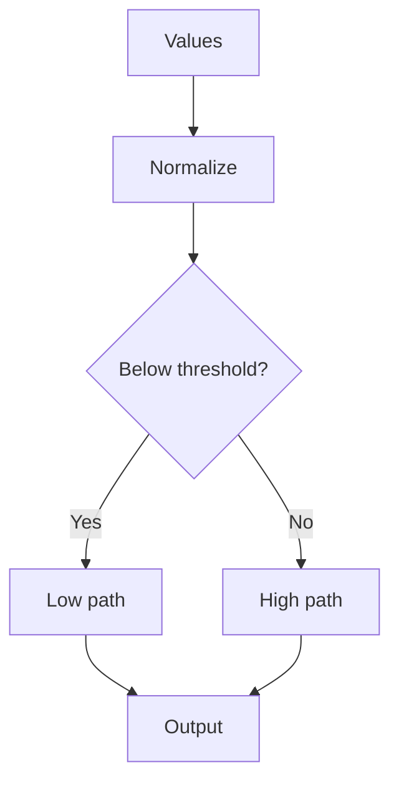

# Core Workflow

## Purpose

Shows how a MAM workflow composes steps in dependency order with conditional branching. Steps run sequentially and the workflow returns a final result.

## Inputs

| Name | Type | Required | Description |
|------|------|----------|-------------|
| values | list | Yes | Input values to process |
| threshold | int | No | Branch threshold (default: 5) |

## Outputs

| Name | Type | Description |
|------|------|-------------|
| steps | list | Per step results |
| final | any | Final workflow output |

## Capabilities

### run

Execute the workflow steps in order.

### evaluate

Evaluate the branch condition for a value.

## Rules

- Steps run in declaration order.
- Branching depends only on the current value.
- A failed step halts the workflow.

## Workflow



## Python

```python
def evaluate(value, threshold=5):
    return "low" if value < threshold else "high"

def run(values, threshold=5):
    results = []
    for value in values:
        results.append({"value": value, "branch": evaluate(value, threshold)})
    return {"steps": results, "final": results}
```

## Tests

### Input

```yaml
values: [1, 9]
threshold: 5
```

### Expected

```yaml
final: present
```

```python
def test_evaluate_low():
    assert evaluate(1) == "low"

def test_evaluate_high():
    assert evaluate(9) == "high"

def test_run():
    result = run([1, 9])
    assert len(result["steps"]) == 2
```

## Examples

### Basic Usage

```python
print(run([1, 9]))
```

### Expected Flow

```text
Values → Normalize → Branch → Output
```

## References

- MAM documentation