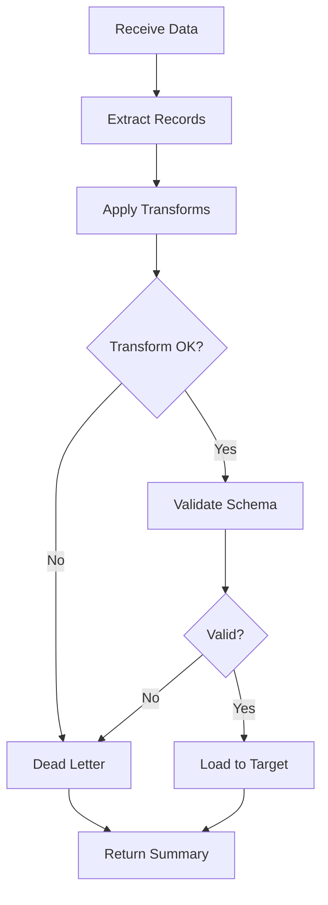

---
# MAM Metadata
id: data-pipeline
name: Data Pipeline Module
version: 1.0.0
type: module

author: MAM Team
description: >
  Data processing pipeline with extract, transform, validate,
  and load stages.

license: MIT

runtime:
  language: python
  version: ">=3.12"

tags:
  - data
  - pipeline
  - etl
  - transformation

dependencies:
  - name: mam-transform
    version: ">=1.0.0"

capabilities:
  - extract
  - apply_transforms
  - validate_schema
  - run
  - register_transform

permissions:
  filesystem:
    - read
  memory:
    - local
---

# Data Pipeline Module

## Purpose

Provides a reusable ETL (Extract-Transform-Load) pipeline framework. Handles data extraction from multiple source types, configurable transformations, schema validation, and loading into target stores with retry and dead-letter support.

## Inputs

| Name | Type | Required | Description |
|------|------|----------|-------------|
| action | string | Yes | "run", "validate_schema", "add_transform" |
| source_type | string | No | Source type: "csv", "json", "text", "list" |
| source_data | any | No | Raw data or path to load |
| transforms | list | No | Ordered list of transform function names |
| schema | dict | No | Validation schema with field rules |
| target | string | No | Target store id |

## Outputs

| Name | Type | Description |
|------|------|-------------|
| records | list | Processed records |
| summary | dict | Pipeline execution summary (counts, errors, duration_ms) |
| valid | bool | Whether all records passed validation |
| errors | list | Validation or processing errors |

## Capabilities

### extract

Extract records from list, json, csv, or text sources.

### apply_transforms

Apply configured transforms in order, routing failures to dead letter.

### validate_schema

Validate records against required fields, types, and patterns.

### run

Execute the full extract → transform → validate → load pipeline.

### register_transform

Register a custom transform function.

## Rules

- Transforms are applied in the order specified
- A failing transform stops that record and sends it to dead letter
- Schema validation runs after all transforms
- Maximum 100,000 records per pipeline run
- Source data must be non-None
- Dead-letter records are accessible via the summary

## Workflow



## Python

```python
import time
from typing import Any, Callable, Dict, List, Optional
from dataclasses import dataclass, field

@dataclass
class PipelineRecord:
    data: Any
    source: str = "input"
    valid: bool = True
    errors: List[str] = field(default_factory=list)

class DataPipeline:
    MAX_RECORDS = 100_000

    def __init__(self):
        self._transforms: Dict[str, Callable] = {}
        self._register_builtins()

    def _register_builtins(self):
        self._transforms["lower"] = lambda r: {k: v.lower() if isinstance(v, str) else v for k, v in r.items()} if isinstance(r, dict) else str(r).lower()
        self._transforms["upper"] = lambda r: {k: v.upper() if isinstance(v, str) else v for k, v in r.items()} if isinstance(r, dict) else str(r).upper()
        self._transforms["strip"] = lambda r: {k: v.strip() if isinstance(v, str) else v for k, v in r.items()} if isinstance(r, dict) else str(r).strip()
        self._transforms["to_int"] = lambda r: {k: int(v) for k, v in r.items()} if isinstance(r, dict) else int(r)
        self._transforms["deduplicate"] = lambda r: r  # handled at pipeline level

    def register_transform(self, name: str, fn: Callable):
        self._transforms[name] = fn

    def extract(self, source_type: str, source_data: Any) -> List[Dict]:
        """Extract records from various source types."""
        if source_type == "list":
            if isinstance(source_data, list):
                return [r if isinstance(r, dict) else {"value": r} for r in source_data]
            return [{"value": source_data}]

        if source_type == "json":
            if isinstance(source_data, str):
                import json
                parsed = json.loads(source_data)
                return parsed if isinstance(parsed, list) else [parsed]
            if isinstance(source_data, (list, dict)):
                return source_data if isinstance(source_data, list) else [source_data]

        if source_type == "csv":
            lines = str(source_data).strip().split("\n")
            if len(lines) < 2:
                return []
            headers = [h.strip() for h in lines[0].split(",")]
            return [
                {headers[i]: cell.strip() for i, cell in enumerate(line.split(",")) if i < len(headers)}
                for line in lines[1:]
            ]

        if source_type == "text":
            lines = str(source_data).strip().split("\n")
            return [{"line": i, "text": line} for i, line in enumerate(lines)]

        return [{"value": source_data}]

    def apply_transforms(self, records: List[Dict], transform_names: List[str]) -> tuple:
        """Apply transforms. Returns (transformed_records, dead_letter)."""
        transformed = []
        dead_letter = []

        for record in records:
            current = record
            failed = False
            for tname in transform_names:
                fn = self._transforms.get(tname)
                if not fn:
                    dead_letter.append({**record, "_error": f"Unknown transform: {tname}"})
                    failed = True
                    break
                try:
                    current = fn(current)
                except Exception as e:
                    dead_letter.append({**record, "_error": str(e)})
                    failed = True
                    break
            if not failed:
                transformed.append(current)

        return transformed, dead_letter

    def validate_schema(self, records: List[Dict], schema: Dict) -> tuple:
        """Validate records against schema. Returns (valid_records, errors)."""
        valid = []
        errors = []

        required = schema.get("required", [])
        types = schema.get("types", {})
        patterns = schema.get("patterns", {})

        for record in records:
            record_errors = []
            for field in required:
                if field not in record:
                    record_errors.append(f"Missing required field: {field}")

            for field, expected_type in types.items():
                if field in record:
                    val = record[field]
                    if expected_type == "int" and not isinstance(val, (int, float)):
                        record_errors.append(f"Field '{field}' must be int, got {type(val).__name__}")
                    elif expected_type == "str" and not isinstance(val, str):
                        record_errors.append(f"Field '{field}' must be str, got {type(val).__name__}")

            if record_errors:
                errors.append({"record": record, "errors": record_errors})
            else:
                valid.append(record)

        return valid, errors

    def run(self, source_type: str, source_data: Any,
            transforms: List[str] = None, schema: Dict = None) -> Dict:
        """Execute the full pipeline."""
        start = time.time()
        transforms = transforms or []

        records = self.extract(source_type, source_data)

        if len(records) > self.MAX_RECORDS:
            return {
                "records": [],
                "summary": {"total": 0, "valid": 0, "errors": 1,
                            "duration_ms": 0, "dead_letter": 0},
                "valid": False,
                "errors": [f"Exceeds max {self.MAX_RECORDS} records"],
            }

        transformed, dead_letter = self.apply_transforms(records, transforms)

        valid_records = transformed
        validation_errors = []
        if schema:
            valid_records, validation_errors = self.validate_schema(transformed, schema)

        duration = (time.time() - start) * 1000

        return {
            "records": valid_records,
            "summary": {
                "total": len(records),
                "valid": len(valid_records),
                "errors": len(validation_errors),
                "dead_letter": len(dead_letter),
                "duration_ms": round(duration, 2),
            },
            "valid": len(validation_errors) == 0,
            "errors": validation_errors,
        }
```

## Tests

### Test: Full Pipeline

Input:

```yaml
action: run
source_type: list
transforms:
  - upper
```

Expected:

```yaml
valid: true
```

```python
def test_extract_list():
    p = DataPipeline()
    records = p.extract("list", ["a", "b", "c"])
    assert len(records) == 3
    assert records[0] == {"value": "a"}

def test_extract_csv():
    p = DataPipeline()
    records = p.extract("csv", "x,y\n1,2\n3,4")
    assert len(records) == 2
    assert records[0] == {"x": "1", "y": "2"}

def test_transform():
    p = DataPipeline()
    records = [{"name": " ALICE "}]
    transformed, dead = p.apply_transforms(records, ["strip", "upper"])
    assert transformed[0]["name"] == "ALICE"

def test_schema_validation():
    p = DataPipeline()
    records = [{"name": "Alice"}, {"name": "Bob"}]
    valid, errors = p.validate_schema(records, {"required": ["name", "age"]})
    assert len(valid) == 0
    assert len(errors) == 2

def test_full_pipeline():
    p = DataPipeline()
    result = p.run("list", ["hello", "world"], transforms=["upper"])
    assert result["valid"] is True
    assert len(result["records"]) == 2
    assert result["records"][0] == "HELLO"
```

## Examples

### Basic Usage

```python
pipeline = DataPipeline()

data = "name,age\nAlice,30\nBob,twenty\nCharlie,25"

result = pipeline.run(
    "csv", data,
    transforms=["strip"],
    schema={"required": ["name", "age"], "types": {"age": "int"}},
)
print(result["summary"])
# {'total': 3, 'valid': 2, 'errors': 1, 'dead_letter': 0, 'duration_ms': ...}
print(result["records"])
# [{'name': 'Alice', 'age': '30'}, {'name': 'Charlie', 'age': '25'}]
```

### Expected Flow

```text
Extract → Transform → Validate → Load → Summary
```

## References

- MAM Data Pipeline Examples
- ETL and dead-letter queue patterns
