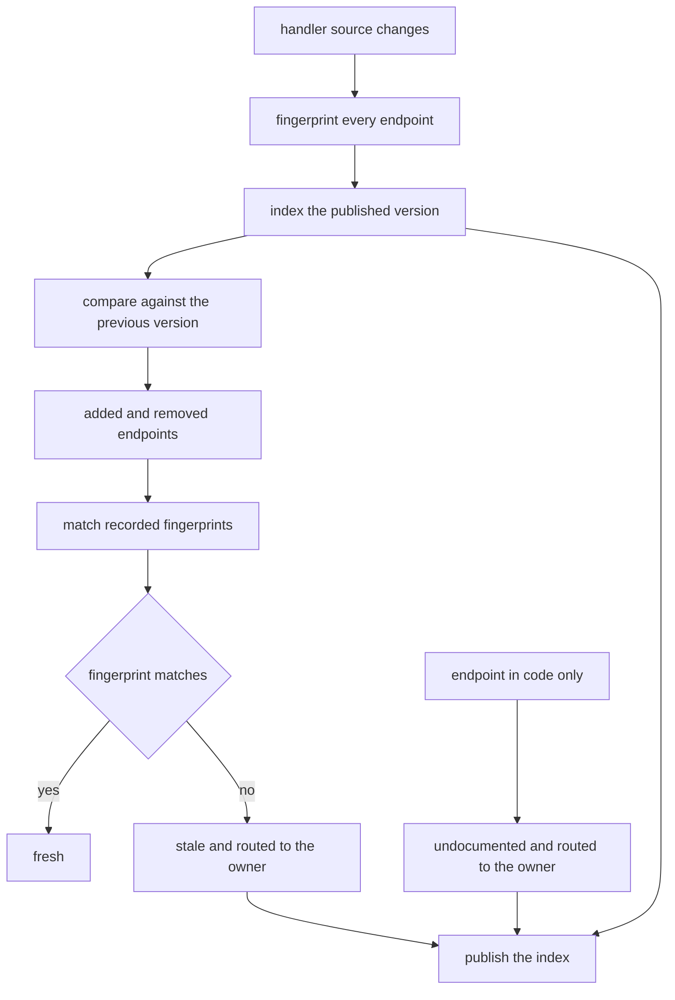

# Versioned API Reference

## Purpose

Documentation is a module that happens to be read by people, and it fails the
same way code fails: quietly, after the thing it describes has moved on. This
one is a versioned reference with three jobs. It indexes the endpoints of a
published version, it diffs two published versions so a reader knows what
changed, and it reports drift by comparing the fingerprint each endpoint had
when the page was written against the fingerprint the code has now.

The drift report is the reason this is a module rather than a folder of
Markdown. A folder cannot tell you it is wrong.

## Inputs

| Name | Type | Required | Description |
|------|------|----------|-------------|
| version | string | Yes | Published reference version such as `2.0.0` |
| spec | object | Yes | Endpoint table of one version: method, path, summary, since |
| code | object | Yes | Map of endpoint key to the current source implementing it |
| recorded | object | Yes | Map of endpoint key to the fingerprint seen at publication |

## Outputs

| Name | Type | Description |
|------|------|-------------|
| index | list | Endpoint keys of a version, sorted, as `METHOD /path` |
| delta | object | `added`, `removed` and `changed` between two versions |
| drift | object | `stale`, `fresh` and `undocumented` lists, each with an owner |

## Capabilities

### index_endpoints

Return the sorted endpoint index of one published reference version.

### compare_versions

Report which endpoints were added, removed, or had their summary changed
between two published versions.

### report_drift

Compare the recorded fingerprints against the current code and name the owner
of everything that has gone stale.

## Audience

- **Primary:** integrators reading what a call looks like before they write it.
- **Secondary:** reviewers who need to know what a change to the service breaks.
- **Not the audience:** the person who wrote the handler. The reference is
  written to be read cold, so every page stands on its own and links out only
  for genuinely separate topics.

## Structure

Each published version is one immutable page set:

| Page | Contents |
|------|----------|
| `index` | Every endpoint of the version, sorted, one line each |
| `changelog` | What the version added, removed, and deprecated |
| `endpoint` | One page per endpoint: method, path, parameters, responses, owner |

Pages are named after the endpoint, never after the internal service or team
that happens to own it, so a reorganisation does not move a URL.

## Source of Truth

- The reference is written from the handlers, never from a design document. If
  the two disagree, the handler wins and the page is wrong.
- Every endpoint page records a fingerprint of the source that implements it.
  The fingerprint is a SHA-256 of the handler source, not a version number,
  because version numbers lie about drift.
- The endpoint key `METHOD /path` is the identity used by the index, the
  changelog, and the drift report alike; nothing is identified by position in
  a file.

## Freshness and Ownership

- A page is stale when the current handler fingerprint differs from the recorded
  one. A stale page is still served, flagged, because deleting it would break
  readers who are mid-integration.
- Every endpoint has exactly one owning team, and the drift report always names
  it, so a stale page is a task with an assignee rather than a fact.
- An endpoint present in the code but absent from the published reference is
  *undocumented*: it exists, it is reachable, and nobody has promised its
  shape.
- A version is frozen on publication. Post-publication fixes are made by
  republishing that version with a bumped patch number, never by editing the
  prose of a frozen one.

## Rules

- Endpoint keys are `METHOD /path` with an uppercase method and a leading slash.
- An endpoint is never silently removed from a version; it is deprecated first.
- A summary change is a documentation change and is reported as such, even when
  the code did not move.
- Drift comparison is a pure function of `code` and `recorded`.
- Every drift entry names an owner, even when the owner is `unassigned`.
- The index never contains duplicates, because a duplicate key is a
  specification bug, not two endpoints.

## Workflow



## Python

```python
import hashlib
from typing import Any, Dict, List, Optional

SPECS: Dict[str, List[Dict[str, str]]] = {
    "1.0.0": [
        {"method": "GET", "path": "/v1/users", "summary": "List users", "since": "1.0.0"},
        {"method": "GET", "path": "/v1/users/{id}", "summary": "Read one user", "since": "1.0.0"},
        {"method": "GET", "path": "/v1/orders", "summary": "List orders", "since": "1.0.0"},
    ],
    "2.0.0": [
        {"method": "GET", "path": "/v1/users", "summary": "List users", "since": "1.0.0", "deprecated": "3.0.0"},
        {"method": "GET", "path": "/v1/users/{id}", "summary": "Read one user, including the tenant id", "since": "1.0.0"},
        {"method": "GET", "path": "/v1/orders", "summary": "List orders", "since": "1.0.0"},
        {"method": "GET", "path": "/v2/orders", "summary": "List orders with cursor pagination", "since": "2.0.0"},
        {"method": "GET", "path": "/v2/orders/{id}", "summary": "Read one order", "since": "2.0.0"},
    ],
}

OWNERS: Dict[str, str] = {
    "GET /v1/users": "identity",
    "GET /v1/users/{id}": "identity",
    "GET /v1/orders": "orders",
    "GET /v2/orders": "orders",
    "GET /v2/orders/{id}": "unassigned",
}

CODE: Dict[str, str] = {
    "GET /v1/users": "def list_users(tenant):\n    return store.users_of(tenant)\n",
    "GET /v1/users/{id}": "def read_user(tenant, user_id):\n    return store.user(tenant, user_id)\n",
    "GET /v1/orders": "def list_orders(tenant):\n    return store.orders_of(tenant)\n",
    "GET /v2/orders": "def list_orders_v2(tenant, cursor=None, limit=50):\n    return store.page(tenant, cursor, limit)\n",
    "GET /v2/orders/{id}": "def read_order_v2(tenant, order_id):\n    return store.order(tenant, order_id)\n",
    "DELETE /v1/users/{id}": "def delete_user(tenant, user_id):\n    return store.delete(tenant, user_id)\n",
}

PUBLISHED = "2.0.0"
RECORDED: Dict[str, str] = {
    "GET /v1/users": "bb0507f2c896dfe66aa3d0de027861a0dafbc49cb87cd4a50f500b70583e45d3",
    "GET /v1/users/{id}": "5ee7ea92591353ee41c2e62b101f275c7ea9edf0e150bba99f65b5edf256757d",
    "GET /v1/orders": "e98e3bed4472649662ee2c668379768a739d70c57e50841c12fdb58fd3615114",
    "GET /v2/orders": "069d440288eb57617802dfcf4c4da683469aeb3f22b05755f5014f8036c18641",
    "GET /v2/orders/{id}": "5d918b17563b7cffd9729257ac136256bec0c5d90bda5ab7c33f8c51c6c03a69",
}


def fingerprint(source: str) -> str:
    """A stable digest of a handler body, whitespace included."""
    return hashlib.sha256(source.encode("utf-8")).hexdigest()


def endpoint_key(method: str, path: str) -> str:
    if not method.isupper():
        raise ValueError(f"method must be uppercase, got {method!r}")
    if not path.startswith("/"):
        raise ValueError(f"path must start with a slash, got {path!r}")
    return f"{method} {path}"


def index_endpoints(version: str) -> List[str]:
    """The sorted endpoint index of one published version."""
    if version not in SPECS:
        raise KeyError(f"no published reference for version {version!r}")
    keys = [endpoint_key(e["method"], e["path"]) for e in SPECS[version]]
    if len(set(keys)) != len(keys):
        raise ValueError(f"version {version!r} contains a duplicate endpoint key")
    return sorted(keys)


def compare_versions(old: str, new: str) -> Dict[str, List[str]]:
    """What changed between two published versions."""
    def table(version: str) -> Dict[str, str]:
        return {endpoint_key(e["method"], e["path"]): e["summary"] for e in SPECS[version]}

    before, after = table(old), table(new)
    return {
        "added": sorted(set(after) - set(before)),
        "removed": sorted(set(before) - set(after)),
        "changed": sorted(k for k in set(before) & set(after) if before[k] != after[k]),
    }


def report_drift(version: str = PUBLISHED) -> Dict[str, Any]:
    """Compare recorded fingerprints against the code that is live now."""
    documented = set(index_endpoints(version))
    live = set(CODE)
    stale: List[Dict[str, str]] = []
    fresh: List[Dict[str, str]] = []
    for key in sorted(documented):
        recorded = RECORDED.get(key)
        if recorded is None:
            stale.append({"endpoint": key, "owner": OWNERS.get(key, "unassigned"), "reason": "no fingerprint recorded"})
            continue
        if key not in CODE:
            stale.append({"endpoint": key, "owner": OWNERS.get(key, "unassigned"), "reason": "handler is gone"})
            continue
        if fingerprint(CODE[key]) == recorded:
            fresh.append({"endpoint": key, "owner": OWNERS.get(key, "unassigned")})
        else:
            stale.append({"endpoint": key, "owner": OWNERS.get(key, "unassigned"), "reason": "handler changed"})
    undocumented = [
        {"endpoint": key, "owner": OWNERS.get(key, "unassigned")} for key in sorted(live - documented)
    ]
    return {
        "version": version,
        "stale": stale,
        "fresh": fresh,
        "undocumented": undocumented,
        "ok": not stale and not undocumented,
    }
```

## Tests

### Input

```yaml
version: 2.0.0
old: 1.0.0
new: 2.0.0
```

### Expected

```yaml
index_size: 5
added: 2
removed: 0
changed: 1
```

```python
def test_index_endpoints_is_sorted_and_unique():
    index = index_endpoints("2.0.0")
    assert index == sorted(index)
    assert len(set(index)) == len(index)
    assert "GET /v2/orders/{id}" in index


def test_index_endpoints_for_the_first_version():
    assert index_endpoints("1.0.0") == [
        "GET /v1/orders",
        "GET /v1/users",
        "GET /v1/users/{id}",
    ]


def test_index_endpoints_rejects_an_unpublished_version():
    try:
        index_endpoints("9.9.9")
    except KeyError:
        return
    raise AssertionError("expected KeyError")


def test_endpoint_key_is_validated():
    for method, path in (("get", "/v1/users"), ("GET", "v1/users")):
        try:
            endpoint_key(method, path)
        except ValueError:
            continue
        raise AssertionError(f"expected rejection for {method} {path}")


def test_compare_versions_finds_additions():
    delta = compare_versions("1.0.0", "2.0.0")
    assert delta["added"] == ["GET /v2/orders", "GET /v2/orders/{id}"]
    assert delta["removed"] == []
    assert delta["changed"] == ["GET /v1/users/{id}"]


def test_compare_versions_is_reversible():
    forward = compare_versions("1.0.0", "2.0.0")
    backward = compare_versions("2.0.0", "1.0.0")
    assert forward["added"] == backward["removed"]
    assert forward["removed"] == backward["added"]
    assert forward["changed"] == backward["changed"]


def test_compare_versions_of_a_version_with_itself_is_empty():
    delta = compare_versions("2.0.0", "2.0.0")
    assert delta == {"added": [], "removed": [], "changed": []}


def test_fingerprint_is_stable_and_sensitive():
    assert fingerprint("def a():\n    pass\n") == fingerprint("def a():\n    pass\n")
    assert fingerprint("def a():\n    pass\n") != fingerprint("def a():\n    return 1\n")
    assert len(fingerprint("x")) == 64


def test_recorded_fingerprints_match_the_live_code():
    for key, recorded in RECORDED.items():
        assert fingerprint(CODE[key]) == recorded, key


def test_report_drift_is_clean_while_nothing_moves():
    report = report_drift()
    assert report["version"] == "2.0.0"
    assert report["stale"] == []
    assert [e["endpoint"] for e in report["fresh"]] == index_endpoints("2.0.0")
    assert report["ok"] is False  # DELETE /v1/users/{id} is live in code but undocumented
    assert [e["endpoint"] for e in report["undocumented"]] == ["DELETE /v1/users/{id}"]


def test_report_drift_flags_a_moved_handler():
    original = CODE["GET /v2/orders"]
    CODE["GET /v2/orders"] = (
        "def list_orders_v2(tenant, cursor=None, limit=25):\n"
        "    return store.page(tenant, cursor, limit)\n"
    )
    try:
        report = report_drift()
    finally:
        CODE["GET /v2/orders"] = original
    stale = {e["endpoint"]: e for e in report["stale"]}
    assert list(stale) == ["GET /v2/orders"]
    assert stale["GET /v2/orders"]["reason"] == "handler changed"
    assert stale["GET /v2/orders"]["owner"] == "orders"
    assert "GET /v2/orders" not in [e["endpoint"] for e in report["fresh"]]
    assert report_drift()["stale"] == []


def test_report_drift_flags_a_handler_that_is_gone():
    saved = CODE.pop("GET /v2/orders/{id}")
    try:
        report = report_drift()
    finally:
        CODE["GET /v2/orders/{id}"] = saved
    assert [e["reason"] for e in report["stale"]] == ["handler is gone"]
    assert report["stale"][0]["owner"] == "unassigned"


def test_report_drift_names_an_owner_for_every_entry():
    report = report_drift()
    for bucket in ("stale", "fresh", "undocumented"):
        for entry in report[bucket]:
            assert entry["owner"]
    assert report["undocumented"][0]["owner"] == "unassigned"


def test_report_drift_rejects_an_unpublished_version():
    try:
        report_drift("3.0.0")
    except KeyError:
        return
    raise AssertionError("expected KeyError")
```

## Examples

```python
def main():
    print("index 2.0.0:")
    for key in index_endpoints("2.0.0"):
        print("  " + key)

    print("1.0.0 -> 2.0.0:", compare_versions("1.0.0", "2.0.0"))

    report = report_drift()
    print("fresh:", [e["endpoint"] for e in report["fresh"]])
    print("stale:", [e["endpoint"] for e in report["stale"]])
    print("undocumented:", [(e["endpoint"], e["owner"]) for e in report["undocumented"]])

    # The page is correct until the handler underneath it moves.
    CODE["GET /v2/orders"] = "def list_orders_v2(tenant, cursor=None, limit=25):\n    return store.page(tenant, cursor, limit)\n"
    moved = report_drift()
    print("after the handler moves:", [(e["endpoint"], e["owner"], e["reason"]) for e in moved["stale"]])
    CODE["GET /v2/orders"] = SOURCE["GET /v2/orders"]


SOURCE = dict(CODE)
main()
# index 2.0.0:
#   GET /v1/orders
#   GET /v1/users
#   GET /v1/users/{id}
#   GET /v2/orders
#   GET /v2/orders/{id}
# 1.0.0 -> 2.0.0: {'added': ['GET /v2/orders', 'GET /v2/orders/{id}'], 'removed': [], 'changed': ['GET /v1/users/{id}']}
# fresh: ['GET /v1/orders', 'GET /v1/users', 'GET /v1/users/{id}', 'GET /v2/orders', 'GET /v2/orders/{id}']
# stale: []
# undocumented: [('DELETE /v1/users/{id}', 'unassigned')]
# after the handler moves: [('GET /v2/orders', 'orders', 'handler changed')]
```

## References

- [MAM Specification](../../plan-doc/full-mam.md)
- [Documentation templates](../../templates/documentation/)
- [Contract templates](../../templates/contract/)
