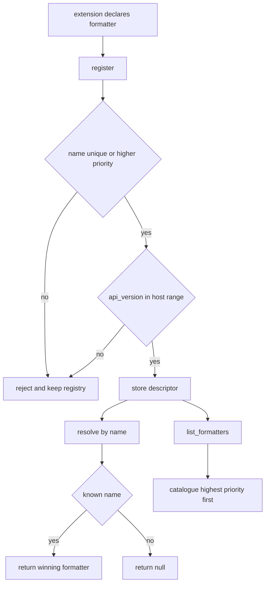

# Formatter Extension Point

## Purpose

An extension point is a promise that something unknown can be added later
without editing the host. Here the host renders tabular reports and leaves the
actual formatting to whatever the user installs. The extension point states
what a formatter is (a name, a media type, a render function), how it is
discovered (declared through the registry, never imported by the host), and
which host API versions it is allowed to load against.

The host in this example ships two built-in formatters and can accept a
third-party one at runtime, which is exactly the property the point exists to
guarantee.

## Inputs

| Name | Type | Required | Description |
|------|------|----------|-------------|
| name | string | Yes | Unique format identifier such as `table` or `csv` |
| extension_id | string | Yes | Reverse-DNS identifier of the providing extension |
| api_version | string | Yes | Host API version the extension was built against |
| priority | integer | No | Tie-breaker when two extensions claim the same name |
| media_type | string | No | Media type emitted for the format, defaults to `text/plain` |
| render | callable | Yes | Function from a record list to a string |

## Outputs

| Name | Type | Description |
|------|------|-------------|
| registration | object | The stored descriptor: name, extension, priority, media type |
| formatter | object | The winning formatter, or `null` when the name is unknown |
| catalogue | list | Every registered formatter, highest priority first |

## Capabilities

### register

Admit a formatter extension after checking uniqueness and host compatibility.

### resolve

Return the formatter that wins for a given format name.

### list_formatters

Return the full catalogue of loaded formatters in resolution order.

## Hook Contract

A formatter extension is any object with a `render(records)` callable that
returns a string. The host guarantees to:

- call `render` with a list of flat dictionaries, never `None`;
- call `render` synchronously and treat any exception as a failed render;
- never pass a formatter anything it did not declare in its registration.

A formatter guarantees to:

- be deterministic for the same records;
- return `str` and perform no I/O on the host's behalf;
- tolerate records it does not recognise by skipping them.

## Discovery

- Extensions declare themselves; the host never imports a third-party module by
  name on its own initiative.
- A formatter whose `api_version` does not satisfy the host's range is rejected
  at load time with a message naming both versions, not silently skipped.
- Registering an already known name is allowed and is the documented way to
  override a built-in, provided the new registration has a strictly higher
  priority.

## Host Compatibility

- The host API range is `>=1.0.0 <2.0.0`; an extension may declare any version
  inside it.
- Extensions below `1.0.0` or at or above `2.0.0` are refused at load time.
- Adding a new formatter name is a non-breaking change for the host; removing
  or renaming a built-in name is breaking and requires a new host major.

## Rules

- Format names are unique, lowercase, and match `[a-z][a-z0-9_-]*`.
- Priority is an integer; the highest priority wins and ties are impossible
  because re-registering a name requires a strictly greater priority.
- Registration order never affects resolution order.
- A rejected registration leaves the registry exactly as it was.
- The catalogue is a copy: mutating it cannot corrupt the registry.
- No filesystem or network access happens during registration or resolution.

## Workflow



## Python

```python
import re
from typing import Any, Callable, Dict, List, Optional

HOST_API_RANGE = ">=1.0.0 <2.0.0"
NAME_PATTERN = re.compile(r"^[a-z][a-z0-9_-]*$")


class ExtensionRejected(ValueError):
    """Raised when an extension cannot be loaded into the host."""


def _version_tuple(version: str):
    bits = str(version).split(".")
    if len(bits) != 3 or not all(part.isdigit() for part in bits):
        raise ExtensionRejected(f"api_version must be MAJOR.MINOR.PATCH, got {version!r}")
    return tuple(int(part) for part in bits)


def _satisfies(version: str, spec: str) -> bool:
    current = _version_tuple(version)
    for operator, bound in re.findall(r"(>=|<=|>|<|=)\s*(\d+\.\d+\.\d+)", spec):
        target = _version_tuple(bound)
        outcome = (current > target) - (current < target)
        if operator == ">=" and not outcome >= 0:
            return False
        if operator == ">" and not outcome > 0:
            return False
        if operator == "<=" and not outcome <= 0:
            return False
        if operator == "<" and not outcome < 0:
            return False
        if operator == "=" and outcome != 0:
            return False
    return True


def _render_json(records: List[Dict[str, Any]]) -> str:
    import json

    return json.dumps(records, indent=2, sort_keys=True)


def _render_table(records: List[Dict[str, Any]]) -> str:
    if not records:
        return "(no rows)"
    columns = list(records[0].keys())
    widths = {c: max(len(c), *(len(str(row.get(c, ""))) for row in records)) for c in columns}
    line = " | ".join(c.ljust(widths[c]) for c in columns)
    rule = "-+-".join("-" * widths[c] for c in columns)
    body = [
        " | ".join(str(row.get(c, "")).ljust(widths[c]) for c in columns).rstrip() for row in records
    ]
    return "\n".join([line, rule, *body])


def _render_csv(records: List[Dict[str, Any]]) -> str:
    if not records:
        return ""
    columns = list(records[0].keys())
    rows = [",".join(columns)]
    rows.extend(",".join(str(row.get(c, "")) for c in columns) for row in records)
    return "\n".join(rows)


class FormatterRegistry:
    """The host side of the extension point."""

    def __init__(self, host_api: str = "1.4.0", api_range: str = HOST_API_RANGE) -> None:
        self.host_api = host_api
        self.api_range = api_range
        self._entries: Dict[str, Dict[str, Any]] = {}

    def register(
        self,
        name: str,
        extension_id: str,
        api_version: str,
        render: Callable[[List[Dict[str, Any]]], str],
        priority: int = 0,
        media_type: str = "text/plain",
    ) -> Dict[str, Any]:
        if not isinstance(name, str) or not NAME_PATTERN.match(name):
            raise ExtensionRejected(f"format name {name!r} must match [a-z][a-z0-9_-]*")
        if not isinstance(priority, int) or isinstance(priority, bool):
            raise ExtensionRejected("priority must be an integer")
        if not callable(render):
            raise ExtensionRejected("render must be callable")
        if not _satisfies(api_version, self.api_range):
            raise ExtensionRejected(
                f"extension {extension_id} targets host API {api_version}, "
                f"host {self.host_api} accepts {self.api_range}"
            )
        existing = self._entries.get(name)
        if existing is not None and priority <= existing["priority"]:
            raise ExtensionRejected(
                f"{name} is already provided by {existing['extension_id']} "
                f"at priority {existing['priority']}"
            )
        descriptor = {
            "name": name,
            "extension_id": extension_id,
            "api_version": api_version,
            "priority": priority,
            "media_type": media_type,
            "render": render,
        }
        self._entries[name] = descriptor
        return dict(descriptor)

    def resolve(self, name: str) -> Optional[Dict[str, Any]]:
        entry = self._entries.get(name)
        return dict(entry) if entry is not None else None

    def list_formatters(self) -> List[Dict[str, Any]]:
        ordered = sorted(self._entries.values(), key=lambda e: (-e["priority"], e["name"]))
        return [{k: v for k, v in entry.items() if k != "render"} for entry in ordered]

    def format_records(self, records: List[Dict[str, Any]], fmt: str) -> Optional[str]:
        entry = self._entries.get(fmt)
        if entry is None:
            return None
        return entry["render"](records)


def build_host() -> FormatterRegistry:
    """A host that ships two built-ins and still accepts a third-party one."""
    registry = FormatterRegistry()
    registry.register("json", "mam.core", "1.0.0", _render_json, priority=10, media_type="application/json")
    registry.register("table", "mam.core", "1.0.0", _render_table, priority=10, media_type="text/plain")
    return registry
```

## Tests

### Input

```yaml
name: csv
extension_id: com.acme.tables
api_version: 1.2.0
priority: 20
```

### Expected

```yaml
accepted: true
resolved_media_type: text/csv
catalogue_head: csv
```

```python
def test_builtin_registry_resolves():
    host = build_host()
    assert sorted(host.list_formatters()[i]["name"] for i in range(2)) == ["json", "table"]
    assert "application/json" == host.resolve("json")["media_type"]


def test_register_third_party_formatter():
    host = build_host()
    host.register("csv", "com.acme.tables", "1.2.0", _render_csv, priority=20, media_type="text/csv")
    entry = host.resolve("csv")
    assert entry["extension_id"] == "com.acme.tables"
    assert entry["media_type"] == "text/csv"
    assert host.list_formatters()[0]["name"] == "csv"


def test_resolve_unknown_name_is_null():
    assert build_host().resolve("yaml") is None
    assert build_host().format_records([{"a": 1}], "yaml") is None


def test_register_rejects_incompatible_api_version():
    host = build_host()
    for version in ("0.9.0", "2.0.0"):
        try:
            host.register("csv", "com.acme.tables", version, _render_csv, priority=20)
        except ExtensionRejected as exc:
            assert "host" in str(exc)
            continue
        raise AssertionError(f"expected rejection for api_version {version}")


def test_register_rejects_bad_name_and_priority():
    host = build_host()
    for name in ("CSV", "1csv", "", "csv!"):
        try:
            host.register(name, "com.acme", "1.0.0", _render_csv)
        except ExtensionRejected:
            continue
        raise AssertionError(f"expected rejection for name {name!r}")
    try:
        host.register("yaml", "com.acme", "1.0.0", _render_csv, priority="high")
    except ExtensionRejected:
        pass
    else:
        raise AssertionError("expected rejection for non-integer priority")


def test_register_requires_callable():
    try:
        build_host().register("yaml", "com.acme", "1.0.0", "not-callable")
    except ExtensionRejected:
        return
    raise AssertionError("expected rejection for non-callable render")


def test_override_requires_strictly_higher_priority():
    host = build_host()
    try:
        host.register("table", "com.acme", "1.0.0", _render_csv, priority=10)
    except ExtensionRejected:
        pass
    else:
        raise AssertionError("expected equal priority to be rejected")
    assert host.resolve("table")["extension_id"] == "mam.core"
    host.register("table", "com.acme", "1.0.0", _render_csv, priority=11)
    assert host.resolve("table")["extension_id"] == "com.acme"


def test_rejected_registration_leaves_registry_untouched():
    host = build_host()
    before = host.list_formatters()
    try:
        host.register("table", "com.acme", "1.0.0", _render_csv, priority=1)
    except ExtensionRejected:
        pass
    assert host.list_formatters() == before


def test_catalogue_is_a_copy():
    host = build_host()
    catalogue = host.list_formatters()
    catalogue.clear()
    assert len(host.list_formatters()) == 2


def test_satisfies_range():
    assert _satisfies("1.0.0", HOST_API_RANGE) is True
    assert _satisfies("1.9.3", HOST_API_RANGE) is True
    assert _satisfies("1.9.3", ">=1.2.0 <2.0.0") is True
    assert _satisfies("1.1.0", ">=1.2.0 <2.0.0") is False
    assert _satisfies("2.0.0", HOST_API_RANGE) is False
```

## Examples

```python
import re

NAME_PATTERN = re.compile(r"^[a-z][a-z0-9_-]*$")
HOST_API_RANGE = ">=1.0.0 <2.0.0"


class ExtensionRejected(ValueError):
    pass


def third_party_markdown(records):
    if not records:
        return "_no rows_"
    lines = []
    for record in records:
        pairs = ", ".join(f"**{k}**: {v}" for k, v in record.items())
        lines.append(f"- {pairs}")
    return "\n".join(lines)


def main():
    host = build_host()
    host.register("csv", "com.acme.tables", "1.2.0", _render_csv, priority=20, media_type="text/csv")
    host.register("md", "com.acme.docs", "1.3.1", third_party_markdown, priority=5, media_type="text/markdown")

    rows = [{"region": "emea", "orders": 12}, {"region": "apac", "orders": 7}]
    for fmt in ("table", "csv", "md", "yaml"):
        rendered = host.format_records(rows, fmt)
        print(f"--- {fmt} ---")
        print(rendered if rendered is not None else "(no such format)")

    print("catalogue:", [entry["name"] for entry in host.list_formatters()])
    try:
        host.register("table", "com.acme", "1.0.0", _render_csv, priority=10)
    except ValueError as exc:
        print("refused:", exc)


main()
# --- table ---
# region | orders
# -------+-------
# emea   | 12
# apac   | 7
# --- csv ---
# region,orders
# emea,12
# apac,7
# --- md ---
# - **region**: emea, **orders**: 12
# - **region**: apac, **orders**: 7
# --- yaml ---
# (no such format)
# catalogue: ['csv', 'json', 'table', 'md']
# refused: table is already provided by mam.core at priority 10
```

## References

- [MAM Specification](../../plan-doc/full-mam.md)
- [Extension templates](../../templates/extension/)
- [Interface templates](../../templates/interface/)
