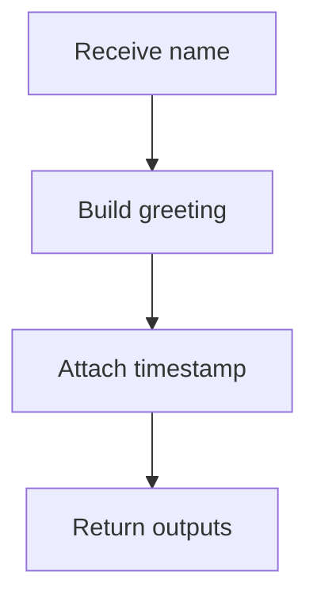

# Hello

## Purpose

Return a greeting for a given name. This module is a standalone `.mam`
artifact executed natively by the MAM runtime, without compiling to Python,
JavaScript, or any other target.

## Inputs

| Name | Type | Required | Description |
|------|------|----------|-------------|
| name | string | No | Name to greet (defaults to "World") |

## Outputs

| Name | Type | Description |
|------|------|-------------|
| greeting | string | The generated greeting message |
| timestamp | string | ISO-8601 timestamp of execution |

## Rules

- Always return a greeting message
- Include a timestamp with every response
- Never expose internal errors to the caller

## Workflow

