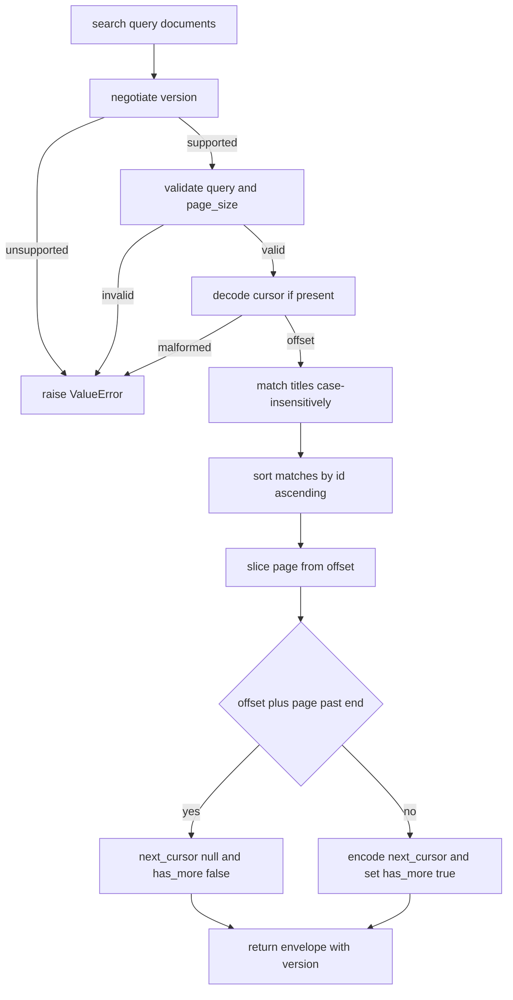

# Paginated Search Interface

## Purpose

An `interface` is a promise. Callers — possibly in other languages, possibly
written years from now — code against the shape of the response and the
meaning of its fields, not against how results happen to be produced. This one
publishes a versioned search endpoint over a document collection: a required
query, a bounded page size, an opaque cursor, and a response envelope that says
what version produced it and whether more pages exist.

The opacity of the cursor is the load-bearing part. A caller must treat it as a
string it hands back unchanged; the encoding, the offset semantics and the sort
stability are implementation details that may change within a major version. The
compatibility promise is spelled out below: fields may be added within a major
version, existing fields may not change type or meaning, and any breaking
change requires a new major version — which the version negotiation in
`negotiate_version` refuses to paper over.

## Inputs

| Name | Type | Required | Description |
|------|------|----------|-------------|
| query | string | Yes | Non-empty search string, whitespace trimmed |
| documents | list | Yes | The collection to search, each a mapping with `id` and `title` |
| page_size | number | No | Items per page, 1 to 100, defaults to 20 |
| cursor | string | No | Opaque cursor from a previous response, null for the first page |
| version | string | No | Requested API version, defaults to the current version |

## Outputs

| Name | Type | Description |
|------|------|-------------|
| items | list | The documents on this page, each a mapping with `id` and `title` |
| next_cursor | string | Cursor for the following page, null on the last page |
| total | number | Total matches across all pages |
| page_size | number | The page size actually used |
| version | string | The major version that served the request |
| has_more | boolean | True when another page exists |

## Capabilities

### search

Return one page of results for a query, honouring page size and cursor.

### describe

Return the contract metadata: supported versions, defaults and field types.

### negotiate_version

Resolve a requested version string to a supported major version, raising on an
unsupported one.

## Rules

- `query` must be a non-empty string after trimming; otherwise `ValueError`.
- `page_size` must be an integer between 1 and 100 inclusive; otherwise
  `ValueError`.
- An unrecognised or malformed cursor must raise `ValueError`, never be
  silently ignored.
- Callers must treat `next_cursor` as opaque and pass it back unchanged.
- `next_cursor` is null on the last page and `has_more` agrees with it.
- New response fields may be added within a major version; existing fields may
  not change type, name or meaning.
- A breaking change requires a new major version; unsupported versions raise.
- Matching is case-insensitive substring matching over the document `title`.
- Results are ordered by document id ascending so pagination is stable.

## Workflow



## Python

```python
from typing import Any, Dict, List, Optional

MAJOR_VERSION = 1
CURRENT_VERSION = "1.0"
SUPPORTED_VERSIONS = ("1.0",)
CURSOR_PREFIX = "c1:"
DEFAULT_PAGE_SIZE = 20
MIN_PAGE_SIZE = 1
MAX_PAGE_SIZE = 100

RESPONSE_FIELDS = {
    "items": "list",
    "next_cursor": "string|null",
    "total": "number",
    "page_size": "number",
    "version": "string",
    "has_more": "boolean",
}


class SearchError(ValueError):
    """Raised when a request violates the search contract."""


def negotiate_version(requested: str) -> str:
    if not isinstance(requested, str) or not requested:
        raise SearchError("version must be a non-empty string")
    major = requested.split(".")[0]
    try:
        major_number = int(major)
    except ValueError as exc:
        raise SearchError(f"malformed version {requested!r}") from exc
    for supported in SUPPORTED_VERSIONS:
        if int(supported.split(".")[0]) == major_number:
            return supported
    raise SearchError(f"unsupported major version {major_number}")


def describe() -> Dict[str, Any]:
    return {
        "interface": "paginated-search",
        "current_version": CURRENT_VERSION,
        "supported_versions": list(SUPPORTED_VERSIONS),
        "defaults": {"page_size": DEFAULT_PAGE_SIZE, "cursor": None},
        "limits": {"min_page_size": MIN_PAGE_SIZE, "max_page_size": MAX_PAGE_SIZE},
        "response_fields": dict(RESPONSE_FIELDS),
        "compatibility": "additive within a major version; breaking changes bump the major",
    }


def _encode_cursor(offset: int) -> str:
    return f"{CURSOR_PREFIX}{offset}"


def _decode_cursor(cursor: str) -> int:
    if not isinstance(cursor, str) or not cursor.startswith(CURSOR_PREFIX):
        raise SearchError("cursor is not a cursor issued by this interface")
    raw = cursor[len(CURSOR_PREFIX):]
    try:
        offset = int(raw)
    except ValueError as exc:
        raise SearchError("cursor does not encode a valid offset") from exc
    if offset < 0:
        raise SearchError("cursor offset must be non-negative")
    return offset


def _matches(document: Dict[str, Any], needle: str) -> bool:
    title = document.get("title", "")
    return isinstance(title, str) and needle in title.lower()


def search(query: str, documents: List[Dict[str, Any]], page_size: int = DEFAULT_PAGE_SIZE,
           cursor: Optional[str] = None, version: str = CURRENT_VERSION) -> Dict[str, Any]:
    served = negotiate_version(version)
    if not isinstance(query, str) or not query.strip():
        raise SearchError("query must be a non-empty string")
    if not isinstance(page_size, int) or isinstance(page_size, bool):
        raise SearchError("page_size must be an integer")
    if page_size < MIN_PAGE_SIZE or page_size > MAX_PAGE_SIZE:
        raise SearchError(f"page_size must be between {MIN_PAGE_SIZE} and {MAX_PAGE_SIZE}")
    offset = _decode_cursor(cursor) if cursor is not None else 0
    needle = query.strip().lower()
    matched = sorted(
        ({"id": doc.get("id"), "title": doc.get("title", "")}
         for doc in documents if _matches(doc, needle)),
        key=lambda doc: str(doc["id"]),
    )
    page = matched[offset: offset + page_size]
    next_offset = offset + len(page)
    has_more = next_offset < len(matched)
    return {
        "items": page,
        "next_cursor": _encode_cursor(next_offset) if has_more else None,
        "total": len(matched),
        "page_size": page_size,
        "version": served,
        "has_more": has_more,
    }


def search_all(query: str, documents: List[Dict[str, Any]],
               page_size: int = DEFAULT_PAGE_SIZE) -> List[Dict[str, Any]]:
    """Client-side helper that follows next_cursor until it is null."""
    collected: List[Dict[str, Any]] = []
    cursor: Optional[str] = None
    while True:
        page = search(query, documents, page_size=page_size, cursor=cursor)
        collected.extend(page["items"])
        cursor = page["next_cursor"]
        if cursor is None:
            return collected
```

## Tests

### Input

```yaml
query: "parser"
page_size: 2
documents:
  - {id: a1, title: "Parser overview"}
  - {id: a2, title: "Runtime overview"}
  - {id: a3, title: "Parser internals"}
```

### Expected

```yaml
total: 2
has_more: true
```

```python
DOCUMENTS = [
    {"id": "a1", "title": "Parser overview"},
    {"id": "a2", "title": "Runtime overview"},
    {"id": "a3", "title": "Parser internals"},
    {"id": "a4", "title": "Validator overview"},
    {"id": "a5", "title": "Nothing relevant"},
]


def test_first_page_matches_case_insensitively():
    page = search("PARSER", DOCUMENTS, page_size=2)
    assert page["total"] == 2
    assert [item["id"] for item in page["items"]] == ["a1", "a3"]
    assert page["has_more"] is False
    assert page["next_cursor"] is None
    assert page["version"] == CURRENT_VERSION


def test_cursor_pages_through_results():
    first = search("overview", DOCUMENTS, page_size=2)
    assert first["total"] == 3
    assert first["has_more"] is True
    assert isinstance(first["next_cursor"], str)
    second = search("overview", DOCUMENTS, page_size=2, cursor=first["next_cursor"])
    assert [item["id"] for item in second["items"]] == ["a4"]
    assert second["next_cursor"] is None
    assert second["has_more"] is False


def test_search_all_follows_cursors():
    found = search_all("overview", DOCUMENTS, page_size=1)
    assert [item["id"] for item in found] == ["a1", "a2", "a4"]


def test_results_are_stable_across_pages():
    first = search("overview", DOCUMENTS, page_size=1)
    second = search("overview", DOCUMENTS, page_size=4)
    assert second["items"][0]["id"] == first["items"][0]["id"]


def test_invalid_query_is_rejected():
    for query in ("", "   ", None, 7):
        try:
            search(query, DOCUMENTS)
        except SearchError:
            continue
        raise AssertionError(f"expected SearchError for {query!r}")


def test_page_size_bounds_are_enforced():
    for size in (0, -1, MAX_PAGE_SIZE + 1, 2.5, True):
        try:
            search("parser", DOCUMENTS, page_size=size)
        except SearchError:
            continue
        raise AssertionError(f"expected SearchError for page_size {size!r}")
    assert search("parser", DOCUMENTS, page_size=MAX_PAGE_SIZE)["page_size"] == MAX_PAGE_SIZE


def test_malformed_cursor_is_rejected():
    for cursor in ("nonsense", "c1:abc", "c1:-3", 5):
        try:
            search("parser", DOCUMENTS, cursor=cursor)
        except SearchError:
            continue
        raise AssertionError(f"expected SearchError for cursor {cursor!r}")


def test_version_negotiation():
    assert negotiate_version("1") == "1.0"
    assert negotiate_version("1.4") == "1.0"
    for version in ("2.0", "", "abc", None):
        try:
            negotiate_version(version)
        except SearchError:
            continue
        raise AssertionError(f"expected SearchError for version {version!r}")


def test_describe_matches_the_response_envelope():
    contract = describe()
    page = search("parser", DOCUMENTS)
    assert set(contract["response_fields"]) == set(page)
    assert contract["current_version"] == CURRENT_VERSION
    assert contract["limits"]["max_page_size"] == MAX_PAGE_SIZE
    assert contract["defaults"]["page_size"] == DEFAULT_PAGE_SIZE
```

## Examples

```python
DOCS = [
    {"id": "d-1", "title": "Parser overview"},
    {"id": "d-2", "title": "Runtime overview"},
    {"id": "d-3", "title": "Parser internals"},
    {"id": "d-4", "title": "Validator internals"},
    {"id": "d-5", "title": "Compiler overview"},
]

contract = describe()
print("contract:", contract["interface"], "v" + contract["current_version"],
      "max page", contract["limits"]["max_page_size"])

cursor = None
while True:
    page = search("overview", DOCS, page_size=2, cursor=cursor)
    print("page:", [item["id"] for item in page["items"]],
          "total:", page["total"], "version:", page["version"])
    cursor = page["next_cursor"]
    if cursor is None:
        break

print("everything at once:", [item["id"] for item in search_all("internals", DOCS, page_size=1)])

try:
    search("overview", DOCS, cursor="c1:oops")
except SearchError as exc:
    print("rejected cursor:", exc)
```

## References

- [MAM Specification](../../plan-doc/full-mam.md)
- [Interface templates](../../templates/interface/)
- [Data Access Policy](../policy/policy.mam)

