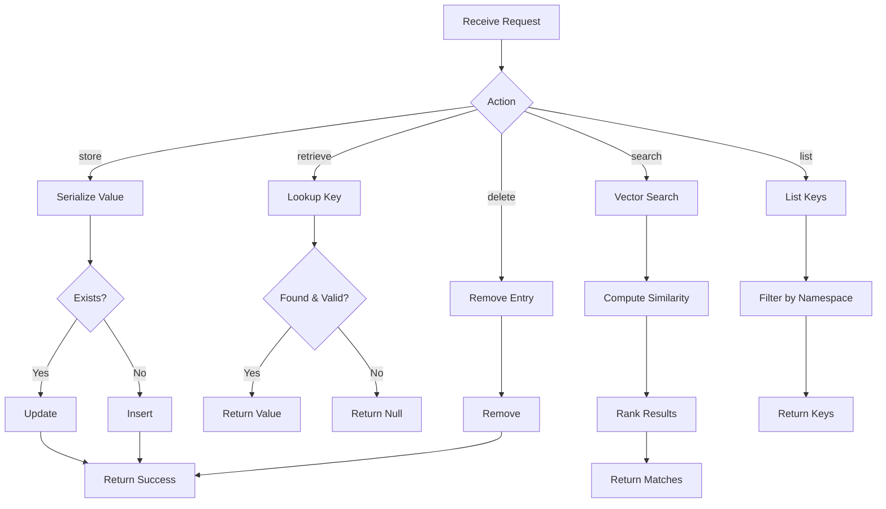

---
# MAM Metadata
id: memory-system
name: Memory Module
version: 1.0.0
type: module

author: MAM Team
description: >
  Persistent memory system for AI agents with vector search and TTL support.

license: MIT

runtime:
  language: python
  version: ">=3.12"

tags:
  - memory
  - state
  - persistence
  - ai

dependencies:
  - name: mam-state
    version: ">=1.0.0"

capabilities:
  - store
  - retrieve
  - search
  - delete
  - list_keys

permissions:
  filesystem:
    - read
    - write
  memory:
    - local
---

# Memory Module

## Purpose

Provides a persistent memory layer for AI agents. Supports key-value storage, vector similarity search, TTL-based expiration, and workspace-scoped isolation between agent sessions.

## Inputs

| Name | Type | Required | Description |
|------|------|----------|-------------|
| action | string | Yes | Operation: "store", "retrieve", "search", "delete", "list" |
| key | string | No | Memory key (required for store/retrieve/delete) |
| value | string | No | Value to store (required for store) |
| query | string | No | Search query (required for search) |
| ttl | int | No | Time-to-live in seconds (default: 3600) |
| namespace | string | No | Namespace for scoped memory (default: "default") |

## Outputs

| Name | Type | Description |
|------|------|-------------|
| result | any | Operation result (value, list, or match objects) |
| success | bool | Whether the operation succeeded |
| error | string | Error message if failed |

## Capabilities

### store

Persist a value under a key within a namespace, with optional TTL.

### retrieve

Fetch a value by key, honoring expiration and namespace isolation.

### search

Rank entries by relevance to a query within a namespace.

### delete

Remove an entry by key.

### list_keys

List non-expired keys within a namespace.

## Rules

- Memory entries must have a non-empty key
- Expired entries are lazily cleaned on access
- Search returns results sorted by similarity score descending
- Maximum 10,000 entries per namespace
- Values must be JSON-serializable
- Deleted entries cannot be recovered

## Workflow



## Python

```python
import json
import time
import hashlib
from typing import Any, Dict, List, Optional
from dataclasses import dataclass, field

@dataclass
class MemoryEntry:
    key: str
    value: Any
    namespace: str = "default"
    created_at: float = field(default_factory=time.time)
    expires_at: Optional[float] = None
    embedding: Optional[List[float]] = None

class MemorySystem:
    def __init__(self, max_entries: int = 10000):
        self._store: Dict[str, MemoryEntry] = {}
        self.max_entries = max_entries

    def _make_key(self, key: str, namespace: str) -> str:
        return f"{namespace}::{key}"

    def store(self, key: str, value: Any, namespace: str = "default",
              ttl: Optional[int] = None) -> bool:
        """Store a value in memory."""
        if not key:
            raise ValueError("Key must be non-empty")

        full_key = self._make_key(key, namespace)
        expires_at = time.time() + ttl if ttl else None

        entry = MemoryEntry(
            key=key, value=value, namespace=namespace,
            expires_at=expires_at,
        )
        self._store[full_key] = entry
        return True

    def retrieve(self, key: str, namespace: str = "default") -> Optional[Any]:
        """Retrieve a value from memory."""
        full_key = self._make_key(key, namespace)
        entry = self._store.get(full_key)

        if entry is None:
            return None

        if entry.expires_at and time.time() > entry.expires_at:
            del self._store[full_key]
            return None

        return entry.value

    def search(self, query: str, namespace: str = "default",
               top_k: int = 5) -> List[Dict]:
        """Search memory by simple text matching (placeholder for vector search)."""
        results = []
        query_lower = query.lower()

        for entry in self._store.values():
            if entry.namespace != namespace:
                continue
            if entry.expires_at and time.time() > entry.expires_at:
                continue

            value_str = json.dumps(entry.value).lower() if not isinstance(entry.value, str) else entry.value.lower()
            if query_lower in value_str:
                score = value_str.count(query_lower) / max(len(value_str), 1)
                results.append({"key": entry.key, "value": entry.value, "score": round(score, 4)})

        results.sort(key=lambda x: x["score"], reverse=True)
        return results[:top_k]

    def delete(self, key: str, namespace: str = "default") -> bool:
        """Delete an entry from memory."""
        full_key = self._make_key(key, namespace)
        if full_key in self._store:
            del self._store[full_key]
            return True
        return False

    def list_keys(self, namespace: str = "default") -> List[str]:
        """List all keys in a namespace."""
        return [
            entry.key for entry in self._store.values()
            if entry.namespace == namespace
            and (not entry.expires_at or time.time() <= entry.expires_at)
        ]
```

## Tests

### Test: Store and Retrieve

Input:

```yaml
action: store
key: k
value: v
```

Expected:

```yaml
retrieve: v
```

```python
def test_store_and_retrieve():
    mem = MemorySystem()
    mem.store("k", "v")
    assert mem.retrieve("k") == "v"

def test_ttl_expiry():
    mem = MemorySystem()
    mem.store("k", "v", ttl=-1)
    assert mem.retrieve("k") is None

def test_delete():
    mem = MemorySystem()
    mem.store("k", "v")
    assert mem.delete("k") is True
    assert mem.retrieve("k") is None

def test_namespace_isolation():
    mem = MemorySystem()
    mem.store("k", "v1", namespace="a")
    mem.store("k", "v2", namespace="b")
    assert mem.retrieve("k", "a") == "v1"
    assert mem.retrieve("k", "b") == "v2"

def test_search():
    mem = MemorySystem()
    mem.store("topic", "machine learning", namespace="ai")
    results = mem.search("learning", "ai")
    assert len(results) == 1
    assert results[0]["key"] == "topic"
```

## Examples

### Basic Usage

```python
mem = MemorySystem()

mem.store("goal", "Build a MAM parser", namespace="project")
mem.store("lang", "TypeScript", namespace="project")

print(mem.retrieve("goal", "project"))  # Build a MAM parser

mem.store("temp", "session data", ttl=60)
print(mem.list_keys("project"))  # ['goal', 'lang']

results = mem.search("parser", "project")
print(results)  # [{'key': 'goal', 'value': 'Build a MAM parser', 'score': 0.0625}]
```

### Expected Flow

```text
Request → Action → Store/Retrieve/Search/Delete/List → Result
```

## References

- MAM Memory Examples
- TTL and namespaced storage patterns
