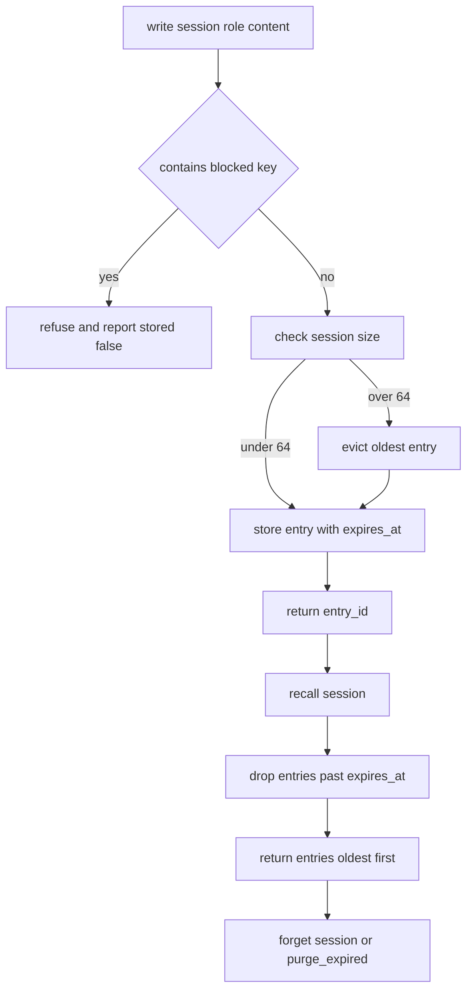

# Session Memory

## Purpose

A `memory` module is the part of a system that survives between calls. This
one stores the turns of a support conversation so a later agent invocation can
remember what was already said, but it is disciplined about what it keeps:
every entry is scoped to a session, every entry expires, and a small set of
sensitive keys is refused outright rather than encrypted and forgotten.

The clock is injected so tests can advance time deterministically instead of
sleeping. In production the caller passes `time.monotonic` or a wall clock
function; the module never reads the clock on its own.

## Inputs

| Name | Type | Required | Description |
|------|------|----------|-------------|
| session_id | string | Yes | The session the entry belongs to |
| role | string | Yes | One of user, assistant, system, tool |
| content | string | Yes | The text to remember |
| clock | object | Yes | Zero-argument callable returning seconds |
| ttl | number | No | Entry lifetime in seconds, defaults to 1800 |

## Outputs

| Name | Type | Description |
|------|------|-------------|
| session_id | string | The session the entry was written to |
| entry_id | number | Monotonic identifier of the stored entry |
| expires_at | number | Clock value at which the entry stops being returned |
| stored | boolean | False when the write was refused by policy |
| entries | list | Entries returned by recall, oldest first |

## Capabilities

### write

Append a turn to a session, refusing blocked keys and expiring old entries.

### recall

Return the live entries for a session in chronological order.

### forget

Delete a single session and everything scoped to it.

### purge_expired

Remove every entry whose time-to-live has elapsed and return how many went.

## Rules

- Entries are scoped to exactly one `session_id`; recall never crosses sessions.
- Entries with a `password`, `token` or `api_key` field are never stored and
  the write is reported as refused.
- Default retention is 1800 seconds; a per-entry `ttl` overrides it.
- A session holds at most 64 entries; the oldest entry is evicted on overflow.
- `purge_expired` is idempotent: calling it twice removes nothing the second time.
- Recall returns entries in insertion order and never returns an expired entry.
- The memory module does not interpret content; storing it is not permission to
  act on it.

## Workflow



## Python

```python
from typing import Any, Callable, Dict, List, Optional

ALLOWED_ROLES = ("user", "assistant", "system", "tool")
BLOCKED_KEYS = ("password", "token", "api_key", "secret")
DEFAULT_TTL_SECONDS = 1800
MAX_ENTRIES_PER_SESSION = 64


class SessionMemory:
    """Session-scoped conversation memory with per-entry expiry."""

    def __init__(self, clock: Callable[[], float], ttl: Optional[float] = None,
                 max_entries: int = MAX_ENTRIES_PER_SESSION) -> None:
        if not callable(clock):
            raise TypeError("clock must be callable")
        if max_entries < 1:
            raise ValueError("max_entries must be at least 1")
        self.clock = clock
        self.ttl = DEFAULT_TTL_SECONDS if ttl is None else ttl
        self.max_entries = max_entries
        self._entries: List[Dict[str, Any]] = []
        self._next_id = 1

    def _live(self) -> List[Dict[str, Any]]:
        now = self.clock()
        return [entry for entry in self._entries if entry["expires_at"] > now]

    def write(self, session_id: str, role: str, content: str, ttl: Optional[float] = None) -> Dict[str, Any]:
        if not isinstance(session_id, str) or not session_id:
            raise ValueError("session_id must be a non-empty string")
        if role not in ALLOWED_ROLES:
            raise ValueError(f"role must be one of {ALLOWED_ROLES}")
        lowered = str(content).lower()
        blocked = [key for key in BLOCKED_KEYS if key in lowered]
        lifetime = self.ttl if ttl is None else ttl
        if blocked:
            return {"session_id": session_id, "entry_id": 0,
                    "expires_at": 0.0, "stored": False,
                    "reason": f"blocked_key:{blocked[0]}"}
        now = self.clock()
        entry = {"session_id": session_id, "entry_id": self._next_id, "role": role,
                 "content": content, "expires_at": now + lifetime}
        self._next_id += 1
        self._entries.append(entry)
        live = self._live()
        if len(live) > self.max_entries:
            overflow = len(live) - self.max_entries
            for stale in live[:overflow]:
                self._entries.remove(stale)
        return {"session_id": session_id, "entry_id": entry["entry_id"],
                "expires_at": entry["expires_at"], "stored": True, "reason": ""}

    def recall(self, session_id: str) -> List[Dict[str, Any]]:
        return [dict(entry) for entry in self._live() if entry["session_id"] == session_id]

    def forget(self, session_id: str) -> int:
        before = len(self._entries)
        self._entries = [e for e in self._entries if e["session_id"] != session_id]
        return before - len(self._entries)

    def purge_expired(self) -> int:
        live = self._live()
        removed = len(self._entries) - len(live)
        self._entries = live
        return removed


class FakeClock:
    """Deterministic clock for tests and examples."""

    def __init__(self, start: float = 0.0) -> None:
        self.now = start

    def __call__(self) -> float:
        return self.now

    def advance(self, seconds: float) -> None:
        self.now += seconds


def recall(memory: SessionMemory, session_id: str) -> List[Dict[str, Any]]:
    return memory.recall(session_id)
```

## Tests

### Input

```yaml
session_id: s-42
role: user
content: "My billing address changed to 12 Mill Lane"
clock: starts at 0
```

### Expected

```yaml
stored: true
entry_id: 1
expires_at: 1800
```

```python
def test_write_and_recall_round_trip():
    clock = FakeClock()
    memory = SessionMemory(clock)
    result = memory.write("s-42", "user", "My billing address changed")
    assert result["stored"] is True
    assert result["entry_id"] == 1
    assert result["expires_at"] == 1800
    entries = memory.recall("s-42")
    assert len(entries) == 1
    assert entries[0]["role"] == "user"


def test_entries_expire_after_ttl():
    clock = FakeClock()
    memory = SessionMemory(clock, ttl=10)
    memory.write("s-1", "user", "hello")
    clock.advance(11)
    assert memory.recall("s-1") == []
    assert memory.purge_expired() == 1
    assert memory.purge_expired() == 0


def test_recall_is_scoped_to_a_session():
    clock = FakeClock()
    memory = SessionMemory(clock)
    memory.write("s-1", "user", "mine")
    memory.write("s-2", "user", "theirs")
    assert len(memory.recall("s-1")) == 1
    assert memory.recall("s-2")[0]["content"] == "theirs"
    assert memory.recall("s-3") == []


def test_blocked_keys_are_never_stored():
    memory = SessionMemory(FakeClock())
    result = memory.write("s-1", "user", "my api_key is abc123")
    assert result["stored"] is False
    assert result["reason"] == "blocked_key:api_key"
    assert memory.recall("s-1") == []


def test_forget_removes_a_whole_session():
    memory = SessionMemory(FakeClock())
    memory.write("s-1", "user", "one")
    memory.write("s-1", "assistant", "two")
    memory.write("s-2", "user", "keep me")
    assert memory.forget("s-1") == 2
    assert memory.recall("s-1") == []
    assert len(memory.recall("s-2")) == 1


def test_session_size_is_capped():
    memory = SessionMemory(FakeClock(), max_entries=2)
    for index in range(4):
        memory.write("s-1", "user", f"message {index}")
    entries = memory.recall("s-1")
    assert [entry["content"] for entry in entries] == ["message 2", "message 3"]


def test_invalid_role_and_session_are_rejected():
    memory = SessionMemory(FakeClock())
    try:
        memory.write("s-1", "wizard", "hello")
    except ValueError:
        pass
    else:
        raise AssertionError("expected ValueError for bad role")
    try:
        memory.write("", "user", "hello")
    except ValueError:
        return
    raise AssertionError("expected ValueError for empty session")


def test_custom_clock_is_required():
    try:
        SessionMemory("noon")
    except TypeError:
        return
    raise AssertionError("expected TypeError")
```

## Examples

```python
class Clock:
    def __init__(self):
        self.t = 1000.0

    def __call__(self):
        return self.t

    def tick(self, seconds):
        self.t += seconds


clock = Clock()
memory = SessionMemory(clock, ttl=300)

print(memory.write("chat-1", "user", "Where is my invoice?"))
print(memory.write("chat-1", "assistant", "It is in Settings, Billing."))
print(memory.write("chat-1", "user", "my api_key is leaked"))

clock.tick(301)
print("after ttl, entries:", memory.recall("chat-1"))
print("purged:", memory.purge_expired())
```

## References

- [MAM Specification](../../plan-doc/full-mam.md)
- [Memory templates](../../templates/memory/)
- [Support Triage Agent](../agent/agent.mam)
