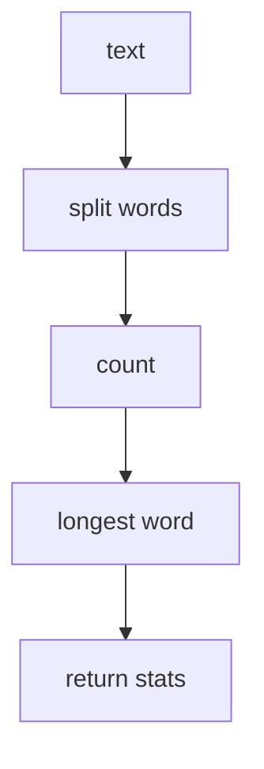

# Text Statistics

## Purpose

The simplest interesting example of a `module`: it reads a string, computes a
few statistics, and returns them. There is no state between calls, no file or
network access, and no dependence on any other module, which makes it safe to
retry and trivial to test.

## Inputs

| Name | Type | Required | Description |
|------|------|----------|-------------|
| text | string | Yes | The text to analyze |

## Outputs

| Name | Type | Description |
|------|------|-------------|
| characters | number | Total characters including whitespace |
| words | number | Whitespace-separated words |
| lines | number | Newline-separated lines |
| longest_word | string | The longest word, empty when there are no words |

## Capabilities

### analyze

Compute the statistics for a piece of text.

### summarize

Return a short human-readable summary line.

## Rules

- The module is pure: the same input always produces the same output.
- No file, network or environment access.
- Empty or whitespace-only input returns zeroes rather than raising.
- A word is any whitespace-separated run of non-whitespace characters.

## Workflow



## Python

```python
from typing import Any, Dict


def analyze(text: str) -> Dict[str, Any]:
    if not isinstance(text, str):
        raise TypeError("text must be a string")

    words = text.split()
    return {
        "characters": len(text),
        "words": len(words),
        "lines": len(text.splitlines()) if text else 0,
        "longest_word": max(words, key=len) if words else "",
    }


def summarize(text: str) -> str:
    stats = analyze(text)
    return f"{stats['words']} words, {stats['characters']} characters"


def run(text: str) -> Dict[str, Any]:
    return {**analyze(text), "summary": summarize(text)}
```

## Tests

### Input

```yaml
text: "the quick brown fox\njumps over"
```

### Expected

```yaml
words: 5
lines: 2
longest_word: quick
```

```python
def test_analyze_counts_words():
    stats = analyze("the quick brown fox\njumps over")
    assert stats["words"] == 5
    assert stats["lines"] == 2
    assert stats["longest_word"] == "quick"


def test_analyze_handles_empty_input():
    stats = analyze("   ")
    assert stats["words"] == 0
    assert stats["longest_word"] == ""
    assert stats["lines"] == 0


def test_analyze_is_pure():
    text = "repeatable"
    assert analyze(text) == analyze(text)
```

## Examples

```python
print(run("the quick brown fox\njumps over"))
# {'characters': 30, 'words': 5, 'lines': 2, 'longest_word': 'quick',
#  'summary': '5 words, 30 characters'}
```

## References

- [MAM Specification](../../plan-doc/full-mam.md)
- [Module templates](../../templates/module/)
