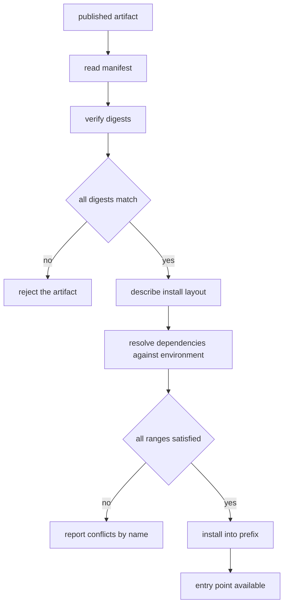

# Summarizer Package Manifest

## Purpose

A package is a promise about bytes. This manifest states which files are
published, what a consumer's environment must look like for those files to
work, where each file lands once installed, and a digest per file so that a
tampered download can be detected before it is imported.

Everything here is data plus a little arithmetic. `resolve` turns declared
ranges plus a candidate environment into a concrete answer, `verify`
recomputes the digests, and `describe` reports the install layout. Nothing in
this module reaches the network or the filesystem.

## Inputs

| Name | Type | Required | Description |
|------|------|----------|-------------|
| environment | object | Yes | Map of dependency name to installed version |
| contents | object | Yes | Map of archive path to the exact bytes published |
| digests | object | Yes | Map of archive path to its declared SHA-256 digest |

## Outputs

| Name | Type | Description |
|------|------|-------------|
| resolution | object | `ok` flag plus ordered `satisfied` and `conflicts` lists |
| verification | object | `ok` flag plus per-file `ok` and `expected`/`actual` digests |
| layout | object | `install_prefix`, `entry_points`, and the destination of each file |

## Capabilities

### resolve

Decide whether a candidate environment satisfies every declared dependency
range and explain any conflict by name.

### verify

Recompute the SHA-256 digest of every published file and compare it with the
digest the manifest declares.

### describe

Report the install layout: prefix, import package, entry points, and the
destination path of every file.

## Contents

| Path | Role |
|------|------|
| `mam_summarizer/__init__.py` | Public surface, re-exports `summarize` |
| `mam_summarizer/summarize.py` | The only implementation module |
| `mam_summarizer/py.typed` | Marker declaring the package ships inline types |
| `CHANGELOG.md` | Human-readable history shipped inside the artifact |

Nothing else is published. A file that is not listed here is a file the package
did not ship, and its presence in a download is a verification failure.

## Dependency Ranges

- Ranges use `>=` and `<` only, so a range is a half-open interval
  `[low, high)` and never resolves to a set with holes.
- Every upper bound is a major-version ceiling: the manifest deliberately does
  not depend on pre-releases.
- The package itself declares no optional extras in this version; the empty
  `dev` group exists so that the layout is stable when one is added.

| Requirement | Range | Why |
|-------------|-------|-----|
| `mam-runtime` | `>=1.2.0 <2.0.0` | Supplies the step context the summarizer is called with |
| `httpx` | `>=0.27.0 <1.0.0` | Only used by the optional fetch path |
| `pydantic` | `>=2.5.0 <3.0.0` | Validates the summary envelope on the way out |

## Install Layout

- Everything installs under the `mam_summarizer/` import package; the
  `CHANGELOG.md` lands at the distribution root, beside it.
- `py.typed` sits inside the import package, which is what makes the inline
  annotations visible to type checkers.
- The console entry point is `mam-summarize`, a thin wrapper over
  `summarize.summarize`.
- No data files, no shared libraries, and no install-time code execution.

## Integrity

- Each path is hashed with SHA-256 over its exact UTF-8 bytes, hex, lowercase.
- A digest mismatch is reported per file and never repaired or re-downloaded.
- The manifest stores no signature field in this version; the digest is what
  makes an accidental corruption detectable, not a malicious one.

## Rules

- Every path in `contents` must have a digest in `digests`, and every digest
  must have a path in `contents`.
- A path listed twice in the contents is a manifest error, not a merge.
- Resolution is pure: it never mutates the manifest or the environment.
- Resolution reports all conflicts, not just the first.
- Verification compares digests case-insensitively but reports them lowercase.
- The manifest is valid only if it passes verification; that is what `resolve`
  assumes and what `verify` proves.

## Workflow



## Python

```python
import hashlib
import re
from typing import Any, Dict, List, Optional

NAME = "mam-summarizer"
VERSION = "1.4.2"
INSTALL_PREFIX = "/usr/lib/python3.12/site-packages"

CONTENTS: Dict[str, str] = {
    "mam_summarizer/__init__.py": (
        '"""Public surface of the summarizer package."""\n'
        "from .summarize import summarize\n"
        "\n"
        '__all__ = ["summarize"]\n'
    ),
    "mam_summarizer/summarize.py": (
        '"""Turn a list of sentences into a bounded summary."""\n'
        "\n"
        "MAX_SENTENCES = 3\n"
        "\n"
        "\n"
        "def summarize(text, limit=MAX_SENTENCES):\n"
        '    """Return at most `limit` sentences of `text`."""\n'
        "    parts = [p.strip() for p in text.split('.') if p.strip()]\n"
        "    return '. '.join(parts[:limit]) + '.'\n"
    ),
    "mam_summarizer/py.typed": "",
    "CHANGELOG.md": (
        "# Changelog\n"
        "\n"
        "## 1.4.2\n"
        "- Cap the summary at three sentences.\n"
    ),
}

DIGESTS: Dict[str, str] = {
    "mam_summarizer/__init__.py": "919e7311c362dcfed4df230857d1570ab702cb218606ba39e71d6fd873c216e3",
    "mam_summarizer/summarize.py": "e69628bbf14b1ab219cec29f615a1b1babe645bd435d8bc5a5b1b66d3726e16d",
    "mam_summarizer/py.typed": "e3b0c44298fc1c149afbf4c8996fb92427ae41e4649b934ca495991b7852b855",
    "CHANGELOG.md": "2e5f28b033067f0d46284f7ef567d4c2a9a8164700a6d577062cd604f656e082",
}

REQUIRES: Dict[str, str] = {
    "mam-runtime": ">=1.2.0 <2.0.0",
    "httpx": ">=0.27.0 <1.0.0",
    "pydantic": ">=2.5.0 <3.0.0",
}

ENTRY_POINTS: Dict[str, str] = {
    "mam-summarize": "mam_summarizer.summarize:summarize",
}


def _parts(version: str):
    bits = str(version).split(".")
    if len(bits) != 3 or not all(part.isdigit() for part in bits):
        raise ValueError(f"version must be MAJOR.MINOR.PATCH, got {version!r}")
    return tuple(int(part) for part in bits)


def _cmp(a: str, b: str) -> int:
    left, right = _parts(a), _parts(b)
    return (left > right) - (left < right)


def digest_of(payload: str) -> str:
    return hashlib.sha256(payload.encode("utf-8")).hexdigest()


def manifest_is_consistent() -> List[str]:
    """Paths and digests must describe the same set of files."""
    problems: List[str] = []
    for path in sorted(set(CONTENTS) ^ set(DIGESTS)):
        problems.append(f"{path} appears in contents but not in digests, or the reverse")
    return problems


def verify(contents: Optional[Dict[str, str]] = None) -> Dict[str, Any]:
    """Recompute every digest and report the differences."""
    source = CONTENTS if contents is None else contents
    files: List[Dict[str, Any]] = []
    for path in sorted(DIGESTS):
        expected = DIGESTS[path].lower()
        if path not in source:
            files.append({"path": path, "ok": False, "reason": "missing from the artifact"})
            continue
        actual = digest_of(source[path])
        files.append(
            {
                "path": path,
                "ok": actual == expected,
                "expected": expected,
                "actual": actual,
                "reason": None if actual == expected else "digest mismatch",
            }
        )
    return {"ok": bool(files) and all(f["ok"] for f in files), "files": files}


def _bounds(spec: str) -> List[Any]:
    pairs = re.findall(r"(>=|<=|>|<|=)\s*(\d+\.\d+\.\d+)", spec)
    if not pairs:
        raise ValueError(f"range {spec!r} declares no bounds")
    return pairs


def resolve(environment: Dict[str, str]) -> Dict[str, Any]:
    """Check a candidate environment against every declared range."""
    satisfied: List[str] = []
    conflicts: List[str] = []
    for name in sorted(REQUIRES):
        spec = REQUIRES[name]
        if name not in environment:
            conflicts.append(f"{name} is required {spec} but is not installed")
            continue
        installed = environment[name]
        try:
            if all(_satisfies(installed, op, bound) for op, bound in _bounds(spec)):
                satisfied.append(f"{name} {installed} satisfies {spec}")
            else:
                conflicts.append(f"{name} {installed} does not satisfy {spec}")
        except ValueError as exc:
            conflicts.append(f"{name} {installed!r} is not a valid version: {exc}")
    return {"ok": not conflicts, "satisfied": satisfied, "conflicts": conflicts}


def _satisfies(version: str, operator: str, bound: str) -> bool:
    outcome = _cmp(version, bound)
    if operator == ">=":
        return outcome >= 0
    if operator == ">":
        return outcome > 0
    if operator == "<=":
        return outcome <= 0
    if operator == "<":
        return outcome < 0
    if operator == "==":
        return outcome == 0
    raise ValueError(f"unsupported operator {operator!r}")


def describe() -> Dict[str, Any]:
    """Report where every published file lands after installation."""
    return {
        "name": NAME,
        "version": VERSION,
        "install_prefix": INSTALL_PREFIX,
        "import_package": "mam_summarizer",
        "file_count": len(CONTENTS),
        "entry_points": dict(ENTRY_POINTS),
        "installs": {path: f"{INSTALL_PREFIX}/{path}" for path in sorted(CONTENTS)},
        "requires": dict(REQUIRES),
    }
```

## Tests

### Input

```yaml
environment:
  mam-runtime: 1.5.0
  httpx: 0.27.2
  pydantic: 2.6.1
```

### Expected

```yaml
resolved: true
verified: true
conflicts: 0
```

```python
def test_manifest_contents_and_digests_agree():
    assert manifest_is_consistent() == []


def test_verify_accepts_the_published_bytes():
    report = verify()
    assert report["ok"] is True
    assert [f["path"] for f in report["files"]] == sorted(CONTENTS)
    assert all(f["expected"] == f["actual"] for f in report["files"])


def test_verify_detects_a_tampered_file():
    tampered = dict(CONTENTS)
    tampered["mam_summarizer/py.typed"] = "# not empty\n"
    report = verify(tampered)
    assert report["ok"] is False
    bad = [f for f in report["files"] if not f["ok"]]
    assert [f["path"] for f in bad] == ["mam_summarizer/py.typed"]
    assert bad[0]["reason"] == "digest mismatch"


def test_verify_detects_a_missing_file():
    partial = {k: v for k, v in CONTENTS.items() if k != "CHANGELOG.md"}
    report = verify(partial)
    assert report["ok"] is False
    missing = [f for f in report["files"] if f["reason"] == "missing from the artifact"]
    assert missing[0]["path"] == "CHANGELOG.md"


def test_digest_is_stable_and_lowercase():
    first = digest_of("mam")
    assert first == digest_of("mam")
    assert first == first.lower()
    assert len(first) == 64


def test_resolve_accepts_a_good_environment():
    report = resolve({"mam-runtime": "1.5.0", "httpx": "0.27.2", "pydantic": "2.6.1"})
    assert report["ok"] is True
    assert report["conflicts"] == []
    assert len(report["satisfied"]) == 3


def test_resolve_rejects_an_out_of_range_dependency():
    report = resolve({"mam-runtime": "2.0.0", "httpx": "0.27.2", "pydantic": "2.6.1"})
    assert report["ok"] is False
    assert report["conflicts"] == ["mam-runtime 2.0.0 does not satisfy >=1.2.0 <2.0.0"]


def test_resolve_reports_every_conflict():
    report = resolve({"mam-runtime": "1.5.0"})
    assert report["ok"] is False
    assert len(report["conflicts"]) == 2
    assert all("not installed" in c for c in report["conflicts"])


def test_resolve_is_pure():
    env = {"mam-runtime": "1.5.0", "httpx": "0.27.2", "pydantic": "2.6.1"}
    snapshot = dict(env)
    resolve(env)
    assert env == snapshot


def test_ranges_are_half_open():
    assert resolve({"mam-runtime": "1.2.0", "httpx": "0.27.0", "pydantic": "2.5.0"})["ok"] is True
    assert resolve({"mam-runtime": "1.1.9", "httpx": "0.27.0", "pydantic": "2.5.0"})["ok"] is False


def test_resolve_rejects_a_malformed_version():
    report = resolve({"mam-runtime": "1.2", "httpx": "0.27.0", "pydantic": "2.5.0"})
    assert report["ok"] is False
    assert "not a valid version" in report["conflicts"][0]


def test_describe_reports_the_install_layout():
    layout = describe()
    assert layout["name"] == "mam-summarizer"
    assert layout["file_count"] == 4
    assert layout["import_package"] == "mam_summarizer"
    assert layout["installs"]["CHANGELOG.md"].endswith("/CHANGELOG.md")
    assert layout["installs"]["mam_summarizer/py.typed"].count("mam_summarizer/") == 1
    assert layout["entry_points"] == {"mam-summarize": "mam_summarizer.summarize:summarize"}


def test_describe_is_a_copy():
    layout = describe()
    layout["entry_points"].clear()
    assert describe()["entry_points"]
```

## Examples

```python
ENVIRONMENT = {"mam-runtime": "1.5.0", "httpx": "0.27.2", "pydantic": "2.6.1"}


def main():
    report = verify()
    layout = describe()
    print("published:", layout["name"], layout["version"], "->", layout["install_prefix"])
    print("verified:", report["ok"], "over", len(report["files"]), "files")
    for entry in report["files"]:
        print(f"  {entry['path']} {entry['actual'][:12]} -> {layout['installs'][entry['path']]}")

    resolution = resolve(ENVIRONMENT)
    print("resolved:", resolution["ok"])
    for line in resolution["satisfied"]:
        print("  " + line)
    print("entry point:", layout["entry_points"]["mam-summarize"])

    namespace = {}
    exec(compile(CONTENTS["mam_summarizer/summarize.py"], "summarize.py", "exec"), namespace)
    print("summary:", namespace["summarize"]("One. Two. Three. Four."))


main()
# published: mam-summarizer 1.4.2 -> /usr/lib/python3.12/site-packages
# verified: True over 4 files
#   CHANGELOG.md 2e5f28b03306 -> /usr/lib/python3.12/site-packages/CHANGELOG.md
#   mam_summarizer/__init__.py 919e7311c362 -> /usr/lib/python3.12/site-packages/mam_summarizer/__init__.py
#   mam_summarizer/py.typed e3b0c44298fc -> /usr/lib/python3.12/site-packages/mam_summarizer/py.typed
#   mam_summarizer/summarize.py e69628bbf14b -> /usr/lib/python3.12/site-packages/mam_summarizer/summarize.py
# resolved: True
#   httpx 0.27.2 satisfies >=0.27.0 <1.0.0
#   mam-runtime 1.5.0 satisfies >=1.2.0 <2.0.0
#   pydantic 2.6.1 satisfies >=2.5.0 <3.0.0
# entry point: mam_summarizer.summarize:summarize
# summary: One. Two. Three.
```

## References

- [MAM Specification](../../plan-doc/full-mam.md)
- [Package templates](../../templates/package/)
- [Repository templates](../../templates/repository/)
