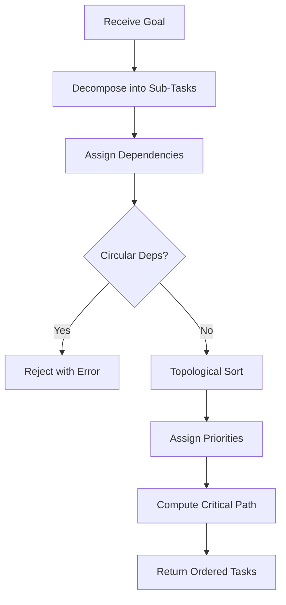

# Planner Module

## Purpose

Decomposes a high-level goal into an ordered graph of sub-tasks. Each task has an id, description, dependencies, priority, and estimated effort. The planner detects circular dependencies and produces a valid topological execution order.

## Inputs

| Name | Type | Required | Description |
|------|------|----------|-------------|
| goal | string | Yes | High-level goal to decompose |
| constraints | list | No | List of constraint strings (e.g. "budget: low") |
| max_depth | int | No | Maximum decomposition depth (default: 3) |

## Outputs

| Name | Type | Description |
|------|------|-------------|
| tasks | list | Ordered list of task dicts |
| total_effort | string | Aggregate effort estimate |
| critical_path | list | IDs of tasks on the critical path |

## Rules

- Each task must have a unique id
- Dependencies must reference existing task ids
- Circular dependencies must be rejected with an error
- Tasks with no dependencies are roots (execute first)
- Priority must be one of: "critical", "high", "medium", "low"

## Workflow



## Python

```python
from dataclasses import dataclass, field
from typing import List, Optional, Set
from collections import defaultdict, deque

@dataclass
class Task:
    id: str
    description: str
    dependencies: List[str] = field(default_factory=list)
    priority: str = "medium"
    effort: str = "small"

class TaskPlanner:
    VALID_PRIORITIES = {"critical", "high", "medium", "low"}

    def __init__(self):
        self.tasks: dict[str, Task] = {}

    def add_task(self, task_id: str, description: str,
                 dependencies: List[str] = None,
                 priority: str = "medium", effort: str = "small") -> Task:
        if priority not in self.VALID_PRIORITIES:
            raise ValueError(f"Invalid priority: {priority}. Must be one of {self.VALID_PRIORITIES}")

        task = Task(
            id=task_id, description=description,
            dependencies=dependencies or [],
            priority=priority, effort=effort,
        )
        self.tasks[task_id] = task
        return task

    def validate(self) -> List[str]:
        """Check for circular dependencies and missing refs. Returns errors."""
        errors = []

        for task in self.tasks.values():
            for dep in task.dependencies:
                if dep not in self.tasks:
                    errors.append(f"Task '{task.id}' depends on unknown task '{dep}'")

        if not errors:
            visited: Set[str] = set()
            path: Set[str] = set()

            def dfs(tid: str) -> bool:
                if tid in path:
                    return True
                if tid in visited:
                    return False
                visited.add(tid)
                path.add(tid)
                for dep in self.tasks[tid].dependencies:
                    if dfs(dep):
                        errors.append(f"Circular dependency detected involving '{tid}'")
                        return True
                path.remove(tid)
                return False

            for tid in self.tasks:
                dfs(tid)

        return errors

    def topological_sort(self) -> List[str]:
        """Return task ids in valid execution order."""
        in_degree = defaultdict(int)
        graph = defaultdict(list)

        for tid, task in self.tasks.items():
            for dep in task.dependencies:
                graph[dep].append(tid)
                in_degree[tid] += 1

        queue = deque([tid for tid in self.tasks if in_degree[tid] == 0])
        order = []

        while queue:
            tid = queue.popleft()
            order.append(tid)
            for neighbor in graph[tid]:
                in_degree[neighbor] -= 1
                if in_degree[neighbor] == 0:
                    queue.append(neighbor)

        return order

    def critical_path(self) -> List[str]:
        """Return ids of tasks marked critical or high priority on the dependency chain."""
        order = self.topological_sort()
        return [tid for tid in order if self.tasks[tid].priority in ("critical", "high")]

    def plan(self, goal: str, max_depth: int = 3) -> dict:
        """Generate a plan from the current task set."""
        errors = self.validate()
        if errors:
            return {"error": errors}

        order = self.topological_sort()
        ordered_tasks = [
            {"id": self.tasks[tid].id, "description": self.tasks[tid].description,
             "priority": self.tasks[tid].priority, "effort": self.tasks[tid].effort,
             "dependencies": self.tasks[tid].dependencies}
            for tid in order
        ]

        return {
            "goal": goal,
            "tasks": ordered_tasks,
            "total_effort": f"{len(ordered_tasks)} tasks",
            "critical_path": self.critical_path(),
        }
```

## Examples

```python
planner = TaskPlanner()
planner.add_task("t1", "Define requirements", priority="critical")
planner.add_task("t2", "Design architecture", dependencies=["t1"], priority="high")
planner.add_task("t3", "Implement parser", dependencies=["t2"], priority="high")
planner.add_task("t4", "Write tests", dependencies=["t2"], priority="medium")
planner.add_task("t5", "Deploy", dependencies=["t3", "t4"], priority="critical")

result = planner.plan("Build MAM parser")
for task in result["tasks"]:
    print(f"  [{task['priority']}] {task['description']}")
```

## Tests

```python
def test_add_task():
    p = TaskPlanner()
    t = p.add_task("t1", "Do something")
    assert t.id == "t1"
    assert t.priority == "medium"

def test_invalid_priority():
    p = TaskPlanner()
    try:
        p.add_task("t1", "Do something", priority="urgent")
        assert False, "Should have raised ValueError"
    except ValueError:
        pass

def test_validate_missing_dep():
    p = TaskPlanner()
    p.add_task("t1", "Step 1", dependencies=["t2"])
    errors = p.validate()
    assert len(errors) == 1
    assert "unknown task" in errors[0]

def test_topological_sort():
    p = TaskPlanner()
    p.add_task("t1", "A")
    p.add_task("t2", "B", dependencies=["t1"])
    p.add_task("t3", "C", dependencies=["t1"])
    order = p.topological_sort()
    assert order.index("t1") < order.index("t2")
    assert order.index("t1") < order.index("t3")

def test_critical_path():
    p = TaskPlanner()
    p.add_task("t1", "A", priority="critical")
    p.add_task("t2", "B", dependencies=["t1"], priority="low")
    p.add_task("t3", "C", dependencies=["t2"], priority="high")
    assert p.critical_path() == ["t1", "t3"]
```

## Dependencies

- None (standard library only)
