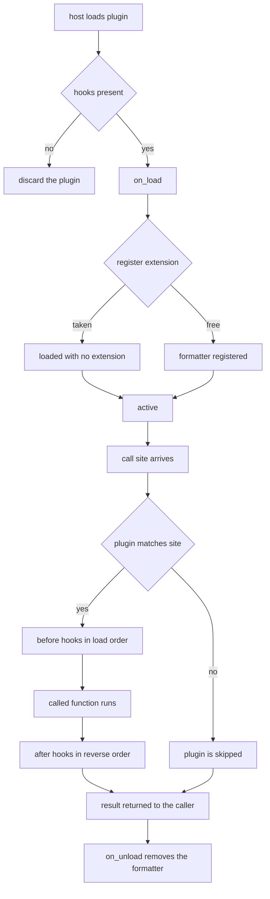

# Report Banner Plugin

## Purpose

A plugin is an extension point that ships. Unlike a standalone extension, a
plugin is loaded by a host it did not write, so it has to be a good citizen: it
announces which call sites it wants, it cleans up everything it added, and it
behaves identically whether it is the only plugin loaded or the tenth.

This one does two things. It registers a `banner` formatter with the host's
extension registry, which makes a new output format exist, and it intercepts
the `render:after` call site, which lets it wrap the host's own output without
the host knowing it happened.

## Inputs

| Name | Type | Required | Description |
|------|------|----------|-------------|
| host | object | Yes | The plugin host that owns the registry and the call sites |
| site | string | Yes | Call site identifier such as `render:before` |
| result | any | Yes | Whatever the intercepted call returned |
| prefix | string | No | Text put in front of every banner, defaults to `acme:` |
| width | integer | No | Maximum banner width, defaults to 48 |

## Outputs

| Name | Type | Description |
|------|------|-------------|
| banner | string | The registered formatter, rendering a titled box |
| wrapped | any | The intercepted result, or the original when nothing applied |
| trace | list | Ordered record of every interception the host performed |

## Capabilities

### on_load

Announce the plugin, register the `banner` formatter, and record the
registration so unload can undo exactly it.

### intercept

Match a call site, contribute before the call, and transform the result after
it.

### on_unload

Remove the registered formatter and drop every interception the plugin made.

## Lifecycle

1. `load` — the host validates that the object exposes the four hook methods,
   then calls `on_load`. A plugin whose `on_load` raises is discarded, and the
   host keeps working without it.
2. `active` — the plugin's pointcuts are consulted for every call site. Its
   `before` hooks run in load order; its `after` hooks run in reverse load
   order, so the first plugin loaded is the last one to see the result.
3. `unload` — the host calls `on_unload` and removes the plugin. Unloading is
   mandatory and happens in reverse load order.
4. `discarded` — a plugin that failed to load. It never becomes `active` and
   contributes nothing.

The host guarantees that a plugin is never called after `on_unload` returns,
and that `on_load` and `on_unload` are each called exactly once.

## Extensions

The plugin registers exactly one extension:

| Name | Provided by | Kind |
|------|-------------|------|
| `banner` | this plugin | formatter |

Registration goes through the host, never through a direct write to the
registry, and the plugin keeps the name it registered so that unloading removes
its own entry and nobody else's. If the host already has a `banner` formatter,
registration is refused and the plugin stays loaded with no extension rather
than silently replacing a built-in.

## Pointcuts

| Pointcut | Hook | Effect |
|----------|------|--------|
| `render:before` | `before` | Records the call in the host trace |
| `render:after` | `after` | Wraps a string result in a banner box |

- A pointcut is a prefix match, so `render:` matches every render site. The
  plugin uses the two concrete sites above.
- `matches` must be side-effect free; it is called on every call site.
- A plugin whose `before` or `after` raises is skipped for that call site, and
  the host records the failure rather than propagating it.
- A plugin that does not match a site is not called at all.

## Rules

- A plugin adds behaviour through the host's registry and its call sites, never
  by editing host state.
- `before` may only add keyword arguments; it may not replace the callable.
- `after` receives the result and returns the replacement, or the value it was
  given.
- Unloading restores the host to the state it had before loading, for
  everything this plugin touched.
- A plugin is a guest: it declares what it matches and never assumes it is the
  only plugin.
- The host is unaffected by plugin failures and stays usable after any of them.

## Workflow



## Python

```python
from typing import Any, Dict, List, Optional

HOOKS = ("on_load", "on_unload", "matches", "before", "after")


class PluginRejected(Exception):
    """Raised when an object cannot be loaded as a plugin."""


class ExtensionTaken(Exception):
    """Raised when the name a plugin wants is already registered."""


class PluginHost:
    """Owns the registry, the call sites, and the plugin list."""

    def __init__(self) -> None:
        self.registry: Dict[str, Any] = {}
        self.plugins: List[Any] = []
        self.trace: List[Dict[str, Any]] = []
        self.failures: List[str] = []

    def load(self, plugin: Any) -> Any:
        missing = [hook for hook in HOOKS if not callable(getattr(plugin, hook, None))]
        if missing:
            raise PluginRejected(f"plugin is missing hooks: {', '.join(missing)}")
        try:
            plugin.on_load(self)
        except Exception as exc:
            self.failures.append(f"{getattr(plugin, 'name', '?')}: {exc}")
            return None
        self.plugins.append(plugin)
        return plugin

    def unload(self, plugin: Any) -> None:
        if plugin not in self.plugins:
            raise PluginRejected(f"{getattr(plugin, 'name', '?')} is not loaded")
        plugin.on_unload(self)
        self.plugins.remove(plugin)

    def call(self, site: str, fn, *args, **kwargs) -> Any:
        for plugin in list(self.plugins):
            if not self._safe_matches(plugin, site):
                continue
            patch = self._safe_before(plugin, site, args, kwargs)
            if isinstance(patch, dict):
                kwargs.update(patch)
            self.trace.append({"site": site, "plugin": getattr(plugin, "name", "?")})
        result = fn(*args, **kwargs)
        for plugin in reversed(list(self.plugins)):
            if not self._safe_matches(plugin, site):
                continue
            replacement = self._safe_after(plugin, site, result)
            if replacement is not None:
                result = replacement
        return result

    def _safe_matches(self, plugin: Any, site: str) -> bool:
        try:
            return bool(plugin.matches(site))
        except Exception as exc:
            self.failures.append(f"{getattr(plugin, 'name', '?')}.matches: {exc}")
            return False

    def _safe_before(self, plugin: Any, site: str, args, kwargs) -> Optional[Dict[str, Any]]:
        try:
            return plugin.before(site, args, kwargs)
        except Exception as exc:
            self.failures.append(f"{getattr(plugin, 'name', '?')}.before: {exc}")
            return None

    def _safe_after(self, plugin: Any, site: str, result: Any) -> Any:
        try:
            return plugin.after(site, result)
        except Exception as exc:
            self.failures.append(f"{getattr(plugin, 'name', '?')}.after: {exc}")
            return None


class BannerFormatter:
    """The extension this plugin contributes."""

    def __init__(self, title: str, width: int) -> None:
        self.title = title
        self.width = width

    def render(self, value: Any) -> str:
        body = str(value).replace("\n", " / ")
        if len(body) > self.width - 4:
            body = body[: self.width - 7] + "..."
        rule = "+" + "-" * (self.width - 2) + "+"
        return "\n".join([rule, f"| {self.title:<{self.width - 4}} |", rule, f"| {body:<{self.width - 4}} |", rule])


class ReportBannerPlugin:
    """Registers a formatter and intercepts the render call sites."""

    name = "com.acme.report-banner"

    def __init__(self, title: str = "ACME", prefix: str = "acme:", width: int = 48) -> None:
        if width < 12:
            raise PluginRejected("a banner needs a width of at least 12")
        self.prefix = prefix
        self.formatter = BannerFormatter(title, width)
        self.registered: Optional[str] = None
        self.loaded = False

    def on_load(self, host: PluginHost) -> None:
        if "banner" in host.registry:
            raise ExtensionTaken("the host already has a banner formatter")
        host.registry["banner"] = self.formatter.render
        self.registered = "banner"
        self.loaded = True

    def on_unload(self, host: PluginHost) -> None:
        if self.registered and host.registry.get(self.registered) == self.formatter.render:
            del host.registry[self.registered]
        self.registered = None
        self.loaded = False

    def matches(self, site: str) -> bool:
        return site in ("render:before", "render:after")

    def before(self, site: str, args, kwargs) -> Dict[str, Any]:
        if site != "render:before":
            return {}
        return {"title": self.prefix + str(kwargs.get("title", "REPORT"))}

    def after(self, site: str, result: Any) -> Any:
        if site != "render:after" or not isinstance(result, str):
            return result
        return self.formatter.render(result)


def render_report(rows: List[Dict[str, Any]], title: str = "REPORT") -> str:
    """The host's own call site, which the plugin has no part in writing."""
    lines = [title] + [f"{row.get('region', '?')}: {row.get('orders', 0)}" for row in rows]
    return "\n".join(lines)
```

## Tests

### Input

```yaml
rows:
  - region: emea
    orders: 12
title: Q1
```

### Expected

```yaml
registered_extensions: 1
wrapped: true
```

```python
def _host_with_plugin(**kwargs):
    host = PluginHost()
    plugin = ReportBannerPlugin(**kwargs)
    assert host.load(plugin) is plugin
    return host, plugin


def test_on_load_registers_the_formatter():
    host, plugin = _host_with_plugin()
    assert plugin.loaded is True
    assert list(host.registry) == ["banner"]
    assert callable(host.registry["banner"])


def test_registered_formatter_renders_a_box():
    host, _ = _host_with_plugin(title="ACME", width=20)
    box = host.registry["banner"]("hello")
    lines = box.splitlines()
    assert len(lines) == 5
    assert all(len(line) == 20 for line in lines)
    assert "hello" in box


def test_on_load_refuses_a_taken_name():
    host = PluginHost()
    host.registry["banner"] = lambda value: "builtin"
    plugin = ReportBannerPlugin()
    assert host.load(plugin) is None
    assert host.registry["banner"]("x") == "builtin"
    assert plugin.loaded is False
    assert host.failures


def test_on_unload_removes_only_its_own_extension():
    host, plugin = _host_with_plugin()
    host.unload(plugin)
    assert host.registry == {}
    assert plugin.loaded is False
    try:
        host.unload(plugin)
    except PluginRejected:
        return
    raise AssertionError("expected PluginRejected on a second unload")


def test_intercept_wraps_the_render_result():
    host, _ = _host_with_plugin(title="ACME", width=24)
    rows = [{"region": "emea", "orders": 12}]
    out = host.call("render:before", render_report, rows, title="Q1")
    out = host.call("render:after", lambda **kw: out, **{})
    assert out.startswith("+")
    assert "Q1" in out
    assert "emea: 12" in out


def test_intercept_only_at_matched_sites():
    host, _ = _host_with_plugin()
    host.call("unrelated:site", lambda: "plain")
    assert host.trace == []
    host.call("render:before", render_report, [], title="Q1")
    assert [entry["site"] for entry in host.trace] == ["render:before"]


def test_before_injects_the_prefixed_title():
    host, _ = _host_with_plugin(prefix="acme:")
    out = host.call("render:before", render_report, [], title="Q1")
    assert out.splitlines()[0] == "acme:Q1"


def test_non_string_results_pass_through():
    host, _ = _host_with_plugin()
    assert host.call("render:after", lambda: 42) == 42
    assert host.call("render:after", lambda: None) is None


def test_trace_records_the_plugin_that_matched():
    host, plugin = _host_with_plugin()
    host.call("render:after", lambda: "x")
    assert [entry["plugin"] for entry in host.trace] == [plugin.name]


def test_a_failing_plugin_does_not_break_the_host():
    class Broken(ReportBannerPlugin):
        name = "com.acme.broken"

        def after(self, site, result):
            raise RuntimeError("boom")

        def on_load(self, host):
            return None

    host = PluginHost()
    host.load(Broken())
    assert host.call("render:after", lambda: "untouched") == "untouched"
    assert any("boom" in failure for failure in host.failures)


def test_load_refuses_an_object_that_is_not_a_plugin():
    try:
        PluginHost().load(object())
    except PluginRejected as exc:
        assert "hooks" in str(exc)
    else:
        raise AssertionError("expected PluginRejected")


def test_banner_is_loaded_only_after_on_load():
    host, plugin = _host_with_plugin(width=12)
    assert plugin.registered == "banner"
    host.unload(plugin)
    assert plugin.registered is None
    assert host.call("render:after", lambda: "x") == "x"
```

## Examples

```python
ROWS = [
    {"region": "emea", "orders": 12},
    {"region": "apac", "orders": 7},
]


def main():
    host = PluginHost()
    plugin = ReportBannerPlugin(width=40)
    print("loaded:", host.load(plugin) is plugin)
    print("extensions:", sorted(host.registry))

    plain = host.call("render:before", render_report, ROWS, title="Q1")
    print("plain:\n" + plain)
    wrapped = host.call("render:after", lambda value: value, plain)
    print("wrapped:\n" + wrapped)
    print("interceptions:", [(e["site"], e["plugin"]) for e in host.trace])

    host.unload(plugin)
    print("after unload, extensions:", sorted(host.registry))
    print("unwrapped again:", host.call("render:after", lambda v: v, plain).splitlines()[0])

    # A plugin whose on_load fails never becomes active.
    class Greedy(ReportBannerPlugin):
        name = "com.acme.greedy"

        def on_load(self, host):
            raise RuntimeError("the name banner is already taken")

    print("greedy loaded:", host.load(Greedy()) is not None)
    print("failures:", host.failures)


main()
# loaded: True
# extensions: ['banner']
# plain:
# acme:Q1
# emea: 12
# apac: 7
# wrapped:
# +--------------------------------------+
# | ACME                                 |
# +--------------------------------------+
# | acme:Q1 / emea: 12 / apac: 7         |
# +--------------------------------------+
# interceptions: [('render:before', 'com.acme.report-banner'), ('render:after', 'com.acme.report-banner')]
# after unload, extensions: []
# unwrapped again: acme:Q1
# greedy loaded: False
# failures: ['com.acme.greedy: the name banner is already taken']
```

## References

- [MAM Specification](../../plan-doc/full-mam.md)
- [Plugin templates](../../templates/plugin/)
- [Extension templates](../../templates/extension/)
