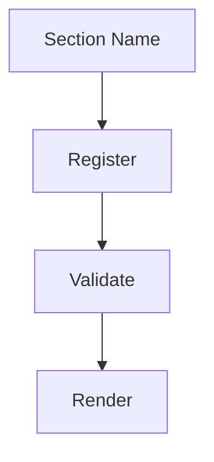

# Custom Section

## Purpose

Registers a custom diagram section type through the MAM Plugin API and
validates Mermaid content before rendering it.

## Inputs

| Name | Type | Required | Description |
|------|------|----------|-------------|
| name | string | No | Section name to register |
| aliases | list | No | Alternative names for the section |

## Outputs

| Name | Type | Description |
|------|------|-------------|
| section | object | Registered section definition |
| status | string | Registration status |

## Capabilities

### register-section

Register a custom section definition.

### validate-section

Validate section content before rendering.

### render-section

Render validated section content.

## Rules

- Register only unique section names.
- Validate content before rendering.

## Workflow



## Python

```python
def register_section(name: str = "diagram") -> dict:
    """Register a custom diagram section type."""
    return {"name": name, "status": "registered"}
```

The plugin hooks into the section lifecycle: registration, validation and
rendering. Each hook receives the parsed section node and returns a result.

## Tests

### Input

```yaml
section: diagram
```

### Expected

```yaml
status: registered
```

```python
def test_register_section():
    result = register_section()
    assert result["status"] == "registered"
```

## Examples

Register a section called diagram and confirm its status.

```text
register_section("diagram")
# returns {"name": "diagram", "status": "registered"}
```

## References

- MAM Plugin API documentation
- Mermaid documentation