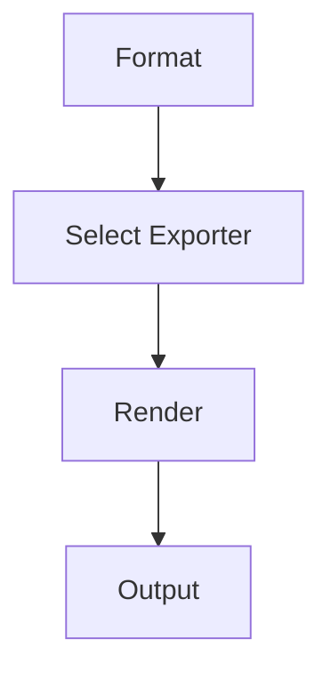

# Export Plugin

## Purpose

Registers custom export formats through the MAM Plugin API so that parsed
modules can render to HTML, PDF and DOCX output.

## Inputs

| Name | Type | Required | Description |
|------|------|----------|-------------|
| format | string | Yes | Target export format |
| source | string | No | Source module reference |

## Outputs

| Name | Type | Description |
|------|------|-------------|
| document | string | Rendered export output |
| format | string | Confirmed export format |

## Capabilities

### export-html

Render a module to HTML output.

### export-pdf

Render a module to PDF output.

### export-docx

Render a module to DOCX output.

## Rules

- Only export modules that parse cleanly.
- Never embed secrets in exported output.

## Workflow



## Python

```python
def export_module(format_name: str = "html") -> dict:
    """Return an export descriptor for a format."""
    return {"format": format_name, "status": "ready"}
```

The plugin hooks into the export lifecycle: format selection, rendering and
output. Each exporter declares its extension and options.

## Tests

### Input

```yaml
format: html
```

### Expected

```yaml
status: ready
```

```python
def test_export_module():
    result = export_module()
    assert result["status"] == "ready"
```

## Examples

Export a module to HTML and confirm the descriptor.

```text
export_module("html")
# returns {"format": "html", "status": "ready"}
```

## References

- MAM Plugin API documentation
- HTML export specification