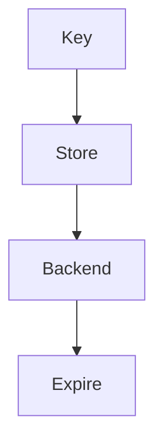

# Memory Plugin

## Purpose

Registers memory backends through the MAM Plugin API that persist module
state and execution results across runs.

## Inputs

| Name | Type | Required | Description |
|------|------|----------|-------------|
| backend | string | No | Memory backend name |
| key | string | No | Key to access |
| value | string | No | Value to store |

## Outputs

| Name | Type | Description |
|------|------|-------------|
| backend | string | Selected backend |
| stored | boolean | Whether the value was stored |

## Capabilities

### store

Persist a value under a key.

### retrieve

Read a value from a backend.

### expire

Apply a time to live on stored entries.

## Rules

- Never store secrets in memory.
- Expire stale entries by their time to live.

## Workflow



## Python

```python
def store_value(key: str = "greeting", value: str = "hello") -> dict:
    """Store a value in the memory backend."""
    return {"key": key, "stored": True}
```

The plugin hooks into the memory lifecycle: connect, store, retrieve and
expire. Each backend supports time to live and namespaced keys.

## Tests

### Input

```yaml
backend: memory
key: greeting
```

### Expected

```yaml
stored: true
```

```python
def test_store_value():
    result = store_value()
    assert result["stored"] is True
```

## Examples

Store a greeting in the memory backend and confirm the result.

```text
store_value("greeting", "hello")
# returns {"key": "greeting", "stored": true}
```

## References

- MAM Plugin API documentation
- Redis documentation
- PostgreSQL documentation