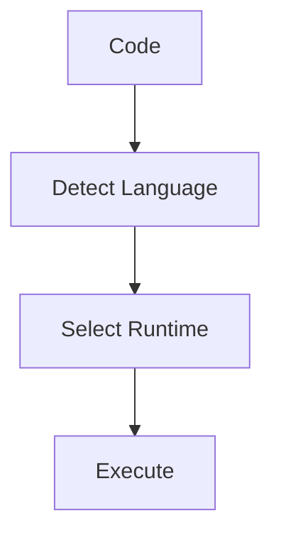

# Runtime Plugin

## Purpose

Registers custom runtime contexts through the MAM Plugin API so that code
blocks can execute in sandboxed environments.

## Inputs

| Name | Type | Required | Description |
|------|------|----------|-------------|
| language | string | Yes | Code language to route |
| code | string | No | Source code to execute |

## Outputs

| Name | Type | Description |
|------|------|-------------|
| runtime | string | Selected runtime context |
| result | string | Execution result |

## Capabilities

### execute-code

Execute code in the matching runtime.

### report-capabilities

Report the capabilities of each runtime context.

## Rules

- Route code to the runtime that handles its language.
- Report capabilities honestly.

## Workflow



## Python

```python
def select_runtime(language: str = "typescript") -> dict:
    """Select a runtime context for a language."""
    return {"runtime": "deno", "language": language, "status": "ready"}
```

The plugin hooks into the execution lifecycle: language detection, runtime
selection and execution. Each runtime reports its supported extensions.

## Tests

### Input

```yaml
language: typescript
```

### Expected

```yaml
status: ready
```

```python
def test_select_runtime():
    result = select_runtime()
    assert result["status"] == "ready"
```

## Examples

Select a runtime for a language and confirm the context.

```text
select_runtime("typescript")
# returns {"runtime": "deno", "language": "typescript", "status": "ready"}
```

## References

- MAM Plugin API documentation
- Deno documentation
- WebAssembly documentation